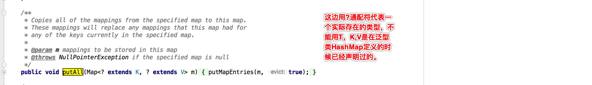

>java泛型(generics)为jdk5引入的新特性，泛型提供了编译时类型安全检测机制，可以在编译时检测到非法的类型。
>泛型的本质是参数化类型，也就是说所操作的数据类型被指定为一个参数。

## 使用泛型的好处

它的主要目标是保障java的类型安全，简化编程，泛型可以使编译器知道一个对象限定类型是什么，所有的强制转换都为自动和隐式的。

##### 举个简单的栗子

```java
public class test1 {
    public static void main(String[] args) {
        List list = new ArrayList();
        list.add("字符串");
        list.add(1);
        for (Object a : list) {
            System.out.println("toString转换->" + a.toString());
            System.out.println("强转->" + (String)a);
        }
    }
}
```

```java
执行结果
Exception in thread "main" java.lang.ClassCastException: java.lang.Integer cannot be cast to java.lang.String
toString转换字符串
强转字符串
toString转换1
	at generics.test1.main(test1.java:13)
```

------

虽然编译的时候没有报错，但是运行的时候强转为String的时候出现类型转换的错，可以看出来这种写法是不安全的。

##### 进一步做点改良(使用泛型后，编译器报错，这样可以预防一些后续编译通过但运行报错的情况)

> 泛型的一个重要特性:跟反射不同的是，泛型检查只在编译期间有效,而反射则是在运行时有效。

下面做个简单的测试

```java
public class test2 {
    public static void main(String[] args) throws NoSuchMethodException, InvocationTargetException, IllegalAccessException {
      	//测试泛型
        List<String> list1 = new ArrayList<String>();
        List<Integer> list2 = new ArrayList<Integer>();
        Class class1 = list1.getClass();
        Class class2 = list2.getClass();
        if(class1.equals(class2)) {
            System.out.println("类型相同");
        }
      
        //测试反射
        Map<String, String> map = new HashMap<String, String>();
        String key = "key";
        Integer val = 1;
        //通过反射获取方法
        Method m = HashMap.class.getDeclaredMethod("put", new Class[] { Object.class, Object.class });
        //invoke意在将方法参数化 动态调用Method类代表的方法 并传入参数
        m.invoke(map, key, val);
        System.out.println(map);
        System.out.println(map.get(key)); //获取key为key的值
    }
}
```


## 泛型的使用方式

```
1.泛型类
2.泛型接口
3.泛型方法
```

#### 泛型类

```java
//T,E,K,V等均表示为泛型
public class Generic<T> {
    private T key;//成员变量类型为T，由外部指定

    public Generic(T key) {
        this.key = key;
    }

    public T getKey(){ //泛型方法getKey的返回值类型为T，T的类型由外部指定
        return key;
    }

    public static void main(String[] args) {
        //在实例化泛型类时 需指定T的具体类型(这边5就代表integer) 
        Generic<Integer> s1 = new Generic<Integer>(5);
        Generic<String> s2 = new Generic<String>("5");

        System.out.println(s1.getClass());//class generics.Generic
        System.out.println(s2.getClass());//class generics.Generic

        System.out.println(s1.getKey().getClass()); //class java.lang.Integer
        System.out.println(s2.getKey().getClass()); //class java.lang.String
      
        /**
         *     定义泛型类不一定要传入泛型类型实参，如果传入的化会在编译时做限制，不传的化可以为任一类型，
         *     但处于安全考虑一般都定义否则一些场景容易出现ClassCastException错误
         */
        Generic t1 = new Generic(5);
        Generic t2 = new Generic(0.5);
        System.out.println(t1.getKey()); //5
        System.out.println(t2.getKey()); //0.5
        System.out.println(t1.getKey().getClass()); //class java.lang.Integer
        System.out.println(t2.getKey().getClass()); //class java.lang.Double
    }
    }
}
```

#### 泛型接口

泛型接口与类定义和使用大致相同，例如Map接口的一小段代码

```java
public interface Map<K,V> {
  ...
  V put(K key, V value);
  void putAll(Map<? extends K, ? extends V> m);//指明泛型的上边界
  ...  
｝
```

实现泛型接口，假设实现map

```java
//假如一个类实现了泛型接口，需要将泛型声明(test3<K,V>) 一起加到类中 否则编译报错 
public class test3<K,V> implements Map<K,V>{
    @Override
    public int size() {
        return 0;
    }

    @Override
    public boolean isEmpty() {
        return false;
    }
    ...
｝
```

#### 泛型方法

**泛型类，是在实例化类的时候指明【泛型】的具体类型；泛型方法，是在调用方法的时候指明泛型的具体类型** 。

这样说有点绕口 举两个栗子

```java
/**
	泛型类
**/
//定义泛型类 该类
public class Test<T> {
    public T key;
    public test5(T key) {
        this.key = key;
    };
｝
//通过实例化指明【泛型】T的类型为String 
Test<String> t = new Test<Sring>("123");
```

```java
/**
	泛型方法 
	定义泛型方法时 必须在返回值前面加一个 <T> 来声明这是一个泛型方法
**/
public class test5<T> {
  	//在这里<T>表示返回的类型是T的 该方法的作用是新建任一指定类型并返回
    public <T> T getObject(Class<T> c) throws IllegalAccessException, InstantiationException {
        T t = c.newInstance();//创建泛型对象
        return t;
    }

    public static void main(String[] args) throws ClassNotFoundException, InstantiationException, IllegalAccessException {
        test5 t = new test5();
        //调用泛型方法【在调用方法的时指明泛型具体类型 这边用User型】
        //在这object就是User的实例 这边测试别用类似java.lang.xxx这样BootStrap类加载器加载的类 否则输出为空
        Object object = t.getObject(Class.forName("generics.User"));
        System.out.println(object.getClass()); //输出class generics.User
    }
}
```


## 泛型的上下边界

使用泛型的时，可以通过传入泛型类型实参进行上下边界的限制。

如定义一个泛型类

```java
public class Generic<T extends Number> { //此处为上边界 意为给定T类型需为Number子类 T super XX 为下边界
    private T key;
    public Generic(T key) {
        this.key = key;
    }
    public T getKey(){
        return key;
    }
}
```

如果这样实例化Generic类编译器会报错，因为String不是Number的子类。

Generic<String> generic = new Generic<String>("11111");


## 一些思考

##### 1.下面这个getKey是否为泛型方法

```java
public class Generic<T> { 
	private T key;
    public Generic(T key) {
    this.key = key;
    }
    public T getKey(){
       return key;
    }
｝
```

并不是，虽然在方法中使用了泛型，这个是类中普通的成员方法，因为它的返回值是声明泛型类【Generic】时已经声明过的泛型【T】，所以在方法中可以继续使用T这个泛型。

##### 2.经常在使用泛型的代码中看见通配符 【?】它的作用是什么，和T的区别在哪呢

比如Map源码

```java
void putAll(Map<? extends K, ? extends V> m);
```

在这里?是通配符，泛指所有类型，常用于不确定类型的情况

? extends T 指T类型或T的子类型

? super T   指T类型或T的父类型

##### 它们的区别在于

"T"是定义类或方法时声明的东西，"?"是调用时传入的东西

①T常用于声明一个泛型类或者泛型方法

②?常用于使用泛型类或泛型方法

声明泛型类时不能用**无界通配符<?>** 

```java
//error example
class demo<?> { 
  private ? item; 
}
```

##### 通配符是可以用来使用定义好的泛型的 但是T不能用来继续使用已经定义好的泛型

当我们在外面使用一个带泛型T的类或方法时，T应该用一个实际的数据类型替代它，也可以使用?通配符

```java
public class User {
    HashMap<T,String> map = new HashMap<String, String>(); //error example
    HashMap<?,String> map = new HashMap<String, String>(); //right example
}
```

##### 看hashMap源码中的putAll方法



##### 简单来说，T一般是声明时用(泛型类，泛型方法)，而?通配符一般是使用时用,可以使用作为通用类。 