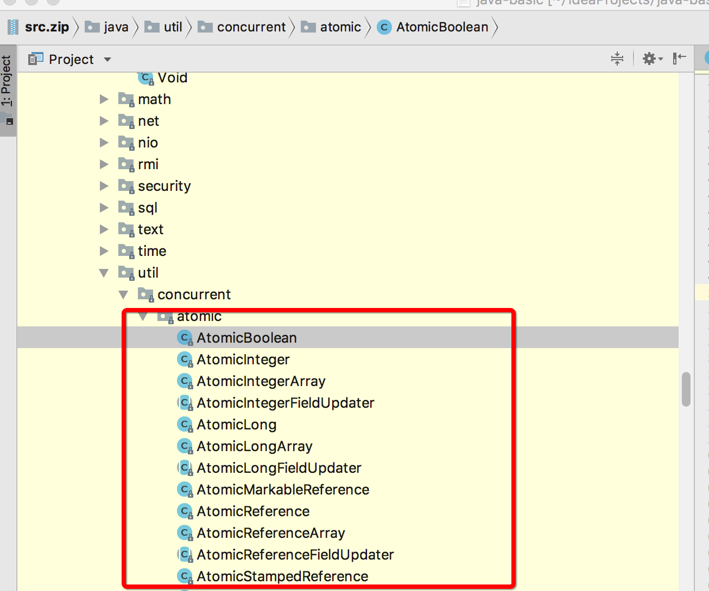
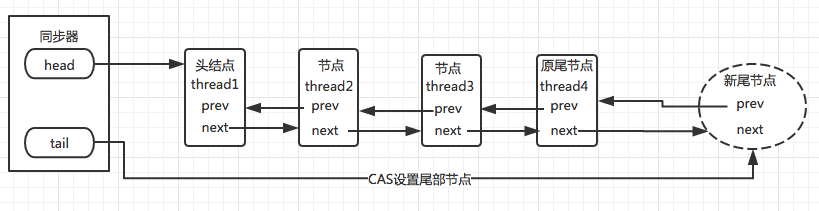
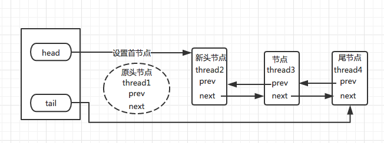
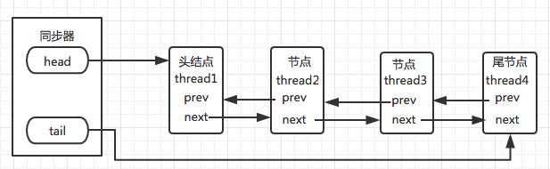

# CAS(Compare And Set)

| 术语   | 英文               | 说明                                       |
| ---- | ---------------- | ---------------------------------------- |
| CAS  | Compare and Swap | 比较并交换(设置)。用于在硬件层面上提供原子性操作。是一种原子操作，非阻塞算法实现【 一个线程的失败或者挂起不应该影响其他线程的失败或挂起的算法】,也常被人称为一种乐观锁、自旋锁技术。在 Intel 处理器中，比较并交换通过指令cmpxchg实现。比较是否和给定的数值一致，如果一致则修改，不一致则不修改。 |

CAS的含义是"我认为V的值应该为A，如果是，那么将V更新为B，否则不修改并告诉V的实际值为多少"，它希望可以成功执行更新操作，【CAS能够检测到来自其它线程的干扰，这使它不用锁也能实现原子的读-写-改操作，做到线程安全】

**三个操作数**

```
1.需要读写的内存位置V[要更新的值]
2.进行比较的值A[预期值]
3.拟写入的新值B[新值]
仅当V的值为A时，CAS才会用原子方式用新值B更新V值[内存值]
```

#### JVM对CAS的支持jdk5以前，如不编写明确的代码将无法执行cas，jdk5后引入的底层的支持，在JUC包下，很多类都提供了高效的CAS操作供使用。

Unsafe类及其Atomic原子类中常用的操作【实际上更底层的还是通过一系列用c写的jni代码实现，没做深究】

很典型的例子,AtomicInteger中的增操作

```java
 public final int incrementAndGet() {
      return unsafe.getAndAddInt(this, valueOffset, 1) + 1;
 }
 
 public final int getAndAddInt(Object var1, long var2, int var4) {
   int var5;
   do {
   var5 = this.getIntVolatile(var1, var2); //native方法 读取同时保证内存可见性
     //cas操作
   } while(!this.compareAndSwapInt(var1, var2, var5, var5 + var4));
  return var5;
 }
```

#### 值得一提的一点是oracle并不建议使用sun

开发者不应该调用sun包,见:http://www.itzhai.com/get-invoker-by-stacktrace-and-getcallerclass.html


### CAS中的ABA问题

维基百科的[ABA问题](https://zh.wikipedia.org/wiki/%E6%AF%94%E8%BE%83%E5%B9%B6%E4%BA%A4%E6%8D%A2)解释是一种无锁结构实现中常见的异常现象，可基本表述为。

> 1. 进程P1读取了一个数值A
> 2. P1被挂起(时间片耗尽、中断等)，进程P2开始执行
> 3. P2修改数值A为数值B，然后又修改回A
> 4. P1被唤醒，比较后发现数值A没有变化，程序继续执行。

这个时候线程1的cas操作完成，但是不代表这个过程没问题，可能会有一系列隐患。举个网上一个类似ABA问题的例子。

```
你拿着一个装满钱的手提箱在飞机场，此时过来了一个火辣性感的美女，然后她很暖昧地挑逗着你，并趁你不注意的时候，把用一个一模一样的手提箱和你那装满钱的箱子调了个包，然后就离开了，你看到你的手提箱还在那，于是就提着手提箱去赶飞机去了。
```

#### 如何解决ABA问题

主要是加版本号(时间戳),每次变量更新价格标示。比如说1A-2B-3C。

jdk5开始，提供了AtomicStampedReference用于解决ABA问题。

该类中的compareAndSet用于判断当前引用是否等于预期引用，并且判断当前标志是否为预期标志。全部相等才做更新。

```java
/**
 * Atomically sets the value of both the reference and stamp
 * to the given update values if the
 * current reference is {@code ==} to the expected reference
 * and the current stamp is equal to the expected stamp.
 *
 * @param expectedReference the expected value of the reference
 * @param newReference the new value for the reference
 * @param expectedStamp the expected value of the stamp
 * @param newStamp the new value for the stamp
 * @return {@code true} if successful
 */
public boolean compareAndSet(V   expectedReference,
                             V   newReference,
                             int expectedStamp,
                             int newStamp) {
    Pair<V> current = pair;
    return
        expectedReference == current.reference &&
        expectedStamp == current.stamp &&
        ((newReference == current.reference &&
          newStamp == current.stamp) ||
         casPair(current, Pair.of(newReference, newStamp)));
}
```

##### cas总结:

CAS是一种乐观的技术，因为它总认为自己可以完成预期操作时，如果有多个线程尝试用CAS同时更新一个变量时，只有一个线程能成功更新变量的值，其它线程都将失败。[反过来来说，当前线程CAS失败不做任何操作是种明智的选择，因为当前线程CAS失败，则说明其它线程已成功执行了要执行的操作]

> 优点:在竞争程度不高时，cas的性能是远超过基于锁的同步操作【比如同步计数器等等。。】，cas在竞争不高的情况下大都能成功执行，相比于cas，锁
>
> 缺点:CAS最大的缺点是难以围绕CAS正确的构建外部算法。【它需要让调用者去处理线程竞争问题(比如说重试、回退等)，但是使用锁可能自动处理竞争问题(其它线程没获取到锁时都是阻塞着的)，在做一些复杂操作时，相比cas用锁编写代码更为容易】
>
> 其它主要缺点
>
> 1.会引起ABA问题
>
> 2.当竞争大的时候，自旋一直不成功将会给cpu带来很大的开销
>
> 3.只能保证一个共享变量的操作，如果对多个共享变量操作，需要把多个共享变量合并为一个才可以，比如jdk5提供的**AtomicReference**，可以把多个变量放在一个里做cas操作。


## 原子变量类

原子变量类常指juc atomic下这12个类

常用到是标量类【AtomicBoolean、AtomicInteger、AtomicLong、AtomicReference】，这4个类都支持cas。AtomicInteger和AtomicLong还支持算数运算。不同与Integer和Long，他们虽然扩展了Number类【都继承了Number】，但是不能进行扩展，而且是可变的，因此不建议用于做散列容器中的键值(比如HashMap)

#### 选择用锁还是原子变量

在高度竞争时，锁的性能优于原子变量的性能【因为高程度的竞争使用锁可以更有效的避免竞争】，但是在中低程度的线程竞争时，原子变量提供了更高的伸缩性【因为锁在竞争时会挂起线程，从而降低了cpu的使用率和共享内存总线的同步通信量。】

> 原子类是通过底层，CAS实现的一种非阻塞算法来维持线程安全性，这些类也被作为一种更好的"volatile"变量来为整数或对象引用做原子操作。这种非阻塞算法【一个线程的失败或者挂起不应该影响其他线程的失败或挂起的算法】虽然设计和实现十分困难，但通常能带来更好的可伸缩性，并且嫩很好的防止活跃性故障的发生【比如死锁】

```
可伸缩性是说:当增加计算资源时[如cpu、内存、存储容量、带宽等]，程序的吞吐量或者处理能力也能相应增加。
```


## AQS

| 术语   | 英文                         | 说明                                       |
| ---- | -------------------------- | ---------------------------------------- |
| AQS  | AbstractQueuedSynchronizer | 队列同步器，可以说是[JUC](http://ifeve.com/j-u-c-framework/)的底层实现，AbstractQueuedSynchronizer抽象类可以说是锁框架的基石，提供了一种基于fifo【先进先出】队列用于构建锁和一些同步基础框架。 |

```
使用到AQS的类的举例
独占锁: ReentrantLock
共享锁: CountDownLatch、CyclicBarrier、Semaphore
```

### 类结构

抽象类、继承AbstractOwnableSynchronizer，实现Serializable接口

```java
//空的protected修饰的构造函数
protected AbstractQueuedSynchronizer() { }
//抽象类编译成class会生成public修饰的空构造方法，
//jvm源码中源码用protected应该是出于更严谨的考虑，供子类调用【Constructor for use by subclasses.】

//在书中有明确说明：抽象类的构造方法定义为protected，因为他只能被子类使用，即用super(paraments);
//参考文献：Java语言程序设计（第十版）P426页
```


### aqs同步器数据结构

aqs通过内置的fifo双向队列来获取锁线程排队工作，遵循先进先出的原则

同步器包含两个节点类型的引用，一个指向头部【head】,一个指向尾部【tail】


同步队列中放着多个等待中的线程，与这个head关联的是当前持有锁的线程，tail节点指向线程队列最后的线程，每当有个新的线程加入，会通过原子操作来设置尾部节点。

加入队列的过程必须要保证线程安全，即多线程下要保证节点的存放顺序，

> aqs同步器基本数据结构

AQS源码注释形象说明

```java
* <p>To enqueue into a CLH lock, you atomically splice it in as new
* tail. To dequeue, you just set the head field.
* <pre>
*      +------+  prev +-----+       +-----+
* head |      | <---- |     | <---- |     |  tail
*      +------+       +-----+       +-----+
* </pre>
大概意思就是，要排入CLH锁定，将其原子拼接为新的尾部。要出列，只需设置头部字段即可
```


.png)


> 同步队列设置尾节点【aqs使用cas来设置尾节点，保证一个未获取到同步状态的线程加入到同步队列后，下一个未获取的线程才能加入。即保证序列的顺序、结构的正确性。】




> 同步队列设置头部节点【原节点释放锁，唤醒后面的节点，后面的节点变为新的头结点】
>
> 设置头节点的操作是获取锁的线程来完成的，由于只有一个线程能够获取同步状态，所以设置头结点的方法不需要cas保证，**需将头结点设置为原首节点的后继节点，并断开原头结点的next引用，然后设置新节点**。




> 获取独占式的锁

当前线程通过tryAcquire(int arg)【布尔】获取锁，获取成功直接返回，获取失败则进入等待队列排队等待，以保证线程安全的同步状态。




### 锁类别

```
1.独占锁
在一个时间点，有且只有一个线程里的对象能获取到锁，如ReentrantLock
在独占锁中，又细分为公平锁和非公平锁
2.共享锁
允许多个线程同时获取到锁，如CountDownLatch、
```


###几个重要的概念

FIFO队列

> FIFO(first input first output),即先进先出


AQS状态

一个同步队列，即AQS中的state只有锁定和非锁定两种状态，其中0表示未锁定，>0表示已锁定，由于可重入，所以state可以>1,知道state为0的时候才说明资源没有被任何线程占用。

```java
//aqs中 通过volatile保证其它线程可见性
private volatile int state;
//几个重要的相关方法
getState();//获取当前同步状态
setState(int newState)；//设置同步状态
compareAndSetState(int expect,int update) //使用CAS设置当前aqs状态
```


### 源码实现

#### Node节点

aqs会把所有请求线程构造成一个CLH队列，这个队列是虚拟的不存在队列实例，仅靠各个节点的前后关系，目的是通过cas把当前线程追加到队列尾，并返回包装后的node实例。

Node节点作为aqs的内部类，每个线程在队列中都相当于双向链表的节点，除了存储当前线程和前后节点的引用外，都有着自己的等待状态【waitStatus】

```java
//aqs类中Node节点成员变量
static final class Node {
  /** waitStatus value to indicate thread has cancelled */ 
  static final int CANCELLED =  1; //取消状态 当等待线程超时或被中断 该节点的waitStatus即会被设为-1，进入该状态的节点将不会再变化
  /** waitStatus value to indicate successor's thread needs unparking */
  static final int  SIGNAL    = -1;  //等待触发状态，即唤醒状态，只要前一节点释放锁，就会通知状态为SIGNAL的猴急节点执行
  /** waitStatus value to indicate thread is waiting on condition */
  static final int CONDITION = -2; //等待条件状态
  /**
  * waitStatus value to indicate the next acquireShared should 下一个acquireShared需无条件传播
  * unconditionally propagate
  */
  static final int PROPAGATE = -3;//与共享模式相关，这里不做研究
  volatile int waitStatus;
  volatile Node prev;
  volatile Node next;
  volatile Thread thread;
  Node nextWaiter;
  ...
  //用于addWaiter的构造方法
  Node(Thread thread, Node mode) {     // Used by addWaiter
    this.nextWaiter = mode;
    this.thread = thread;
  }
}


```


### acquire方法

**acquire**可以说是独占模式下线程获取共享资源的顶层入口，如果获取到资源，线程直接返回，否则进入等待队列直到获取到资源为止。

```java
/**
 * Acquires in exclusive mode, ignoring interrupts.  Implemented
 * by invoking at least once {@link #tryAcquire},
 * returning on success.  Otherwise the thread is queued, possibly
 * repeatedly blocking and unblocking, invoking {@link
 * #tryAcquire} until success.  This method can be used
 * to implement method {@link Lock#lock}.
 *
 * @param arg the acquire argument.  This value is conveyed to
 *        {@link #tryAcquire} but is otherwise uninterpreted and
 *        can represent anything you like.
 
 独占模式的方式获取，忽略中断，至少一次调用tryAcquire
 如果成功则直接返回，失败的话线程可能排队，反复阻塞解除阻塞，调用tryAcquire直到成功
 该方法可用于实现方法[给子类]
 
 至于arg这个参数传给tryAcquire后 并没有什么解释。。可以代表你喜欢的任何int值含义[供子类重写使用]
 */
public final void acquire(int arg) {
    if (!tryAcquire(arg) &&
        acquireQueued(addWaiter(Node.EXCLUSIVE), arg))
        selfInterrupt();
}

//通过tryAcquire获取锁，如果尝试获取失败,将通过addWaiter将独占模式节点添加到队列中，再通过acquireQueued阻塞。
//将调用selfInterrupt中断线程执行，说明已经加入到aqs队列中。


```

大致过程

>1. tryAcquire()尝试直接去获取资源，如果成功则直接返回, 如果失败则到addWaiter；
>2. addWaiter()将该线程作为节点【Node node = new Node(Thread.currentThread(), mode);】】加入等待队列的尾部，并标记为独占模式，返回加入的新节点
>3. acquireQueued()把已经追加到等待队列的线程节点进行阻塞，阻塞前还会尝试tryAcquire获取锁，线程在等待队列中自我检查【循环】，一直获取到资源后才返回。如果在整个等待过程中有被中断过，则返回true【interrupted = true】，否则返回false。
>4. 如果线程在等待过程中被中断过，它是不响应的。只是获取资源后才再进行自我中断selfInterrupt()，将中断补上。


上面的解释有点绕口，结合图


#### 在队列中的线程获取锁的过程


### 以ReentrantLock为例

> ReentrantLock是基于aqs的一种独占锁实现，大致结构如下，体现在内部实现调用的是acquire而不是acquireShared

**ReentrantLock大致结构**

```java
//实现Lock接口
public class ReentrantLock implements Lock, java.io.Serializable {
    private static final long serialVersionUID = 7373984872572414699L;
    /** Synchronizer providing all implementation mechanics */
    private final Sync sync;

    /**
     * Base of synchronization control for this lock. Subclassed
     * into fair and nonfair versions below. Uses AQS state to
     * represent the number of holds on the lock.
     */
    abstract static class Sync extends AbstractQueuedSynchronizer {
        abstract void lock();
        final boolean nonfairTryAcquire(int acquires) {
            ...
        }
        protected final boolean tryRelease(int releases) {
            ...
        }
        ...
    }
    
       /**
     * Sync object for non-fair locks
     */
    static final class NonfairSync extends Sync {
        private static final long serialVersionUID = 7316153563782823691L;
        /**
         * Performs lock.  Try immediate barge, backing up to normal
         * acquire on failure.
         */
        //非公平锁lock具体实现 
        final void lock() {
            if (compareAndSetState(0, 1))
                setExclusiveOwnerThread(Thread.currentThread());
            else
                acquire(1);
        }

        protected final boolean tryAcquire(int acquires) {
            return nonfairTryAcquire(acquires);
        }
    }
    
       /**
     * Sync object for fair locks
     */
    static final class FairSync extends Sync {
        private static final long serialVersionUID = -3000897897090466540L;
		
        //公平锁lock实现，没重写调用aqs的acquire 但是重写了tryAcquire 调用自身的tryAcquire
        final void lock() {
            acquire(1);
        }

        /**
         * Fair version of tryAcquire.  Don't grant access unless
         * recursive call or no waiters or is first.
         */
        protected final boolean tryAcquire(int acquires) {
            final Thread current = Thread.currentThread();
            int c = getState();
            if (c == 0) {
                //hasQueuedPredecessors是实现公平的关键，因为它会先去判断队列中是否有节点【或者说线程】
                if (!hasQueuedPredecessors() &&
                    compareAndSetState(0, acquires)) {
                    setExclusiveOwnerThread(current);
                    return true;
                }
            }
            else if (current == getExclusiveOwnerThread()) {
                int nextc = c + acquires;
                if (nextc < 0)
                    throw new Error("Maximum lock count exceeded");
                setState(nextc);
                return true;
            }
            return false;
        }
    }
    ...
    //构造方法、默认为非公平锁
    public ReentrantLock() {
        sync = new NonfairSync();
    }

    /**
     * Creates an instance of {@code ReentrantLock} with the
     * given fairness policy.
     *
     * @param fair {@code true} if this lock should use a fair ordering policy
      如果传true则为公平锁实现
     */
    public ReentrantLock(boolean fair) {
        sync = fair ? new FairSync() : new NonfairSync();
    }
    ...
}
```

可以看出来，aqs同步器的具体实现主要是通过继承，子类通过继承同步器并实现它的抽象方法【如果没有重写的方法则使用aqs中的方法(一般为非抽象的)】

------

我们一般是这样实例化独占锁

```java
ReentrantLock lock = new ReentrantLock();
//线程执行方法 多线程共用一个锁对象,相当于共用一个CLH同步队列，每个线程在队列相当于一个节点
public void xxx() {
     lock.lock();
     try {
     } catch (InterruptedException e) {
     	e.printStackTrace();
     } finally {
     	lock.unlock();
     }
}
```

实例化后，一般用lock，这边使用无参构造方法因此为非公平锁

### 加锁【lock】，主要使用aqs的acquire方法

**非公平锁的lock实现**

```java
//非公平锁lock具体实现 
final void lock() {
    //通过cas将aqs状态从0改为1，如果为0说明当前没有线程竞争到资源【或者说获取到锁】
    if (compareAndSetState(0, 1))
        //那么自己设置当前线程独占资源
    	setExclusiveOwnerThread(Thread.currentThread());
    else
    //或者就加入队列里竞争【非公平的方式】
    acquire(1);
}
```

**接下来看非公平锁的acquire实现**

没有重写acquire，因此还是用父类aqs的acquire(int arg),其中里面的arg没有特定的含义，根据子类的需要定义其含义

```java
//再观察下入口方法acquire，主要是一系列如争锁、自旋的操作，每lock一次都会执行以下操作
public final void acquire(int arg) {
    if (!tryAcquire(arg) &&
        acquireQueued(addWaiter(Node.EXCLUSIVE), arg))
        selfInterrupt();
}
```

ReentrantLock子类Sync的子类NonfairSync重写tryAcquire

```java
protected final boolean tryAcquire(int acquires) {
    return nonfairTryAcquire(acquires);
}
```

```java
/**
 执行不公平取锁操作，tryAcquire在子类，都需以不公平方式实现
 * Performs non-fair tryLock.  tryAcquire is implemented in
 * subclasses, but both need nonfair try for trylock method.
 */
final boolean nonfairTryAcquire(int acquires) {
    final Thread current = Thread.currentThread();
    int c = getState(); //获取aqs状态
    if (c == 0) {//如果为0 则说明资源没有被任何线程获取，则再做一次cas操作 成功则当前线程独占资源
        if (compareAndSetState(0, acquires)) {
            setExclusiveOwnerThread(current);
            return true;
        }
    }
    //判断是否为exclusiveOwnerThread，此为为aqs父类方法，其中setExclusiveOwnerThread用于设置最后设置的线程【体现独占】；getExclusiveOwnerThread用于返回，如果从未设置，则返回 null
    //如果当前线程为最近刚设置的值，即说明当前线程和持有锁的线程相同，如果相同则当前状态再加上acquires进行设置【体现可重入】
    else if (current == getExclusiveOwnerThread()) {
        int nextc = c + acquires;
        if (nextc < 0) // overflow
            throw new Error("Maximum lock count exceeded");
        setState(nextc);
        return true;
    }
    return false;
}
//nonfairTryAcquire加锁流程
//如果为fasle，说明tryAcquire失败，后面将往等待队列添加新的节点【addWaiter】
```

> 可以看到nonfairTryAcquire方法前半部分通过cas实现，后半部分没有代码体现出同步，为state++的操作。为什么没有同步操作是因为:
>
> 后半部分是线程重入已经获取到了锁后才触发的操作，这个时候已经获取到了锁，就无需再做同步操作保证线程安全。状态++后直到为0【释放锁】，才能彻底释放资源，其它线程才有机会获取到锁。

##### addWaiter(Node mode)

```java
/**
 * Creates and enqueues node for current thread and given mode.
 *
 * @param mode Node.EXCLUSIVE for exclusive, Node.SHARED for shared
 * @return the new node
 *为当前线程和给定模式创建和排队节点。
  返回新节点
 */
private Node addWaiter(Node mode) {
    //创建一个节点，根据模式 EXCLUSIVE（独占）和SHARED（共享）
    Node node = new Node(Thread.currentThread(), mode);
    // Try the fast path of enq; backup to full enq on failure 
    //尝试快速enq的方式添加新节点，如果失败就老实执行enq方法
    //新节点的上一节点设为aqs的tail【尾巴】
    Node pred = tail;
    //如果不为空说明CLH队列中还有节点
    if (pred != null) {
        //尝试将当前node 前一节点设为尾巴 即添加到CLH队列队尾 
        node.prev = pred;
        //通过cas 将tail设置为当前节点
        if (compareAndSetTail(pred, node)) {
            pred.next = node;
            return node;
        }
    }
    //如果队列为空或者上面失败了,则通过enq方法强行入列
    enq(node);
    return node;
}
```

```java
/**
   将节点插入队列，必要时初始化
 * Inserts node into queue, initializing if necessary. See picture above.
 * @param node the node to insert
 * @return node's predecessor
 */
private Node enq(final Node node) {
    //死循环、cas自旋直到添加到队尾位置
    for (;;) {
        Node t = tail;
        //如果队列为空 初始化new Node()一个空的标志作为head节点
        if (t == null) { // Must initialize
            //通过cas的方式 初始化一个
            if (compareAndSetHead(new Node()))
                //同时tail也指向这个head节点 
                tail = head;
        } else {//队列不为空 就正常操作将节点放入队尾 这里因为死循环的原因，后面一定会放入队列中
            node.prev = t;
            if (compareAndSetTail(t, node)) {
                t.next = node;
                return t;
            }
        }
    }
}
```

addWaiter主要作用就是往CLH队列添加一个定义好模式的节点

##### acquireQueued(Node, int)

通过tryAcquire()失败和addWaiter()成功放入队尾后，接下来要做的就是进入等待状态休息，或者说阻塞，直到其它线程彻底释放后唤醒自己【然后就变成了老二】

```java
final boolean acquireQueued(final Node node, int arg) {
    boolean failed = true;
    try {
        boolean interrupted = false;
        //死循环检查
        for (;;) {
            //获取前一节点
            final Node p = node.predecessor();
            //如果前一节点为head 说明该节点为老二 前面节点为head才有资格去竞争锁【说不定老大要释放了或者被中断了】
            if (p == head && tryAcquire(arg)) {
                //如果获取锁 则设置头部为当前节点【刚加入的】 
                setHead(node);//setHead时 会将前一节点prev设为null
                p.next = null; // help GC 这里再将下一节点设为null方便gc
                failed = false;
                //返回中断的标志
                return interrupted;
            }
           //如果前一个节点不是头结点则检查前一个节点的状态
            if (shouldParkAfterFailedAcquire(p, node) &&
                parkAndCheckInterrupt())//如果等待过程中被中断过 即使只有一次 interrupted也会被标记为true
                interrupted = true;
        }
    } finally {
        //如果有异常抛出不捕获、或者有中断 就会取消线程请求操作、将当前节点从队列中移除
        if (failed)
            cancelAcquire(node); //出列
    }
}
//这里看似是个死循环 如果p == head && tryAcquire(arg) 一直false则不会停下。但是由于parkAndCheckInterrupt的原因是不会有死循环的情况，因为如果前一节点不是head或这是head但是竞争锁失败，会把当前线程挂起
```

##### shouldParkAfterFailedAcquire：

一层一层往上找前节点判断当前线程是否应该被阻塞，如果前一节点状态为CANCELLED，则顺带删掉为CANCELLED的节点【通过gc的方式】

```java
/**
 * Checks and updates status for a node that failed to acquire.
 * Returns true if thread should block. This is the main signal
 * control in all acquire loops.  Requires that pred == node.prev.
 *
 * @param pred node's predecessor holding status
 * @param node the node
 * @return {@code true} if thread should block
 */
//shouldParkAfterFailedAcquire:字面意思acquire失败后是否需要休息，该方法作用主要就是是否用于检查状态，查看自己是否可以去休息(进入waiting状态)
private static boolean shouldParkAfterFailedAcquire(Node pred, Node node) {
    int ws = pred.waitStatus;//获取前一节点状态
    //如果为-1 说明前一节点正在等待唤醒的状态 还轮不到自己 可以安心休息返回true
    if (ws == Node.SIGNAL)
        /*
         * This node has already set status asking a release
         * to signal it, so it can safely park.
         */
        return true;
  	//根据节点状态 只有>0即为1(CANCELLED)的时候 说明是处于取消状态的节点
    if (ws > 0) {
        /*
         * Predecessor was cancelled. Skip over predecessors and
         * indicate retry.
         */
     	//这个时候就循环一直往前找一个正常的节点(>0)
        do {
            node.prev = pred = pred.prev;
        } while (pred.waitStatus > 0);
      	//则把当前节点
        pred.next = node;
    } else {
        /*
         * waitStatus must be 0 or PROPAGATE.  Indicate that we
         * need a signal, but don't park yet.  Caller will need to
         * retry to make sure it cannot acquire before parking.
         */
      	//如果前一节点正常，则尝试把前驱状态设置为SIGNAL 这样的话后面可以通知一下当前节点，【这是因为在doReleaseShared方法中[主要用于唤醒后继节点]，会从head往后检查，假设前一节点为SIGNAL，就会唤醒[通知]后继节点)】
        compareAndSetWaitStatus(pred, ws, Node.SIGNAL);
    }
    return false;
}
```

##### parkAndCheckInterrupt

如果线程找到休息点后，就可以【暂且】安心休息，用于阻塞当前线程，好把时间片让给获取到锁的线程执行锁内部的操作。

```java
/**
 * Convenience method to park and then check if interrupted
 * 
 * @return {@code true} if interrupted
 */
private final boolean parkAndCheckInterrupt() {
    LockSupport.park(this);//调用park()使线程进入waiting状态
    return Thread.interrupted();//返回当前线程是否被中断
}

public static void park(Object blocker) {
    Thread t = Thread.currentThread();
    setBlocker(t, blocker);
    UNSAFE.park(false, 0L);//到这里就是native方法，jvm层次的挂起线程方法
    setBlocker(t, null);
}

public static boolean interrupted() {
  	return currentThread().isInterrupted(true);
}
```

##### cancelAcquire

cancelAcquire比较复杂，大致就是失败了做出列操作，有多种情况，参考:

[关于cancelAcquire](https://www.jianshu.com/p/01f2046aab64)

再做一下加锁过程


### 解锁【unlock】,主要使用release

如果说acquire是加锁的顶层入口，那release可以说是独占模式下释放的顶层入口，它会释放指定量的资源。如果彻底释放会唤醒等待队列中其它线程来获取资源。


## 疑问

在观看源码及其前辈们的博客时，中途产生了些许疑问。

#### 为什么只有前节点是头结点[老二]才有资格尝试获取锁?

```java
acquireQueued中
if (p == head && tryAcquire(arg)) {
   ...
}
```


> 1:头节点是成功获取到锁的节点，而头节点释放锁后将唤醒后面的线程【节点】，后面的线程被唤醒后要检查前节点是否为头结点
>
> 2:这是用于维护fifo原则，节点进入同步队列后，每个节点【或者说是线程】都在观察自己


#### ReentrantLock中非公平锁[NonfairSync]和公平锁[FairSync]的区别

可重入锁ReentrantLock有公平和非公平两种锁的实现。它们的具体实现也不尽相同。

##### 主要体现在获取锁的方式

tryAcquire，

**非公平锁**

```java
//非公平锁，会尝试让当前线程去获取锁
protected final boolean tryAcquire(int acquires) {
    return nonfairTryAcquire(acquires);
}

final boolean nonfairTryAcquire(int acquires) {
  final Thread current = Thread.currentThread();
  //获取当前状态
  int c = getState();
    //如果当前aqs的状态为0，说明当前的锁没有被任何线程获取，则尝试做cas操作将其设为acquires(1),
    if (c == 0) {
      //若设置成功，则将当前线程设置为持有锁的线程，并返回ture说明成功
      if (compareAndSetState(0, acquires)) {
      setExclusiveOwnerThread(current);
      return true;
    }
  }
  else if (current == getExclusiveOwnerThread()) {
    int nextc = c + acquires;
    if (nextc < 0) // overflow
      throw new Error("Maximum lock count exceeded");
      setState(nextc);
      return true;
    }
  return false;
}
```

**公平锁**

```java
protected final boolean tryAcquire(int acquires) {
    final Thread current = Thread.currentThread();
    int c = getState();
    if (c == 0) {
        //关键区别
        if (!hasQueuedPredecessors() &&
            compareAndSetState(0, acquires)) {
            setExclusiveOwnerThread(current);
            return true;
        }
    }
    else if (current == getExclusiveOwnerThread()) {
        int nextc = c + acquires;
        if (nextc < 0)
            throw new Error("Maximum lock count exceeded");
        setState(nextc);
        return true;
    }
    return false;
}
```

aqs中hasQueuedPredecessors用来判断是否有等待线程

判断的方式是如果头不为尾【一般初始的时候】

```java
public final boolean hasQueuedPredecessors() {
    // The correctness of this depends on head being initialized
    // before tail and on head.next being accurate if the current
    // thread is first in queue.
    Node t = tail; // Read fields in reverse initialization order
    Node h = head;
    Node s;
    return h != t &&
        ((s = h.next) == null || s.thread != Thread.currentThread());
}
```

hasQueuedPredecessors是实现公平锁的关键，如果返回true说明有其它线程优于当前线程等待获取锁，此时为了保证公平，保证等待时间长的尽可能先获取锁，不进行。

```
acquire(1);
```

可以看到lock方法就有些许不同


### 为什么acquireQueued为true要selfInterrupt【自我中断】

```java
public final void acquire(int arg) {
    if (!tryAcquire(arg) &&
        acquireQueued(addWaiter(Node.EXCLUSIVE), arg))
        selfInterrupt();
}
```

```java
 private final boolean parkAndCheckInterrupt() {
     LockSupport.park(this);//调用park()使线程进入waiting状态
     return Thread.interrupted();//如果被唤醒，查看自己是不是被中断的。
 }
```

如果线程在挂起状态，那么对中断LockSupport.park(this);是不响应的，后面终会唤醒。

LockSupport.park(this)是不会更改标志位的值的,


## 总结


## 参考链接

https://www.jianshu.com/p/e674ee68fd3f

https://www.cnblogs.com/200911/p/6031350.html

[java并发之aqs详解](http://www.cnblogs.com/waterystone/p/4920797.html)