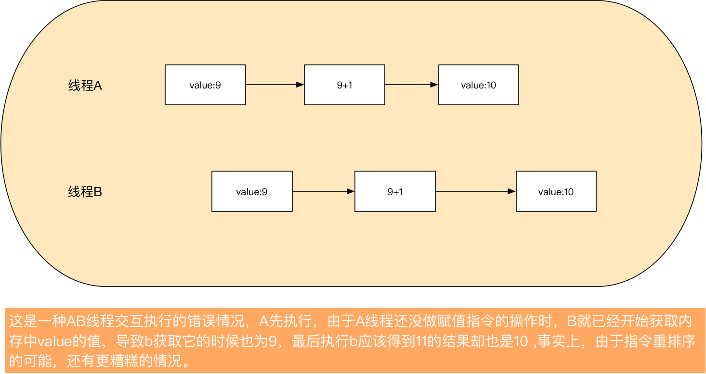

> 本文主要描述一些关于并发、多线程的基本概念,从计算机的发展历史讲述并发编程能带来的问题和优点。
>
> 书中大部分参考<<Java并发编程实战>>一书

# 1.并发简史

> 早期计算机中不含操作系统，只能执行一个程序，该程序能访问所有资源。

### 1.1 引入操作系统后的优点

```
1.资源利用率:在某些情况，程序要等待外部某个操作执行完成，在等待的同时，可以执行另外一个程序提高资源利用率。
2.公平性:不同的程序对于计算机资源有同等使用权，高效的通过粗粒的时间分片使用户和程序能共享程序资源，而不是由一个程序从头到尾，再执行另外的程序。
3.便利性，在计算多个任务时，编写多个程序执行不同任务比所有任务在一个程序里更容易实现。
```


# 2.线程

### 2.1 背景

> 早期的系统中，每个进程相当于一个冯诺依曼计算机，根据及其语言的语义串行执行命令。

事实上，一件事可以细化成很多事，比如说烧水等谁开的时候看电视，这里等水开的过程就包含一定的异步性，好比程序能够在串行性和异步性找到合理的平衡。

这些特性促进了进程和线程的出现。

### 线程和进程的区别

了解它们区别之前，需要了解一个事实，那就是cpu的速度实在是太快了。进程和线程都是cpu工作时间段的描述，但是进程的颗粒度更大。

> 科普:主频的单位是MHz和GHz,现在的CPU速度都达到了千兆赫(GHz)，即十亿赫兹（10^9 Hz 1 000 000 000 Hz）。GHz是CPU的处理频率，换言之，即CPU的处理速度。1HZ=1s一次。目前主流的i5级别处理器，每秒的浮点运算速度在数百亿次。更别说i9，e5这样的u[反正很快]

**举个例子**

假设要实现程序A，被分为1，2，3三个模块，具体的执行可能为。程序A得到cpu宠幸，得到时间片，cpu加载A的1小段，然后执行2小段，3小段，最后cpu保存A的上下文。

这里1，2，3共享A的上下文，cpu执行没有上下文切换。这里的123相当于线程，也就是线程共享了进程的上下文环境，是更小的cpu时间段。

```
总结:
1.线程也成轻量级进程，同一个程序中的多个线程可以被调度到多个CPU上运行
2.线程和进程都是一个时间段的描述，是CPU工作时间段的描述，但是颗粒大小不同。
3。线程建立在进程上的一次程序运行单位。而进程虽然包含程序，但它的作用不是去执行程序，而是负责资源分配。线程无法脱离进程而存在。
4.进程就是包换上下文切换的程序执行时间总和 = CPU加载上下文+CPU执行+CPU保存上下文。[现代系统中，一个进程实际可以有多个称为线程的执行单元组成，每个线程运行在进程的上下文中，并共享同样的代码和全局数据。]
5.java线程实现是抢占式，多个线程轮流执行，同一线程一般不会一直占用CPU。
```


### 线程的好处及其带来的风险

> 现代操作系统大都以线程为基本调度单位，由于同一个进程的所有线程都共享进程的内存地址空间，如果没有明确的同步机制，那么一个线程正在使用某个变量(比如改变)，另外一个线程可能同时使用该变量，那么可能导致难以预测的结果。

如果处理得当，线程可以有效的降低程序开发和维护的成本，同时提升复杂程序的性能。

诸如我们平时用的gui程序，也有通过线程提高灵敏度和执行效率。

线程还可以简化JVM，让垃圾收集器在一个或多个专门的线程下执行。事实上在许多重要的java程序中都使用到线程。

> 线程好处总结:
>
> 1.发挥多处理器的强大能力
>
> 如果程序中只有一个线程，那么最多只能在一个处理器上运行，如果是10核处理器，9成资源将无法使用。由于多个线程可以在不同处理器使用，如果合理设计，将提高处理器资源的利用率来提高系统吞吐量。
>
> 2.建模简单性
>
> 一个分工明确的团队比共同做杂七杂八事情的团队做事更有效率，如果完成多种任务，分工不明确的团队需管理不同任务之间的优先级和执行时间，还要来回切换做不同事，而且不同人擅长的领域也有限。
>
> 对于软件来说也是如此，程序中只包含一种类型的任务，比包含多种不同类型任务的程序更容易编写，测试。
>
> 如果为每个任务都分配一个专门的线程，那么就有一种串行的假象。
>
> **通过线程可以将复杂的工作流进一步分解为一组简单并同步的工作流，每个工作流在一个单独的线程中执行并在特定的同步位置做交互**。比如传菜的不需要掌握炒菜的技能，对程序而言，这样更容易简化组件开发，学习一门独立框架等。
>
> 3.异步事件的简化处理
>
> 服务器应用程序在接受多个远程客户端的请求时，如果为每个链接分配各自的线程并且使用同步I/O，将降低程序的开发难度。
>
> 早期单线程程序如果在I/O的过程中阻塞，容易中断请求，这个时候需要使用非阻塞的I/O,但是这种I/O的实现复杂度远远高于同步I/O，并且容易出错。
>
> 然而如果使用多线程，每个请求有各自的处理线程，这样在处理一个阻塞的请求不会影响到其它线程。
>
> 虽然非阻塞I/O也有自己的优势，但是随着现在的操作系统线程数量有了很大的提升，需要使用非阻塞I/O的情况变得更少。
>
> 4.响应更为灵敏的用户界面
>
> 早期的gui程序大都是单线程，容易因为一些操作导致卡顿，多线程的gui程序可以专门把不同的任务放到不同线程中，比如一个运行时间长的任务单独放在一个线程，这样不会影响其它线程，可以在这期间做不同操作提高灵敏度。


### 使用线程的风险

```
java对线程的支持是双刃剑，我们平时说的并发一般指的就是多线程，不合理的使用容易造成难以预知的风险。
```

#### 1.安全性问题

在没有充足同步的情况，多线程的操作执行顺序是不可预测的，甚至会产生奇怪的结果。

例如

```java
public class test {
  private int value;
  
  public int getNext() { //使用synchronize可做同步操作
    return value++;
  }
}
```

该程序单线程下无任何问题，多线程下可能会有如下情况。

```
++的操作看似单个操作，但如果通过javap -verbose test可以看到其实是包含3个操作[指令]
细化一下就是  1.读取value 2.加1 3.赋值
```

假设两个线程A,B执行这段代码，这个时候value在内存中的数据为9。

A读取value为9，做9+1的操作，但并没有执行到第三步赋值的操作，这个时候A的时间片用完了。到B执行




上图是很基本且常见的一个并发安全问题，【两个线程争cpu】也称为竞态条件。

由于多个线程共享内存空间且并发运行，这可以很容易的实现数据共享，同时也有并发安全问题，如图上的修改操作，而这种串行行为有时候很难分析，必须对共享变量的访问操作协同执行，避免不同线程之间干扰。

```
java提供了各种同步机制来协同这种访问。
如果没有同步,例如寄存器或者处理器进行缓存，这些缓存的变量对其它线程是不可见的，将带来风险。
```

> 开发人员需要做的事:在开发的过程中找到数据在哪些位置被多个线程共享，合理利用好jvm的同步机制，这样才能做优化措辞不破坏线程安全性。


### 2.活跃性问题

```
一个并发应用程序能及时执行的能力称为活跃性
```

安全性的侧重与不要发生糟糕的事，而活跃性侧重于希望正确的事最终会发生。当某个操作无法继续，即可能出现活跃性问题。比如说串行程序无意间造成无限循环【比如jdk1.7的hashmap多线程下做put操作可能造成闭环链表循环】，再比如说线程A等待线程B释放锁资源，可是B一直不释放，那么A只能一直等下去。

> 常见的活跃性问题:死锁、活锁、饥饿

#### 2.1 死锁

> 摘自百度百科:死锁是指两个或两个以上的进程在执行过程中，由于竞争资源或者由于彼此通信而造成的一种阻塞的现象，若无外力作用，它们都将无法推进下去。此时称系统处于死锁状态或系统产生了死锁，这些永远在互相等待的进程称为死锁进程。

死锁就相当于两个人在过独木桥，谁也不让谁，最后只能一直等待对方。

> 开发人员需要做的事: 尽量避免阻塞、死锁这样的情况。


### 死锁

https://www.cnblogs.com/bopo/p/9228834.html

两个线程或两个以上线程因为竞争资源相互等待，没有外力作用无限等待的情况，处于僵局，称为死锁

永远等待的线程称为:死锁线程

##### 死锁-必要条件[如果死锁一定有以下情况，如果有一个不满足就一定不会发生死锁]

```
1.互斥条件：一个资源每次只能被一个进程使用，即在一段时间内某 资源仅为一个进程所占有。此时若有其他进程请求该资源，则请求进程只能等待。
2.请求和保持条件：进程已经保持了至少一个资源，但又提出了新的资源请求，而该资源 已被其他进程占有，此时请求进程被阻塞，但对自己已获得的资源保持不放
3.不可剥夺条件：进程所获得的资源在未使用完毕之前，不能被其他进程强行夺走，即只能由获得该资源的进程自己来释放（只能是主动释放)
4.环路等待条件【循环等待条件】：在发生死锁时，必然存在一个进程--资源的环形链。
```

##### 如何检测死锁

```
1.jconsole可视化界面
2.jstack -l 进程号 如果有死锁会出现类似Found 1 deadlock
```

##### 避免死锁

```
2.添加时限 超过一定时限释放
```

##### 预防死锁

四大必要条件中，除了资源互斥是固有特性难以改变

```
1.破坏不可剥夺
2.破坏请求和保持条件
3.破坏循环等待条件
按照资源特性给资源从小到大编号，进程按从小到大申请资源，且规定进程占用的资源号小于申请的资源号
https://blog.csdn.net/hustwht/article/details/52146270
例如:
在一个圆餐桌上有5份通心粉，间隔放有5把叉子，5个哲学家各自坐在一盘通心粉前。哲学家思考时，他们不作任何动作。当他们饥饿的时候，必须同时手拿两把叉子才能吃到通心粉，而且只能取得自己左手边和右手边的叉子。吃完后，叉子放回。
我们可以把五个哲学家比喻成五个进程，五把叉子就是五种资源。当哲学家们吃东西的时间相继发生时，那么每个人都可以吃到通心粉，但是若他们同时感到饥饿，并同时拿起手边的一把叉子，那么有可能五个人都因无法再取得一把叉子而永远吃不到通心粉，这就是“死锁”问题。那么我们如何运用“破坏循环等待”法来解决它呢？
我们可以给五把叉子依次编号为0~4，规定哲学家必须先拿小号叉子，再拿大号叉子，若小号叉子被占用，他就进入阻塞态。这样的话，即使五个哲学家同时伸出左手，那么第4号哲学家应该先拿0号叉子，但是0号叉子被第一个哲学家所占据，所以，4号哲学家就会因无法占有0号叉子从而无法申请4号叉子，进入了阻塞态。那么拿3号叉子的哲学家可以申请拿4号叉子，从而先吃完通心粉，释放其占据的叉子，唤醒其他哲学家进程，以此类推，大家都可以吃完通心粉。问题得到解决~
```


### 3.性能问题

性能问题和活跃性问题密切相关，活跃性希望最终正确的发生，但是可能还不够好，比如服务时间过长、响应不灵敏、资源消耗过高等性能问题。

```
多线程的主要目的是提高程序的运行性能，可以更好的利用或者说压榨计算机资源【为了性能这是不得不忍受多线程复杂性的原因】，多线程是可以提高程序性能，但也总会带来某些程度的开销【比如说线程之间的协调(加锁、触发信号、内存同步等)、上下文切换、线程创建和销毁、线程调度】。一个设计不好的并发程序可能性能比单线程的串行程序还差。
```

> 比如线程调度器临时挂起活跃线程而运行另外一个线程时，就会出现频繁的上下文切换的操作，而这种操作又将带来很大的开销，让cpu将很多时间发在线程调度而不是线程运行上。
>
> 再比如多线程共享数据时，往往要用到同步机制来防止一系列问题【如上述多线程++运算，指令重排序等】，但是这些机制往往会抑制某些编译器优化，使内存缓冲区中数据无效，以及增加共享内存总栈的同步流量，这些种种因素都可能带来性能问题。

> 开发人员需要做的事: 尽量写高性能的代码，比如减少锁的竞争，缩小锁的范围【快进快出】,避免锁所持时间过长。


### 3.1 同步机制与线程安全

要编写线程安全的代码，其核心是要对状态访问操作进行管理，特别是共享和可变状态的访问。

```
共享:变量可以被多个线程同时访问
可变:对象生命周期内可以发生变化
```

一个`对象`是否需要线程安全，取决于是否被多个线程访问，而不是对象要实现什么功能。

要使得对象线程安全，需要使用`同步机制`协同对象可变状态的访问。否则将会出现"预期之外的结果"。

多个线程没用合理的同步机制可能引发一系列问题，以下三种方式可以避免。

```
1.合理的在访问变量时使用同步。[通过synchronized、volatile、lock]
2.不在线程之间共享该状态变量。[线程封闭]
3.将状态变量改为不可变的变量。[使用不可变变量 如string]
```


### java内存模型与并发编程

规范了java虚拟机和计算机内存是如何协同工作

规范了线程如何和何时可以看到由其它线程修改过后的共享变量的值

规范了并发时如何同步的访问共享变量


### 重排序

java内存模型中，允许编译器和处理器对指令进行重排序，重排序不会影响单线程但是可能会影响多线程。

先天性。不需要操作保证有序性

> 在JMM中，如果一个操作执行的结果需要对另一个操作可见，那么这两个操作之间必须存在happens-before关系。
>
> happens-before原则非常重要，它是判断数据是否存在竞争、线程是否安全的主要依据

八大原则

```
--前四条重要
1.程序次序规则，按照代码顺序执行，虽然重排序但是结果一致
2.锁定规则:一个unlock操作先行对同一个锁的lock状态[锁定状态下]
3.volatile变量规则，对一个变量的写操作先行发生于后面对这个变量的读操作
4.传递规则，如果操作A先行B，B先行与C则操作A先行与操作C
5.线程启动规则:Thread对象的start先行与线程的任一动作
6.线程中断规则:对线程的interrput()方法的调用先行发生被中断线程代码检测到中断事件的发生[需先设置标识]
7.线程终结规则:线程中所有操作都先行发生于线程的终止检测、可以通过Thread.join()方法结束，Thread.isAlive()检测线程是否已终止
8.对象终结规则:一个对象的初始化完成先行发生于它finalize方法的开始
```

如果两个线程的操作的执行顺序无法从happens-before推导出来，那么就不能保证有序性，虚拟机就可以随意的进行重排序。


## 总结

要编写正确的并发程序，关键是在于在访问共享的可变状态时需要进行正确的管理,


