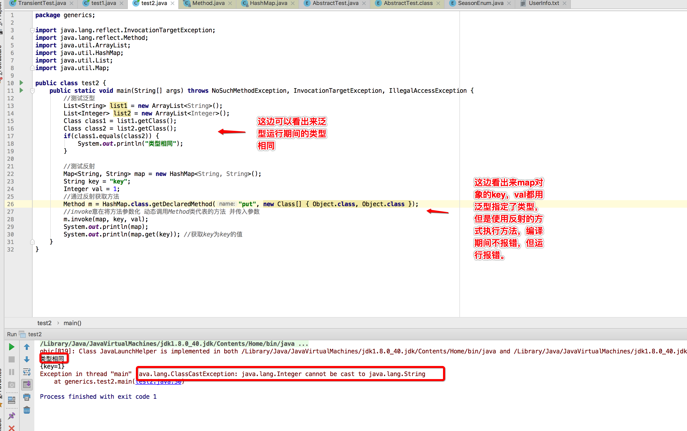

## 1 CPU和内存的交互

了解jvm内存模型前，了解下cpu和计算机内存的交互情况。【因为Java虚拟机内存模型定义的访问操作与计算机十分相似】

有篇很棒的文章，从cpu讲到内存模型:[什么是java内存模型](https://www.jianshu.com/p/bf158fbb2432)

------

在计算机中，cpu和内存的交互最为频繁，相比内存，磁盘读写太慢，内存相当于高速的缓冲区。

但是随着cpu的发展，内存的读写速度也远远赶不上cpu。因此cpu厂商在每颗cpu上加上高速缓存，用于缓解这种情况。现在cpu和内存的交互大致如下。


cpu上加入了高速缓存这样做解决了处理器和内存的矛盾(一快一慢)，但是引来的新的问题 - **缓存一致性**

在多核cpu中，每个处理器都有各自的高速缓存(L1,L2,L3)，而主内存确只有一个 。
以我的pc为例,因为cpu成本高，缓存区一般也很小。


```
CPU要读取一个数据时，首先从一级缓存中查找，如果没有找到再从二级缓存中查找，如果还是没有就从三级缓存或内存中查找，每个cpu有且只有一套自己的缓存。
```

> 如何保证多个处理器运算涉及到同一个内存区域时，多线程场景下会存在缓存一致性问题，那么运行时保证数据一致性？
>
> 为了解决这个问题，各个处理器需遵循一些协议保证一致性。【如MSI，MESI啥啥的协议。。】

大概如下


在CPU层面，内存屏障提供了个充分必要条件

### 1.1.1 内存屏障(Memory Barrier)

CPU中，每个CPU又有多级缓存【上图统一定义为高速缓存】，一般分为L1,L2,L3，因为这些缓存的出现，提高了数据访问性能，避免每次都向内存索取，但是弊端也很明显，不能实时的和内存发生信息交换，分**在不同CPU执行的不同线程对同一个变量的缓存值不同。**

- 硬件层的内存屏障分为两种：`Load Barrier` 和 `Store Barrier`即读屏障和写屏障。【内存屏障是硬件层的】

##### 为什么需要内存屏障

```
由于现代操作系统都是多处理器操作系统，每个处理器都会有自己的缓存，可能存再不同处理器缓存不一致的问题，而且由于操作系统可能存在重排序，导致读取到错误的数据，因此，操作系统提供了一些内存屏障以解决这种问题.
简单来说:
1.在不同CPU执行的不同线程对同一个变量的缓存值不同，为了解决这个问题。
2.用volatile可以解决上面的问题，不同硬件对内存屏障的实现方式不一样。java屏蔽掉这些差异，通过jvm生成内存屏障的指令。
对于读屏障:在指令前插入读屏障，可以让高速缓存中的数据失效，强制从主内存取。
```

##### 内存屏障的作用

```
cpu执行指令可能是无序的，它有两个比较重要的作用
1.阻止屏障两侧指令重排序
2.强制把写缓冲区/高速缓存中的脏数据等写回主内存，让缓存中相应的数据失效。
```

#### volatile型变量

当我们声明某个变量为volatile修饰时，这个变量就有了线程可见性，volatile通过在读写操作前后添加内存屏障。

用代码可以这么理解

```java
//相当于读写时加锁，保证及时可见性，并发时不被随意修改。
public class SynchronizedInteger {
  private long value;

  public synchronized int get() {
    return value;
  }

  public synchronized void set(long value) {
    this.value = value;
  }
}
```

volatile型变量拥有如下特性

```
可见性，对于一个该变量的读，一定能看到读之前最后的写入。
防止指令重排序，执行代码时,为了提高执行效率,会在不影响最后结果的前提下对指令进行重新排序,使用volatile可以防止，比如单例模式双重校验锁的创建中有使用到，如(https://www.jianshu.com/p/b30a4d568be4)

注意的是volatile不具有原子性，如volatile++这样的复合操作,这里感谢大家的指正。

```

至于volatile底层是怎么实现保证不同线程可见性的，这里涉及到的就是硬件上的，被volatile修饰的变量在进行写操作时，会生成一个特殊的汇编指令，该指令会触发mesi协议，会存在一个总线嗅探机制的东西，简单来说就是这个cpu会不停检测总线中该变量的变化，如果该变量一旦变化了，由于这个嗅探机制，其它cpu会立马将该变量的cpu缓存数据清空掉，重新的去从主内存拿到这个数据。简单画了个图。


##  2. Java内存区域

> 前提:本文讲的基本都是以Sun HotSpot虚拟机为基础的，Oracle收购了Sun后目前得到了两个【Sun的HotSpot和JRockit(以后可能合并这两个),还有一个是IBM的IBMJVM】

之所以扯了那么多计算机内存模型，是因为java内存模型的设定符合了计算机的规范。

**Java程序内存的分配是在JVM虚拟机内存分配机制下完成**。

**Java内存模型（Java Memory Model ,JMM）就是一种符合内存模型规范的，屏蔽了各种硬件和操作系统的访问差异的，保证了Java程序在各种平台下对内存的访问都能保证效果一致的机制及规范。**

> 简要言之，jmm是jvm的一种规范，定义了jvm的内存模型。它屏蔽了各种硬件和操作系统的访问差异，不像c那样直接访问硬件内存，相对安全很多，它的主要目的是解决由于多线程通过共享内存进行通信时，存在的本地内存数据不一致、编译器会对代码指令重排序、处理器会对代码乱序执行等带来的问题。可以保证并发编程场景中的原子性、可见性和有序性。

从下面这张图可以看出来，Java数据区域分为五大数据区域。这些区域各有各的用途，创建及销毁时间。

```
其中方法区和堆是所有线程共享的，栈，本地方法栈和程序虚拟机则为线程私有的。
```

根据java虚拟机规范，java虚拟机管理的内存将分为下面五大区域。


### 2.1 五大内存区域

####  2.1.1 程序计数器

```
程序计数器是一块很小的内存空间，它是线程私有的，可以认作为当前线程的行号指示器。
```

**为什么需要程序计数器**

> 我们知道对于一个处理器(如果是多核cpu那就是一核)，在一个确定的时刻都只会执行一条线程中的指令，一条线程中有多个指令，为了线程切换可以恢复到正确执行位置，每个线程都需有独立的一个程序计数器，不同线程之间的程序计数器互不影响，独立存储。
>
> 注意：如果线程执行的是个java方法，那么计数器记录虚拟机字节码指令的地址。如果为native【底层方法】，那么计数器为空。**这块内存区域是虚拟机规范中唯一没有OutOfMemoryError的区域**。

####  2.1.2 Java栈（虚拟机栈）

同计数器也为线程私有，生命周期与相同，就是我们平时说的栈，**栈描述的是Java方法执行的内存模型**。

**每个方法被执行的时候都会创建一个栈帧用于存储局部变量表，操作栈，动态链接，方法出口等信息。每一个方法被调用的过程就对应一个栈帧在虚拟机栈中从入栈到出栈的过程。【栈先进后出，下图栈1先进最后出来】**

对于栈帧的解释参考 [Java虚拟机运行时栈帧结构](https://www.cnblogs.com/noKing/p/8167700.html)

```
栈帧: 是用来存储数据和部分过程结果的数据结构。
栈帧的位置:  内存 -> 运行时数据区 -> 某个线程对应的虚拟机栈 -> here[在这里]
栈帧大小确定时间: 编译期确定，不受运行期数据影响。
```

通常有人将java内存区分为栈和堆，实际上java内存比这复杂，这么区分可能是因为我们最关注，与对象内存分配关系最密切的是这两个。

**平时说的栈一般指局部变量表部分。**

> 局部变量表:一片连续的内存空间，用来存放方法参数，以及方法内定义的局部变量，存放着编译期间已知的数据类型(八大基本类型和对象引用(reference类型),returnAddress类型。它的最小的局部变量表空间单位为Slot，虚拟机没有指明Slot的大小，但在jvm中，long和double类型数据明确规定为64位，这两个类型占2个Slot，其它基本类型固定占用1个Slot。
>
> reference类型:与基本类型不同的是它不等同本身，即使是String，内部也是char数组组成，它可能是指向一个对象起始位置指针，也可能指向一个代表对象的句柄或其他与该对象有关的位置。
>
> returnAddress类型:指向一条字节码指令的地址【深入理解Java虚拟机】[怎么理解returnAddress](https://www.zhihu.com/question/29056872)


**需要注意的是，局部变量表所需要的内存空间在编译期完成分配，当进入一个方法时，这个方法在栈中需要分配多大的局部变量空间是完全确定的，在方法运行期间不会改变局部变量表大小。**

> Java虚拟机栈可能出现两种类型的异常：
>
> 1. 线程请求的栈深度大于虚拟机允许的栈深度，将抛出StackOverflowError。
> 2. 虚拟机栈空间可以动态扩展，当动态扩展是无法申请到足够的空间时，抛出OutOfMemory异常。


####  2.1.3 本地方法栈

本地方法栈是与虚拟机栈发挥的作用十分相似,区别是虚拟机栈执行的是Java方法(也就是字节码)服务，而本地方法栈则为虚拟机使用到的native方法服务，可能底层调用的c或者c++,我们打开jdk安装目录可以看到也有很多用c编写的文件，可能就是native方法所调用的c代码。


#### 2.1.4 堆

对于大多数应用来说，**堆是java虚拟机管理内存最大的一块内存区域，因为堆存放的对象是线程共享的，所以多线程的时候也需要同步机制**。因此需要重点了解下。

java虚拟机规范对这块的描述是:所有对象实例及数组都要在堆上分配内存，但随着JIT编译器的发展和逃逸分析技术的成熟，这个说法也不是那么绝对，但是大多数情况都是这样的。

jit编译器做的相关优化 可能参考美团技术团队的一篇博客 [基本功 | Java即时编译器原理解析及实践](https://tech.meituan.com/2020/10/22/java-jit-practice-in-meituan.html)


> 即时编译器:可以把把Java的字节码，包括需要被解释的指令的程序）转换成可以直接发送给处理器的指令的程序)
>
> 逃逸分析:通过逃逸分析来决定某些实例或者变量是否要在堆中进行分配，如果开启了逃逸分析，即可将这些变量直接在栈上进行分配，而非堆上进行分配。这些变量的指针可以被全局所引用，或者其其它线程所引用。
>
> [参考逃逸分析](https://www.jianshu.com/p/20bd2e9b1f03)


> 注意:它是所有线程共享的，它的目的是存放对象实例。同时它也是GC所管理的主要区域，因此常被称为GC堆，又由于现在收集器常使用分代算法，Java堆中还可以细分为新生代和老年代，再细致点还有Eden(伊甸园)空间之类的不做深究。
>
> 根据虚拟机规范，Java堆可以存在物理上不连续的内存空间，就像磁盘空间只要逻辑是连续的即可。它的内存大小可以设为固定大小，也可以扩展。
>
> 当前主流的虚拟机如HotPot都能按扩展实现(通过设置 -Xmx和-Xms)，如果堆中没有内存内存完成实例分配，而且堆无法扩展将报OOM错误(OutOfMemoryError)


#### 2.1.5 方法区

方法区同堆一样，是所有线程共享的内存区域，为了区分堆，又被称为非堆。

用于存储已被虚拟机加载的类信息、常量、静态变量，如static修饰的变量加载类的时候就被加载到方法区中。

> 运行时常量池
>
> 是方法区的一部分，class文件除了有类的字段、接口、方法等描述信息之外，还有常量池用于存放编译期间生成的各种字面量和符号引用。

在老版jdk，方法区也被称为永久代【因为没有强制要求方法区必须实现垃圾回收，HotSpot虚拟机以永久代来实现方法区，从而JVM的垃圾收集器可以像管理堆区一样管理这部分区域，从而不需要专门为这部分设计垃圾回收机制。不过自从JDK7之后，Hotspot虚拟机便将运行时常量池从永久代移除了。】

```
jdk1.7开始逐步去永久代。从String.interns()方法可以看出来
String.interns()
native方法:作用是如果字符串常量池已经包含一个等于这个String对象的字符串，则返回代表池中的这个字符串的String对象，在jdk1.6及以前常量池分配在永久代中。可通过 -XX:PermSize和-XX:MaxPermSize限制方法区大小。
```

```java
public class StringIntern {
    //运行如下代码探究运行时常量池的位置
    public static void main(String[] args) throws Throwable {
        //用list保持着引用 防止full gc回收常量池
        List<String> list = new ArrayList<String>();
        int i = 0;
        while(true){
            list.add(String.valueOf(i++).intern());
        }
    }
}
//如果在jdk1.6环境下运行 同时限制方法区大小 将报OOM后面跟着PermGen space说明方法区OOM，即常量池在永久代
//如果是jdk1.7或1.8环境下运行 同时限制堆的大小  将报heap space 即常量池在堆中
```

[idea设置相关内存大小设置](https://www.cnblogs.com/yingsong/p/5896207.html)

这边不用全局的方式，设置main方法的vm参数。

做相关设置，比如说这边设定堆大小。（-Xmx5m -Xms5m -XX:-UseGCOverheadLimit）

```
这边如果不设置UseGCOverheadLimit将报java.lang.OutOfMemoryError: GC overhead limit exceeded，
这个错是因为GC占用了多余98%（默认值）的CPU时间却只回收了少于2%（默认值）的堆空间。目的是为了让应用终止，给开发者机会去诊断问题。一般是应用程序在有限的内存上创建了大量的临时对象或者弱引用对象，从而导致该异常。虽然加大内存可以暂时解决这个问题，但是还是强烈建议去优化代码，后者更加有效，也可通过UseGCOverheadLimit避免[不推荐，这里是因为测试用，并不能解决根本问题]
```


**jdk8真正开始废弃永久代，而使用元空间(Metaspace)**


> java虚拟机对方法区比较宽松，除了跟堆一样可以不存在连续的内存空间，定义空间和可扩展空间，还可以选择不实现垃圾收集。


#### 2.2 对象的内存布局

在HotSpot虚拟机中。对象在内存中存储的布局分为

```
1.对象头
2.实例数据
3.对齐填充
```

##### 2.2.1 对象头【markword】

在32位系统下，对象头8字节，64位则是16个字节【未开启压缩指针，开启后12字节】。

```
markword很像网络协议报文头，划分为多个区间，并且会根据对象的状态复用自己的存储空间。
为什么这么做:省空间，对象需要存储的数据很多，32bit/64bit是不够的，它被设计成非固定的数据结构以便在极小的空间存储更多的信息，
```

```
假设当前为32bit，在对象未被锁定情况下。25bit为存储对象的哈希码、4bit用于存储分代年龄，2bit用于存储锁标志位，1bit固定为0。
```

不同状态下存放数据


这其中锁标识位需要特别关注下。**锁标志位与是否为偏向锁对应到唯一的锁状态**。

锁的状态分为四种`无锁状态`、`偏向锁`、`轻量级锁`和`重量级锁`

不同状态时对象头的区间含义，如图所示。


HotSpot底层通过markOop实现Mark Word，具体实现位于`markOop.hpp`文件。

```
markOop中提供了大量方法用于查看当前对象头的状态，以及更新对象头的数据，为synchronized锁的实现提供了基础。[比如说我们知道synchronized锁的是对象而不是代码，而锁的状态保存在对象头中，进而实现锁住对象]。
```

关于对象头和锁之间的转换，网上大神总结


##### 2.2.2 实例数据

```
存放对象程序中各种类型的字段类型，不管是从父类中继承下来的还是在子类中定义的。
分配策略:相同宽度的字段总是放在一起，比如double和long
```

##### 2.2.3 对齐填充

这部分没有特殊的含义，仅仅起到占位符的作用满足JVM要求。

```
由于HotSpot规定对象的大小必须是8的整数倍，对象头刚好是整数倍，如果实例数据不是的话，就需要占位符对齐填充。
```

#### 2.3 对象的访问定位

java程序需要通过引用(ref)数据来操作堆上面的对象，那么如何通过引用定位、访问到对象的具体位置。

```
对象的访问方式由虚拟机决定，java虚拟机提供两种主流的方式
1.句柄访问对象
2.直接指针访问对象。(Sun HotSpot使用这种方式)
```

参考[Java对象访问定位](https://blog.csdn.net/u011080472/article/details/51321769)

##### 2.3.1 句柄访问

> 简单来说就是java堆划出一块内存作为句柄池,引用中存储对象的句柄地址,句柄中包含对象实例数据、类型数据的地址信息。
>
> ##### 优点:引用中存储的是稳定的句柄地址,在对象被移动【垃圾收集时移动对象是常态】只需改变句柄中实例数据的指针，不需要改动引用【ref】本身。


##### 2.3.2 直接指针

> 与句柄访问不同的是，ref中直接存储的就是对象的实例数据,但是类型数据跟句柄访问方式一样。
>
> 优点:优势很明显，就是速度快，**相比于句柄访问少了一次指针定位的开销时间**。【可能是出于Java中对象的访问时十分频繁的,平时我们常用的JVM HotSpot采用此种方式】


## 3.内存溢出

```
两种内存溢出异常[注意内存溢出是error级别的]
1.StackOverFlowError:当请求的栈深度大于虚拟机所允许的最大深度
2.OutOfMemoryError:虚拟机在扩展栈时无法申请到足够的内存空间[一般都能设置扩大]
```

java -verbose:class -version 可以查看刚开始加载的类，可以发现这两个类并不是异常出现的时候才去加载，而是jvm启动的时候就已经加载。这么做的原因是在vm启动过程中我们把类加载起来，并创建几个没有堆栈的对象缓存起来，只需要设置下不同的提示信息即可，当需要抛出特定类型的OutOfMemoryError异常的时候，就直接拿出缓存里的这几个对象就可以了。

比如说OutOfMemoryError对象，jvm预留出4个对象【固定常量】，这就为什么最多出现4次有堆栈的OutOfMemoryError异常及大部分情况下都将看到没有堆栈的OutOfMemoryError对象的原因。

[参考OutOfMemoryError解读](http://lovestblog.cn/blog/2016/08/29/oom/)


两个基本的例子

```java
public class MemErrorTest {
    public static void main(String[] args) {
        try {
            List<Object> list = new ArrayList<Object>();
            for(;;) {
                list.add(new Object()); //创建对象速度可能高于jvm回收速度
            }
        } catch (OutOfMemoryError e) {
            e.printStackTrace();
        }

        try {
            hi();//递归造成StackOverflowError 这边因为每运行一个方法将创建一个栈帧，栈帧创建太多无法继续申请到内存扩展
        } catch (StackOverflowError e) {
            e.printStackTrace();
        }

    }

    public static void hi() {
        hi();
    }
}
```


## 4.GC简介

> GC(Garbage Collection)：即垃圾回收器，诞生于1960年MIT的Lisp语言，主要是用来回收，释放垃圾占用的空间。

------

java GC泛指java的垃圾回收机制，该机制是java与C/C++的主要区别之一，我们在日常写java代码的时候，一般都不需要编写内存回收或者垃圾清理的代码，也不需要像C/C++那样做类似/free的操作。


##  4.1.为什么需要学习GC

> 对象的内存分配在java虚拟机的自动内存分配机制下，一般不容易出现内存泄漏问题。但是写代码难免会遇到一些特殊情况，比如OOM神马的。。尽管虚拟机内存的动态分配与内存回收技术很成熟，可万一出现了这样那样的内存溢出问题，那么将难以定位错误的原因所在。

对于本人来说，由于水平有限，而且作为小开发，并没必要深入到GC的底层实现，但至少想要说学会看懂gc及定位一些内存泄漏问题。

从三个角度切入来学习GC

> 1.哪些内存要回收
>
> 2.什么时候回收
>
> 3.怎么回收

哪些内存要回收

> java内存模型中分为五大区域已经有所了解。我们知道`程序计数器`、`虚拟机栈`、`本地方法栈`，由线程而生，随线程而灭，其中栈中的栈帧随着方法的进入顺序的执行的入栈和出栈的操作，一个栈帧需要分配多少内存取决于具体的虚拟机实现并且在编译期间即确定下来【忽略JIT编译器做的优化，基本当成编译期间可知】，当方法或线程执行完毕后，内存就随着回收，因此无需关心。
>
> 而`Java堆`、`方法区`则不一样。方法区存放着类加载信息，但是一个接口中多个实现类需要的内存可能不太一样，一个方法中多个分支需要的内存也可能不一样【只有在运行期间才可知道这个方法创建了哪些对象没需要多少内存】，这部分内存的分配和回收都是动态的，gc关注的也正是这部分的内存。

```
Java堆是GC回收的“重点区域”。堆中基本存放着所有对象实例，gc进行回收前，第一件事就是确认哪些对象存活，哪些死去[即不可能再被引用]
```


## 4.2 堆的回收区域

```
为了高效的回收，jvm将堆分为三个区域
1.新生代（Young Generation）NewSize和MaxNewSize分别可以控制年轻代的初始大小和最大的大小
2.老年代（Old Generation）
3.永久代（Permanent Generation）【1.8以后采用元空间，就不在堆中了】
```

[GC为什么要分代-R大的回答](https://www.zhihu.com/question/53613423/answer/135743258)

[关于元空间](http://lovestblog.cn/blog/2016/10/29/metaspace/)

## 5 判断对象是否存活算法

```
1.引用计数算法
早期判断对象是否存活大多都是以这种算法，这种算法判断很简单，简单来说就是给对象添加一个引用计数器，每当对象被引用一次就加1，引用失效时就减1。当为0的时候就判断对象不会再被引用。
优点:实现简单效率高，被广泛使用与如python何游戏脚本语言上。
缺点:难以解决循环引用的问题，就是假如两个对象互相引用已经不会再被其它其它引用，导致一直不会为0就无法进行回收。

2.可达性分析算法
目前主流的商用语言[如java、c#]采用的是可达性分析算法判断对象是否存活。这个算法有效解决了循环利用的弊端。
它的基本思路是通过一个称为“GC Roots”的对象为起始点，搜索所经过的路径称为引用链，当一个对象到GC Roots没有任何引用跟它连接则证明对象是不可用的。
```


可作为GC Roots的对象有四种

```
①虚拟机栈(栈桢中的本地变量表)中的引用的对象，就是平时所指的java对象，存放在堆中。
②方法区中的类静态属性引用的对象，一般指被static修饰引用的对象，加载类的时候就加载到内存中。
③方法区中的常量引用的对象,
④本地方法栈中JNI（native方法)引用的对象
```

即使可达性算法中不可达的对象，也不是一定要马上被回收，还有可能被抢救一下。网上例子很多，基本上和深入理解JVM一书讲的一样[对象的生存还是死亡](https://blog.csdn.net/lwang_IT/article/details/78650168)

```
要真正宣告对象死亡需经过两个过程。
1.可达性分析后没有发现引用链
2.查看对象是否有finalize方法，如果有重写且在方法内完成自救[比如再建立引用]，还是可以抢救一下，注意这边一个类的finalize只执行一次，这就会出现一样的代码第一次自救成功第二次失败的情况。[如果类重写finalize且还没调用过，会将这个对象放到一个叫做F-Queue的序列里，这边finalize不承诺一定会执行，这么做是因为如果里面死循环的话可能会时F-Queue队列处于等待，严重会导致内存崩溃，这是我们不希望看到的。]
```

[HotSpot虚拟机如何实现可达性算法](https://www.cnblogs.com/onlinemf/p/7044953.html)

## 5 垃圾收集算法

> jvm中，可达性分析算法帮我们解决了哪些对象可以回收的问题，垃圾收集算法则关心怎么回收。

### 5.1 三大垃圾收集算法

```
1.标记/清除算法【最基础】
2.复制算法
3.标记/整理算法
jvm采用`分代收集算法`对不同区域采用不同的回收算法。
```

[参考GC算法深度解析](https://www.cnblogs.com/fangfuhai/p/7203468.html?utm_source=itdadao&utm_medium=referral)

**新生代采用复制算法**

新生代中因为对象都是"朝生夕死的"，【深入理解JVM虚拟机上说98%的对象,不知道是不是这么多，总之就是存活率很低】，适用于复制算法【复制算法比较适合用于存活率低的内存区域】。它优化了标记/清除算法的效率和内存碎片问题，且JVM不以5:5分配内存【由于存活率低，不需要复制保留那么大的区域造成空间上的浪费，因此不需要按1:1【原有区域:保留空间】划分内存区域，而是将内存分为一块Eden空间和From Survivor、To Survivor【保留空间】，三者默认比例为8:1:1，优先使用Eden区，若Eden区满，则将对象复制到第二块内存区上。但是不能保证每次回收都只有不多于10%的对象存货，所以Survivor区不够的话，则会依赖老年代年存进行分配】。

GC开始时，对象只会存于Eden和From Survivor区域，To Survivor【保留空间】为空。

GC进行时，Eden区所有存活的对象都被复制到To Survivor区，而From Survivor区中，仍存活的对象会根据它们的年龄值决定去向，年龄值达到年龄阈值(默认15是因为对象头中年龄战4bit，新生代每熬过一次垃圾回收，年龄+1)，则移到老年代，没有达到则复制到To Survivor。

**老年代采用`标记/清除算法`或`标记/整理算法`**

由于老年代存活率高，没有额外空间给他做担保，必须使用这两种算法。

### 5.2 枚举根节点算法

`GC Roots` 被虚拟机用来判断对象是否存活

> 可作为GC Roos的节点主要是在一些全局引用【如常量或静态属性】、执行上下文【如栈帧中本地变量表】中。那么如何在这么多全局变量和本地变量表找到【枚举】根节点将是个问题。

可达性分析算法需考虑

1.如果方法区几百兆，一个个检查里面的引用，将耗费大量资源。

2.在分析时，需保证这个对象引用关系不再变化，否则结果将不准确。【因此GC进行时需停掉其它所有java执行线程(Sun把这种行为称为‘Stop the World’)，即使是号称几乎不会停顿的CMS收集器，枚举根节点时也需停掉线程】

解决办法:实际上当系统停下来后JVM不需要一个个检查引用，而是通过OopMap数据结构【HotSpot的叫法】来标记对象引用。

虚拟机先得知哪些地方存放对象的引用，在类加载完时。HotSpot把对象内什么偏移量什么类型的数据算出来，在jit编译过程中，也会在特定位置记录下栈和寄存器哪些位置是引用，这样GC在扫描时就可以知道这些信息。【目前主流JVM使用准确式GC】


OopMap可以帮助HotSpot快速且准确完成GC Roots枚举以及确定相关信息。但是也存在一个问题，可能导致引用关系变化。

这个时候有个safepoint(安全点)的概念。

HotSpot中GC不是在任意位置都可以进入，而只能在safepoint处进入。 GC时对一个Java线程来说，它要么处在safepoint,要么不在safepoint。

safepoint不能太少，否则GC等待的时间会很久

safepoint不能太多，否则将增加运行GC的负担

安全点主要存放的位置

```
1:循环的末尾 
2:方法临返回前/调用方法的call指令后 
3:可能抛异常的位置
```

参考:[关于安全点safepoint](https://blog.csdn.net/ITer_ZC/article/details/41847887)


## 6.垃圾收集器

```
如果说垃圾回收算法是内存回收的方法论，那么垃圾收集器就是具体实现。jvm会结合针对不同的场景及用户的配置使用不同的收集器。
```

```
年轻代收集器
Serial、ParNew、Parallel Scavenge
老年代收集器
Serial Old、Parallel Old、CMS收集器
特殊收集器
G1收集器[新型，不在年轻、老年代范畴内]
```


### 新生代收集器

### 6.1 Serial

最基本、发展最久的收集器，在jdk3以前是gc收集器的唯一选择，Serial是单线程收集器，Serial收集器只能使用一条线程进行收集工作，在收集的时候必须得停掉其它线程，等待收集工作完成其它线程才可以继续工作。

```
虽然Serial看起来很坑，需停掉别的线程以完成自己的gc工作，但是也不是完全没用的，比如说Serial在运行在Client模式下优于其它收集器[简单高效,不过一般都是用Server模式，64bit的jvm甚至没Client模式]
```

[JVM的Client模式与Server模式](https://www.cnblogs.com/wxw7blog/p/7221756.html)

优点:对于Client模式下的jvm来说是个好的选择。适用于单核CPU【现在基本都是多核了】
缺点:收集时要暂停其它线程，有点浪费资源，多核下显得。


### 6.2 ParNew收集器

可以认为是Serial的升级版，因为它支持多线程[GC线程]，而且收集算法、Stop The World、回收策略和Serial一样，就是可以有多个GC线程并发运行，它是HotSpot第一个真正意义实现并发的收集器。默认开启线程数和当前cpu数量相同【几核就是几个，超线程cpu的话就不清楚了 - -】，如果cpu核数很多不想用那么多，可以通过*-XX:ParallelGCThreads*来控制垃圾收集线程的数量。

```
优点:
1.支持多线程，多核CPU下可以充分的利用CPU资源
2.运行在Server模式下新生代首选的收集器【重点是因为新生代的这几个收集器只有它和Serial可以配合CMS收集器一起使用】

缺点: 在单核下表现不会比Serial好，由于在单核能利用多核的优势，在线程收集过程中可能会出现频繁上下文切换，导致额外的开销。
```


### 6.3 Parallel Scavenge

采用复制算法的收集器，和ParNew一样支持多线程。

但是该收集器重点关心的是吞吐量【吞吐量 = 代码运行时间 / (代码运行时间 + 垃圾收集时间)  如果代码运行100min垃圾收集1min，则为99%】

对于用户界面，适合使用GC停顿时间短,不然因为卡顿导致交互界面卡顿将很影响用户体验。

对于后台

高吞吐量可以高效率的利用cpu尽快完成程序运算任务，适合后台运算

>Parallel Scavenge注重吞吐量，所以也成为"吞吐量优先"收集器。


### 老年代收集器

## 6.4 Serial Old

和新生代的Serial一样为单线程，Serial的老年代版本，不过它采用"标记-整理算法"，这个模式主要是给Client模式下的JVM使用。

如果是Server模式有两大用途

1.jdk5前和Parallel Scavenge搭配使用，jdk5前也只有这个老年代收集器可以和它搭配。

2.作为CMS收集器的后备。


## 6.5 Parallel Old

支持多线程，Parallel Scavenge的老年版本，jdk6开始出现， 采用"标记-整理算法"【老年代的收集器大都采用此算法】

在jdk6以前，新生代的Parallel Scavenge只能和Serial Old配合使用【根据图，没有这个的话只剩Serial Old，而Parallel Scavenge又不能和CMS配合使用】，而且Serial Old为单线程Server模式下会拖后腿【多核cpu下无法充分利用】，这种结合并不能让应用的吞吐量最大化。


> Parallel Old的出现结合Parallel Scavenge，真正的形成“吞吐量优先”的收集器组合。


### 6.6 CMS

CMS收集器(Concurrent Mark Sweep)是以一种获取最短回收停顿时间为目标的收集器。【重视响应，可以带来好的用户体验，被sun称为并发低停顿收集器】

```
启用CMS：-XX:+UseConcMarkSweepGC
```

正如其名，CMS采用的是"标记-清除"(Mark Sweep)算法，而且是支持并发(Concurrent)的

它的运作分为4个阶段

```
1.初始标记:标记一下GC Roots能直接关联到的对象，速度很快
2.并发标记:GC Roots Tarcing过程，即可达性分析
3.重新标记:为了修正因并发标记期间用户程序运作而产生变动的那一部分对象的标记记录，会有些许停顿，时间上一般 初始标记 < 重新标记 < 并发标记
4.并发清除
```

以上初始标记和重新标记需要stw(停掉其它运行java线程)

之所以说CMS的用户体验好，是因为CMS收集器的内存回收工作是可以和用户线程一起并发执行。

总体上CMS是款优秀的收集器，但是它也有些缺点。

> 1.cms堆cpu特别敏感，cms运行线程和应用程序并发执行需要多核cpu，如果cpu核数多的话可以发挥它并发执行的优势，但是cms默认配置启动的时候垃圾线程数为 (cpu数量+3)/4，它的性能很容易受cpu核数影响，当cpu的数目少的时候比如说为为2核，如果这个时候cpu运算压力比较大，还要分一半给cms运作，这可能会很大程度的影响到计算机性能。
>
> 2.cms无法处理浮动垃圾，可能导致Concurrent Mode Failure（并发模式故障）而触发full GC
>
> 3.由于cms是采用"标记-清除“算法,因此就会存在垃圾碎片的问题，为了解决这个问题cms提供了 **-XX:+UseCMSCompactAtFullCollection**选项，这个选项相当于一个开关【默认开启】，用于CMS顶不住要进行full GC时开启内存碎片合并，内存整理的过程是无法并发的，且开启这个选项会影响性能(比如停顿时间变长)

```
浮动垃圾:由于cms支持运行的时候用户线程也在运行，程序运行的时候会产生新的垃圾，这里产生的垃圾就是浮动垃圾，cms无法当次处理，得等下次才可以。
```


###6.7 G1收集器

G1(garbage first:尽可能多收垃圾，避免full gc)收集器是当前最为前沿的收集器之一(1.7以后才开始有)，同cms一样也是关注降低延迟，是用于替代cms功能更为强大的新型收集器，因为它解决了cms产生空间碎片等一系列缺陷。

> 摘自甲骨文:适用于 Java HotSpot VM 的低暂停、服务器风格的分代式垃圾回收器。G1 GC 使用并发和并行阶段实现其目标暂停时间，并保持良好的吞吐量。当 G1 GC 确定有必要进行垃圾回收时，它会先收集存活数据最少的区域（垃圾优先)
>
> g1的特别之处在于它强化了分区，弱化了分代的概念，是区域化、增量式的收集器，它不属于新生代也不属于老年代收集器。
>
> 用到的算法为标记-清理、复制算法

```
jdk1.7,1.8的都是默认关闭的，更高版本的还不知道
开启选项 -XX:+UseG1GC 
比如在tomcat的catania.sh启动参数加上
```

g1是区域化的，它将java堆内存划分为若干个大小相同的区域【region】，jvm可以设置每个region的大小(1-32m,大小得看堆内存大小，必须是2的幂),它会根据当前的堆内存分配合理的region大小。

> [jdk7中计算region的源码](http://hg.openjdk.java.net/jdk7/jdk7/hotspot/file/9b0ca45cd756/src/share/vm/gc_implementation/g1/heapRegion.cpp),这边博主看了下也看不怎么懂，也翻了下openjdk8的看了下关于region的处理似乎不太一样。。

g1通过并发(并行)标记阶段查找老年代存活对象，通过并行复制压缩存活对象【这样可以省出连续空间供大对象使用】。

g1将一组或多组区域中存活对象以增量并行的方式复制到不同区域进行压缩，从而减少堆碎片，目标是尽可能多回收堆空间【垃圾优先】，且尽可能不超出暂停目标以达到低延迟的目的。

g1提供三种垃圾回收模式 young gc、mixed gc 和 full gc,不像其它的收集器，根据区域而不是分代，新生代老年代的对象它都能回收。

几个重要的默认值，更多的查看官方文档[oracle官方g1中文文档](http://www.oracle.com/technetwork/cn/articles/java/g1gc-1984535-zhs.html)

```shell
g1是自适应的回收器，提供了若干个默认值，无需修改就可高效运作
-XX:G1HeapRegionSize=n  设置g1 region大小，不设置的话自己会根据堆大小算，目标是根据最小堆内存划分2048个区域
-XX:MaxGCPauseMillis=200 最大停顿时间 默认200毫秒
```


## 7 Minor GC、Major GC、FULL GC、mixed gc

### 7.1 Minor GC

> 在年轻代`Young space`(包括Eden区和Survivor区)中的垃圾回收称之为 Minor GC,Minor GC只会清理年轻代.


### 7.2 Major GC

> Major GC清理老年代(old GC)，但是通常也可以指和Full GC是等价，因为收集老年代的时候往往也会伴随着升级年轻代，收集整个Java堆。所以有人问的时候需问清楚它指的是full GC还是old GC。


### 7.3 Full GC

> full gc是对新生代、老年代、永久代【jdk1.8后没有这个概念了】统一的回收。
>
> 【知乎R大的回答:收集整个堆，包括young gen、old gen、perm gen（如果存在的话)、元空间(1.8及以上)等所有部分的模式】


### 7.4 mixed GC【g1特有】

> 混合GC 
>
> 收集整个young gen以及部分old gen的GC。只有G1有这个模式


## 8 查看GC日志

#### 8.1 简单日志查看

要看得懂并理解GC，需要看懂GC日志。

这边我在idea上试了个小例子，需要在idea配置参数(-XX:+PrintGCDetails)。


```java
public class GCtest {
    public static void main(String[] args) {
        for(int i = 0; i < 10000; i++) {
            List<String> list = new ArrayList<>();
            list.add("aaaaaaaaaaaaa");
        }
        System.gc();
    }
}
```

```log
[GC (System.gc()) [PSYoungGen: 3998K->688K(38400K)] 3998K->696K(125952K), 0.0016551 secs[本次回收时间]] [Times: user=0.01 sys=0.00, real=0.00 secs] 
[Full GC (System.gc()) [PSYoungGen: 688K->0K(38400K)] [ParOldGen: 8K->603K(87552K)] 696K->603K(125952K), [Metaspace: 3210K->3210K(1056768K)], 0.0121034 secs] [Times: user=0.01 sys=0.00, real=0.01 secs] 
Heap
 PSYoungGen[年轻代]      total 38400K, used 333K [0x0000000795580000, 0x0000000798000000, 0x00000007c0000000)
  eden space 33280K, 1% used [0x0000000795580000,0x00000007955d34a8,0x0000000797600000)
  from space 5120K, 0% used [0x0000000797600000,0x0000000797600000,0x0000000797b00000)
  to   space 5120K, 0% used [0x0000000797b00000,0x0000000797b00000,0x0000000798000000)
 ParOldGen[老年代]       total 87552K, used 603K [0x0000000740000000, 0x0000000745580000, 0x0000000795580000)
  object space 87552K, 0% used [0x0000000740000000,0x0000000740096fe8,0x0000000745580000)
 Metaspace[元空间]      used 3217K, capacity 4496K, committed 4864K, reserved 1056768K
  class space    used 352K, capacity 388K, committed 512K, reserved 1048576K
```


#### 8.2 离线工具查看

比如sun的[gchisto](https://java.net/projects/gchisto)，[gcviewer](https://github.com/chewiebug/GCViewer)离线分析工具，做个笔记先了解下还没用过，可视化好像很好用的样子。


### 8.3 自带的jconsole工具、jstat命令

终端输入jconsole就会出现jdk自带的gui监控工具


可以根据内存使用情况间接了解内存使用和gc情况


jstat命令

比如jstat -gcutil pid查看对应java进程gc情况


```
s0: 新生代survivor space0简称 就是准备复制的那块 单位为%
s1:指新生代s1已使用百分比，为0的话说明没有存活对象到这边
e:新生代eden(伊甸园)区域(%)
o:老年代(%)
ygc:新生代  次数
ygct:minor gc耗时
fgct:full gc耗时(秒)
GCT: ygct+fgct 耗时
```


## 几个疑问

### 1.GC是怎么判断对象是被标记的

通过枚举根节点的方式，通过jvm提供的一种oopMap的数据结构，简单来说就是不要再通过去遍历内存里的东西，而是通过OOPMap的数据结构去记录该记录的信息,比如说它可以不用去遍历整个栈，而是扫描栈上面引用的信息并记录下来。

总结:通过OOPMap把栈上代表引用的位置全部记录下来，避免全栈扫描，加快枚举根节点的速度，除此之外还有一个极为重要的作用，可以帮HotSpot实现准确式GC【这边的准确关键就是类型，可以根据给定位置的某块数据知道它的准确类型，HotSpot是通过oopMap外部记录下这些信息，存成映射表一样的东西】。


### 2.什么时候触发GC

简单来说，触发的条件就是GC算法区域满了或将满了。

```
minor GC(young GC):当年轻代中eden区分配满的时候触发[值得一提的是因为young GC后部分存活的对象会已到老年代(比如对象熬过15轮)，所以过后old gen的占用量通常会变高]

full GC:
①手动调用System.gc()方法 [增加了full GC频率，不建议使用而是让jvm自己管理内存，可以设置-XX:+ DisableExplicitGC来禁止RMI调用System.gc]
②发现perm gen（如果存在永久代的话)需分配空间但已经没有足够空间
③老年代空间不足，比如说新生代的大对象大数组晋升到老年代就可能导致老年代空间不足。
④CMS GC时出现Promotion Faield[pf]
⑤统计得到的Minor GC晋升到旧生代的平均大小大于老年代的剩余空间。
这个比较难理解，这是HotSpot为了避免由于新生代晋升到老年代导致老年代空间不足而触发的FUll GC。
比如程序第一次触发Minor GC后，有5m的对象晋升到老年代，姑且现在平均算5m，那么下次Minor GC发生时，先判断现在老年代剩余空间大小是否超过5m，如果小于5m，则HotSpot则会触发full GC(这点挺智能的)
```

```
Promotion Faield:minor GC时 survivor space放不下[满了或对象太大]，对象只能放到老年代，而老年代也放不下会导致这个错误。
Concurrent Model Failure:cms时特有的错误，因为cms时垃圾清理和用户线程可以是并发执行的，如果在清理的过程中
可能原因：
1 cms触发太晚，可以把XX:CMSInitiatingOccupancyFraction调小[比如-XX:CMSInitiatingOccupancyFraction=70 是指设定CMS在对内存占用率达到70%的时候开始GC(因为CMS会有浮动垃圾,所以一般都较早启动GC)]
2 垃圾产生速度大于清理速度，可能是晋升阈值设置过小，Survivor空间小导致跑到老年代，eden区太小，存在大对象、数组对象等情况
3.空间碎片过多，可以开启空间碎片整理并合理设置周期时间
```

> full gc导致了concurrent mode failure，而不是因为concurrent mode failure错误导致触发full gc，真正触发full gc的原因可能是ygc时发生的promotion failure。


### 3.cms收集器是否会扫描年轻代

> 会，在初始标记的时候会扫描新生代。
>
> 虽然cms是老年代收集器，但是我们知道年轻代的对象是可以晋升为老年代的，为了空间分配担保，还是有必要去扫描年轻代。


### 4.什么是空间分配担保

在minor gc前，jvm会先检查老年代最大可用空间是否大于新生代所有对象总空间，如果是的话，则minor gc可以确保是安全的，

> 如果担保失败,会检查一个配置(HandlePromotionFailire),即是否允许担保失败。
>
> 如果允许:继续检查老年代最大可用可用的连续空间是否大于之前晋升的平均大小，比如说剩10m，之前每次都有9m左右的新生代到老年代，那么将尝试一次minor gc(大于的情况)，这会比较冒险。
>
> 如果不允许，而且还小于的情况，则会触发full gc。【为了避免经常full GC 该参数建议打开】
>
> 这边为什么说是冒险是因为minor gc过后如果出现大对象，由于新生代采用复制算法，survivor无法容纳将跑到老年代，所以才会去计算之前的平均值作为一种担保的条件与老年代剩余空间比较，这就是分配担保。
>
> 这种担保是动态概率的手段，但是也有可能出现之前平均都比较低，突然有一次minor gc对象变得很多远高于以往的平均值，这个时候就会导致担保失败【Handle Promotion Failure】，这就只好再失败后再触发一次FULL GC，


### 5.为什么复制算法要分两个Survivor，而不直接移到老年代

这样做的话效率可能会更高，但是old区一般都是熬过多次可达性分析算法过后的存活的对象，要求比较苛刻且空间有限，而不能直接移过去，这将导致一系列问题(比如老年代容易被撑爆)

分两个Survivor(from/to)，自然是为了保证复制算法运行以提高效率。


### 6.各个版本的JVM使用的垃圾收集器是怎么样的

准确来说，垃圾收集器的使用跟当前jvm也有很大的关系，比如说g1是jdk7以后的版本才开始出现。

并不是所有的垃圾收集器都是默认开启的，有些得通过设置相应的开关参数才会使用。比如说cms，需设置(XX:+UseConcMarkSweepGC)

这边有几个实用的命令，比如说server模式下

```shell
#UnlockExperimentalVMOptions UnlockDiagnosticVMOptions解锁获取jvm参数，PrintFlagsFinal用于输出xx相关参数，以Benchmark类测试，这边会有很多结果 大都看不懂- - 在这边查(usexxxxxxgc会看到jvm不同收集器的开关情况)
java -server -XX:+UnlockExperimentalVMOptions -XX:+UnlockDiagnosticVMOptions -XX:+PrintFlagsFinal Benchmark

#后面跟| grep ":"获取已赋值的参数[加:代表被赋值过]
java -server -XX:+UnlockExperimentalVMOptions -XX:+UnlockDiagnosticVMOptions -XX:+PrintFlagsFinal Benchmark| grep ":"

#获得用户自定义的设置或者jvm设置的详细的xx参数和值
java -server -XX:+PrintCommandLineFlags Benchmark
```


本人用的jdk8，这边UseParallelGC为true，参考深入理解jvm那本书说这个是Parallel Scavenge+Serial old搭配组合的开关，但是网上又说8默认是Parallel Scavenge+Parallel Old,我还是信书的吧 - -。

更多相关参数[来源](https://upload-images.jianshu.io/upload_images/4914401-4503c1ac0196db78.png)


> 据说更高版本的jvm默认使用g1


### 7 stop the world具体是什么，有没有办法避免

stop the world简单来说就是gc的时候，停掉除gc外的java线程。

无论什么gc都难以避免停顿，即使是g1也会在初始标记阶段发生，stw并不可怕，可以尽可能的减少停顿时间。

### 8 新生代什么样的情况会晋升为老年代
对象优先分配在eden区，eden区满时会触发一次minor GC
>对象晋升规则
1 长期存活的对象进入老年代，对象每熬过一次GC年龄+1(默认年龄阈值15，可配置)。
2 对象太大新生代无法容纳则会分配到老年代
3 eden区满了，进行minor gc后，eden和一个survivor区仍然存活的对象无法放到(to survivor区)则会通过分配担保机制放到老年代，这种情况一般是minor gc后新生代存活的对象太多。
4 动态年龄判定，为了使内存分配更灵活，jvm不一定要求对象年龄达到MaxTenuringThreshold(15)才晋升为老年代，若survior区相同年龄对象总大小大于survior区空间的一半，则大于等于这个年龄的对象将会在minor gc时移到老年代

### 8.怎么理解g1，适用于什么场景

> G1 GC 是区域化、并行-并发、增量式垃圾回收器，相比其他 HotSpot 垃圾回收器，可提供更多可预测的暂停。增量的特性使 G1 GC 适用于更大的堆，在最坏的情况下仍能提供不错的响应。G1 GC 的自适应特性使 JVM 命令行只需要软实时暂停时间目标的最大值以及 Java 堆大小的最大值和最小值，即可开始工作。

g1不再区分老年代、年轻代这样的内存空间，这是较以往收集器很大的差异，所有的内存空间就是一块划分为不同子区域，每个区域大小为1m-32m，最多支持的内存为64g左右，且由于它为了的特性适用于大内存机器。


适用场景:

1.像cms能与应用程序并发执行，GC停顿短【短而且可控】，用户体验好的场景。

2.面向服务端，大内存，高cpu的应用机器。【网上说差不多是6g或更大】

3.应用在运行过程中经常会产生大量内存碎片，需要压缩空间【比cms好的地方之一，g1具备压缩功能】。

# 参考

深入理解Java虚拟机

 [JVM内存模型、指令重排、内存屏障概念解析](https://www.cnblogs.com/chenyangyao/p/5269622.html)

[Java对象头](https://www.jianshu.com/p/9c19eb0ea4d8)

[GC收集器](https://www.cnblogs.com/duke2016/p/6250766.html)

[Major GC和Full GC的区别](https://www.zhihu.com/question/41922036/answer/93079526)

 [JVM 垃圾回收 Minor gc vs Major gc vs Full gc](http://m635674608.iteye.com/blog/2236137)

[关于准确式GC、保守式GC](http://rednaxelafx.iteye.com/blog/1044951)

[关于CMS垃圾收集算法的一些疑惑](https://www.jianshu.com/p/55670407fdb9)

[图解cms](https://www.jianshu.com/p/2a1b2f17d3e4)

[G1垃圾收集器介绍](https://www.jianshu.com/p/0f1f5adffdc1)

[详解cms回收机制](http://www.cnblogs.com/littleLord/p/5380624.html)


## 总结

JMM 是一种规范，是解决由于多线程通过共享内存进行通信时，存在的本地内存数据不一致、编译器会对代码指令重排序、处理器会对代码乱序执行等带来的问题，而且写java代码的时候难免会经常和内存打交道，遇到各种内存溢出问题，有时候又难以定位问题，因此是一定要学习jmm以及GC的。

由于博主本人水平有限【目前还是小菜鸡】，所以花了点时间，写下这篇博客当做为笔记总结归纳，但是写博客这种事如果全都是照抄别人的成果就很没意思了，吸收别人的成果的同时，也希望自己有能力多写点自己独特的理解和干货后续继续更新，所以如果有哪里写的不好或写错请指出，以便我继续学习和改进。


## 先谈谈JVM

这篇文章主要是讲class文件和类加载机制，但是整个过程都和jvm密切相关，所以先从jvm说起。


Java之所以跨平台【我们把处理器和操作系统的整体称为平台】，得益于java编译后生成的存储字节码的文件，即class文件以及虚拟机的实现。

#### JVM

JVM(Java Virtual Machine) 就是我们平时一直说的java虚拟机，是一种软件实现，是整个java实现跨平台的核心部分，可以运行class格式的类文件，jvm屏蔽了平台，使得java程序只需要在各自平台上的虚拟机上运行，可以实现同一个class文件跨平台运行。


#### JVM、JDK、JRE的关系

```
JRE： Java Runtime Environment   --java运行环境,  不包含开发工具(编译器,调试器),包含jvm
JDK：Java Development Kit  --java开发工具包 包含jre
```

JRE: 包含了java虚拟机，java基础类库。是使用java语言编写的程序运行所需要的软件环境，是提供给想运行java程序的用户使用的。
JDK:编写java程序所需的开发工具包，供开发使用。JDK包含了JRE，同时还包含了编译java源码的编译器javac，还包含了很多java程序调试和分析的工具：jconsole，jvisualvm等工具软件，还包含了java程序编写所需的文档和demo例子程序。

运行java程序，安装JRE就可以了。

编写java程序，安装JDK即可。

> 三者关系是jdk包含jre，jre包含jvm，如果要用图片描述，如图所示。(其中jre除了包含jvm，还包含了类似rt.jar这样的基础类库和其它软件环境，jdk除了包含jre还包含上述的其它工具等)


#### JVM实例和jvm执行引擎实例

- jvm实例 对应一个独立运行的java程序，进程级别当一个java程序启动时，一个jvm实例诞生，当该程序关闭时，jvm实例随之消亡。如果一个计算机运行多个java程序，每个java程序都运行它自己的jvm实例。
- jvm执行引擎实例则是对应所属程序的线程，线程级别

#### jvm生命周期

- 启动：当启动一个java程序时，一个jvm实例就诞生了，任何一个拥有main方法的class都可以作为jvm实例运行的起点。
- 运行：main()函数作为程序初始线程起点，其它线程由该线程启动，包括守护线程(daemon)和non-daemon(普通线程)。守护线程是JVM自己使用的线程比如GC线程就是个守护线程，只要这个jvm实例还有普通线程执行，就不会停止，但是可以用exit()强制终止程序。
- 消亡：所有非守护线程退出时，JVM实例结束生命，若安全管理器允许，程序也可以使用java.lang.Runtime类或者System.exit(0)来退出。实际上exit也是用到Runtime类来退出，Runtime是个神奇的类，它还可以用于启动和关闭非java进程。

```java
//查看java.lang.System类的部分源码    
public static void exit(int status) {    	
	Runtime.getRuntime().exit(status);   
}
```


## 再谈谈Class文件

> 各种不同平台的虚拟机和平台都统一使用一种存储格式-字节码，是和平台无关的基石

```
大致过程为
java编译器将java源程序生成与平台无关的字节码文件(即class文件)，然后jvm对字节码文件解释执行，不同系统的jvm解释器将其解释执行为各自的机器编码。
可以看出：java依赖于jvm，jvm给java提供了运行环境，但解释器与平台相关，不同系统有不同的jvm，因此可以说java是跨平台的【虽说跨平台，但也要考虑jdk版本的差异性】，但jvm不是跨平台的。
```

图片[来源](https://blog.csdn.net/luanlouis/article/details/50529868#comments)


虚拟机不关心class的来源是什么语言，java，scala，JRuby这些基于jvm的语言等通过各自的编译器都可以生成class文件。jvm和java准确来说没啥关系，准确来说应该是和class文件有关系，但是java生成class需要jvm。


## 一些概念

### 字节码(Byte-code)

不同平台的虚拟机与所有平台统一使用的程序存储格式。是一种包含执行程序，由一序列 op 代码/数据对组成的二进制文件，是一种中间码。*字节*是电脑里的数据量单位。


### class文件

class文件是一组以8位字节为基础单位的二进制流，各个数据项目严格按照顺序紧凑排在class文件，中间无分隔符，这使得class文件里几乎都是程序运行的必要数据。【当遇到需占用8位以上字节的数据时，则会按高位在前的方式分割成多个8位字节存储】

```
class文件是一组以8位字节为基础单位的二进制流。
```

> 这边以前一直有个问题困扰着我，class文件是不是二进制文件。因为在看深入理解jvm虚拟机的时候看到这么一句话，但是用16进制查看工具查看class文件的时候又出现包括有CAFEBABE等内容。而且如果class文件如果是二进制，那么计算机直接就能运行了，为什么还需要jvm呢。

```
计算机最后只认0和1(即二进制)，即使是复杂的程序最终到cpu执行层面还是一串串0和1的指令。
【class文件其实是特殊的二进制文件，用UltraEdit打开确实是0和1，用hex这样的16进制工具打开为16进制】Class文件中包含了Java虚拟机指令集和符号表以及若干其他辅助信息。

class文件并不是机器语言而是二进制文件
机器语言指的是硬件能直接运行的二进制指令代码
```


### 魔数与class文件

每个Class文件的头4个字节称为魔数（Magic Number),它唯一作用就是用来确定文件是否能被虚拟机接受。

很多文件存储标准中都用魔数进行身份标识，如图片gif，jpeg都在文件头部中存储着魔数。使用魔数而不是用扩展名来进行识别主要是基于安全考虑，因为扩展名我们可以随意通过重命名等方式改动。

> 有趣的是class文件的魔数很贴切java的图标含义-CAFFBABE，即咖啡宝贝。之所以说是4个字节，因为这是用16进制打开的，比如说CA实际上是一个字节。

紧跟在魔数4个字节后的是版本号，这里第五个字节和第六个字节是次版本号，第七和第八字节是主版本号。


按十进制的话，jdk1.7是51，jdk1.8是52，这里我使用jdk1.8编译生成的某个class文件用Hex Fiend打开，这边是1.8说明可以被1.8以上版本的虚拟机运行，但是不能被以下的运行。


下面编译一个基础的java类


图上主版本号为第7，8字节，就是00 34，之所以两位代表一个字节是因为在16进制中

```
1、1字节 = 8位（8个二进制位） 1Byte = 8bit；
2、一个十六进制 = 4个二进制位
3、1字节 = 2个十六进制
```


class文件采用一种伪结构存储数据，这种结构只有两种数据类型。1.无符号数 2.表

| 存储类型 | 含义                                  | 举例[类型-名称-数目]                      |
| ---- | ----------------------------------- | --------------------------------- |
| 无符号数 | 基本数据类型，以u1，u2，u4，u8一定字节数目的无符号数，     | u4-magic-1   u2-methods_count-1   |
| 表    | 由多个无符号数或者其它表作为数据项构成的复合数据类型，以_info结尾 | method_info-methods-methods_count |

无论是无符号数还是表。当需要描述同一类型但不明确数量时，经常使用前置的容量计数器加上若干个连续的数据项形式【如列表中methods_info类型】


###jvm常量池

常量池跟在主次版本后，跟着是常量池入口【由于常量的数量不固定，所以先放个u2类型的数据代表常量池容量计数器。】

**常量池中每一项常量都是一个表,jdk1.7有14种结构不同的表结构，这14个表有个共同特点，就是表开始的第一位都是一个u1类型的标志位，JVM根据这个标志位[tag]来确定某个常量池项表示什么类型的字面量，比如tag为1就是指CONSTANT_utf8_info**


常量池类型表【可以看到为】

| 类  型                             | 标   志 | 描  述        |
| -------------------------------- | ----- | ----------- |
| CONSTANT_utf8_info               | 1     | UTF-8编码的字符串 |
| CONSTANT_Integer_info            | 3     | 整形字面量       |
| CONSTANT_Float_info              | 4     | 浮点型字面量      |
| CONSTANT_Long_info               | 5     | 长整型字面量      |
| CONSTANT_Double_info             | 6     | 双精度浮点型字面量   |
| CONSTANT_Class_info              | 7     | 类或接口的符号引用   |
| CONSTANT_String_info             | 8     | 字符串类型字面量    |
| CONSTANT_Fieldref_info           | 9     | 字段的符号引用     |
| CONSTANT_Methodref_info          | 10    | 类中方法的符号引用   |
| CONSTANT_InterfaceMethodref_info | 11    | 接口中方法的符号引用  |
| CONSTANT_NameAndType_info        | 12    | 字段或方法的符号引用  |
| CONSTANT_MethodHandle_info       | 15    | 表示方法句柄      |
| CONSTANT_MothodType_info         | 16    | 标志方法类型      |
| CONSTANT_InvokeDynamic_info      | 18    | 表示一个动态方法调用点 |

[该图片出处](http://www.sohu.com/a/131458551_504186)


这里举个例子，这里编写个非常简单的java类

```java
package jvm;
public class Pool {
    private String b = "常量池";
}
```

编译成class过后，用16进制工具打开，文本大概是这样的

```
cafe babe 0000 0034 0016 0a00 0500 1108
0012 0900 0400 1307 0014 0700 1501 0001
6201 0012 4c6a 6176 612f 6c61 6e67 2f53
7472 696e 673b 0100 063c 696e 6974 3e01
0003 2829 5601 0004 436f 6465 0100 0f4c
696e 654e 756d 6265 7254 6162 6c65 0100
124c 6f63 616c 5661 7269 6162 6c65 5461
626c 6501 0004 7468 6973 0100 0a4c 6a76
6d2f 506f 6f6c 3b01 000a 536f 7572 6365
4669 6c65 0100 0950 6f6f 6c2e 6a61 7661
0c00 0800 0901 0009 e5b8 b8e9 878f e6b1
a00c 0006 0007 0100 086a 766d 2f50 6f6f
6c01 0010 6a61 7661 2f6c 616e 672f 4f62
6a65 6374 0021 0004 0005 0000 0001 0002
0006 0007 0000 0001 0001 0008 0009 0001
000a 0000 0039 0002 0001 0000 000b 2ab7
0001 2a12 02b5 0003 b100 0000 0200 0b00
0000 0a00 0200 0000 0300 0400 0400 0c00
0000 0c00 0100 0000 0b00 0d00 0e00 0000
0100 0f00 0000 0200 10
这边u4类型的魔数为cafebabe，u2类型的次版本号为0034，16进制的34转为10进制为52，说明是jdk1.8编译生成的class文件，
次版本号的后面跟着就是常量池的东西了
首先入口是u2类型的0016说明有22-1即21个常量
```

|                常量池对应16进制                 | tag                          | 对应结构                        | 除了tag其它说明【对照表格】                          | 顺序   |
| :--------------------------------------: | ---------------------------- | --------------------------- | ---------------------------------------- | ---- |
|               0a 0005 0011               | 0a[ CONSTANT_Methodref_info] | {tag:u1 index:u2 index:u2}  | 第一个u2类型的描述指向CONSTANT_Class_info的index[5]，第二个 u2类型描述指向CONSTANT_NameAndType_info的index[此处11转10进制为17]组成 | 1    |
|                 08 0012                  | 08[ CONSTANT_String_info]    | {tag:u1 index:u2}           | 这里的u2描述指向字符串字面量索引(18),说明这个字面量的位置在第18个常量项中 | 2    |
|               09 0004 0013               | 09[CONSTANT_Fieldref_info]   | {tag:u1 index:u2 index:u2}  | u2:指向CONSTANT_Class_info的索引项[4] u2:指向CONSTANT_NameAndType_info的索引项[19] | 3    |
|                 07 0014                  | 07[CONSTANT_Class_info]      | {tag:u1 index:u2}           | u2:指向类的全限定名的索引[20]                       | 4    |
|                07    0015                | 07[CONSTANT_Class_info]      | {tag:u1 index:u2}           | u2:指向类的全限定名的索引[21]                       | 5    |
|              01    0001 62               | 01[CONSTANT_utf8_info]      | {tag:u1 length:u2 bytes:u1} | 长度为1的utf-8编码字符串 这里b的utf-8编码就是62(这里两个为一个字节) | 6    |
| 01 0012 4c6a 6176 612f 6c61 6e67 2f53 7472 696e 673b | 01[CONSTANT_utf8_info]      | {tag:u1 length:u2 bytes:u1} | 长度为length(18)的utf-8编码字符串，就是从4c6a到673b共有18个字节，而4c6a 6176 612f 6c61 6e67 2f53 7472 696e 673b的utf-8编码刚好为Ljava/lang/String;具体可到http://hexutf8.com/验证 | 7    |
|  01  0006 3c69 6e69 743e 0100 0328 2956  | 01[CONSTANT_utf8_info]      | {tag:u1 length:u2 bytes:u1} | 长度为6， 3c69 6e69 743e  即<init>            | 8    |
|              01 0003 282956              | 01[CONSTANT_utf8_info]      | {tag:u1 length:u2 bytes:u1} | length:3 282956 即()V                     | 9    |
|            01 0004 436f 6465             | 01[CONSTANT_utf8_info]      | {tag:u1 length:u2 bytes:u1} | length:4 436f 6465 即Code                 | 10   |
|                 ...依次类推                  | ...                          | ...                         | ...                                      |      |
|        01 0008 6a 766d 2f50 6f6f         | 01[CONSTANT_utf8_info]      | {tag:u1 length:u2 bytes:u1} | length:8 6a 766d 2f50 6f6f 即jvm/Pool     | 20   |
| 01 0010 6a61 7661 2f6c 616e 672f 4f626a65 6374 | 01[CONSTANT_utf8_info]      | {tag:u1 length:u2 bytes:u1} | length:16 6a61 7661 2f6c 616e 672f 4f626a65 6374 即java/lang/Object | 21   |

常量池作为占用class文件空间最大的数据项目之一【数目不固定，可以很大】，明明就写了几行代码却包含这么多各种信息，如果一一看16进制文件再比对含义会十分繁琐。

好在oracle提供了javap -verbose的命令可以帮助我们输出常量表【还是以上面的Pool.class为例】

输出结果如下
!](https://upload-images.jianshu.io/upload_images/10006199-1bd26a98e62b9622.png?imageMogr2/auto-orient/strip%7CimageView2/2/w/1240)

#### 注意点

```
1.常量池可以理解为class文件中的资源仓库，有很多种类型，主要存放两大常量
①.字面量 
字面量就是通俗理解的java常量，如文本字符串，final修饰的常量值等
②.符号引用
符号引用属于编译原理的概念，主要包含以下三种
Ⅰ类和接口的全限定名
Ⅱ字段的名称和描述符
Ⅲ方法的名称和描述符
2.不同与其它计数器，常量池容量计数器它是以1开头，之所以这样是因为要满足需要表达"不引用任何一个常量池项目"这样的特定情况，这种情况用0表示。

值的一提的是，class文件中的方法、字段都需要引用CONSTANT_Utf8_info型常量来描述名称，所以受它最大长度的限制【u2型能表示的最大长度为65535bytes即64kb(注意这里指的是长度的大小)】，因此超过64KB的变量或方法名，将无法编译【正常也没人写那么长 = =】。
```


###运行时常量池、字符串常量池的区别

##### 运行时常量池: 就是上述javap -v后后描述的的常量池，包括有字面量引用和符号引用。

运行时常量池存在方法区中，相较于class常量池，运行时常量池更具有动态性。class文件中除了有类的版本字段方法接口等描述信息外，还有一项信息是常量池用于存放编译器生成的字面量和符号引用

- 字面量：1.文本字符串 2.八种基本类型的值 3.被声明为final的常量等 【字面量可以使用string.intern()动态添加】
- 符号引用：1.类和方法的全限定名  2.字段的名称和描述符  3.方法的名称和描述符 


##### 字符串常量池

```
在目JDK1.7的HotSpot中，已经把原本放在永久带的字符串常量池移除，之后的字符串常量池应该是放在堆中。
```


举个很常见的例子

```java
 public static void main(String[] args) {
   String s1 = "A";
   String s2 = new String("A");
   System.out.println(s1 == s2);// false
 }
```


### 访问标志

常量池后面紧跟的是两个字节的访问标志【u2】。它的作用是正如其名，用于识别一些类或者接口的访问信息，比如这个Class是类还是接口【class文件也有可能代表的是接口】，是否声明为public，是否为abstract类型，如果是类是否被声明为final。

访问标志占两字节，共16位。

在<<深入理解jvm>>一书中是用一系列标志值来表示，参考了[访问标志、类索引、父类索引、接口索引集合](https://blog.csdn.net/luanlouis/article/details/41039269)一文，感觉用2进制的方式更好理解点，比如说ACC_ABSTRCT【是否为abstract类型】用0x0400表示，统一都是转换为16进制的方式，可以更细化点用2进制的方式表示。

0x0400 = 0000 0100 0000 0000

访问标志实际上就是一系列组合，因为有16位所以共有16个标志可以使用，但是目前就定义了8个，不知道jdk9和10是否也是。这8个如图所示。


还是以上述class文件为例，常量池结束后，0021即为访问标志，转为二进制后为 0000 0000 0010 0001

为0000 0000 0010 0000【ACC_SUPER】与上0000 0000 0000 0001【ACC_PUBLIC】的组合，

通过javap -verbose命令也可以看到访问标志


### 类索引、父类索引、接口索引集合

```
类索引:一个java类可能有多个类，这样编译出来的class文件不只是一个，但每个class文件只表示一个类，类索引就是用来确定这个类叫什么名字【全限定名】。
父类索引:java不支持多继承，就是除了Object，每个类都会有且只有一个父类【如果没有继承除了Object的类，就默认继承Object】，父类索引的作用就是描述类继承自哪个类。
接口索引集合:与其他两项不同，接口索引是集合，因为一个类可以实现多个接口，接口索引集合分两部分，入口是索引数，用一个u2类型表示索引的容量，如果类没有实现任何接口，则该计数器值为0，后面的索引表不占任何字节。如果有实现n个接口，后面就用n个索引分别描述各自的接口索引位置。
```

还是以刚才的class文件为例

类索引【u2】、父类索引【u2】、接口索引集合【u2容量+对应索引】

0004 0005 0000


这边类索引【0004】对应常量池中的第四个，而第四个的CONSTANT_Class_info又指向第20个，即jvm/Pool，说明它的全限定名就是这个。


父类索引【0005】对应常量池中的第五个，第五个指向21，即它的全限定名为java/lang/Object。该类没有继承其它类，因此默认继承Object这个祖宗。


因为刚才那个类没有实现任何接口，所以此处为0000后续也都不是接口索引集合的范畴内


这边再举一个有实现接口的例子

简要写一个类和一个接口

```java
package jvm;
public class Aimpl implements A {
}
```

```java
package jvm;
public interface A {
}
```

Aimpl.class文件二进制如下

```
cafe babe 0000 0034 0012 0a00 0300 0e07
000f 0700 1007 0011 0100 063c 696e 6974
3e01 0003 2829 5601 0004 436f 6465 0100
0f4c 696e 654e 756d 6265 7254 6162 6c65
0100 124c 6f63 616c 5661 7269 6162 6c65
5461 626c 6501 0004 7468 6973 0100 0b4c
6a76 6d2f 4169 6d70 6c3b 0100 0a53 6f75
7263 6546 696c 6501 000a 4169 6d70 6c2e
6a61 7661 0c00 0500 0601 0009 6a76 6d2f
4169 6d70 6c01 0010 6a61 7661 2f6c 616e
672f 4f62 6a65 6374 0100 056a 766d 2f41
0021 0002 0003 0001 0004 0000 0001 0001
0005 0006 0001 0007 0000 002f 0001 0001
0000 0005 2ab7 0001 b100 0000 0200 0800
0000 0600 0100 0000 0300 0900 0000 0c00
0100 0000 0500 0a00 0b00 0000 0100 0c00
0000 0200 0d
```

根据刚才的经验，先javap -verbose Aimpl找到常量池最后一个,是 jvm/A,在转hex编码后为

0021开始是访问标志，0000 0000 0010 0001说明为ACC_PUBLIC, ACC_SUPER的组合。后面则是这几个索引和集合信息。

```
类索引【u2】、父类索引【u2】、接口索引集合【u2容量+对应索引】
分别对应0002 0003 0001(1个) 0004(接口位于常量池第四个)
这里不一一查看16进制编码，对应javap -verbose Aimp做验证。类为jvm/Aimpl，父类为java/lang/Object，接口数目为1，接口全限定名为jvm/A
Constant pool:
   #1 = Methodref          #3.#14         // java/lang/Object."<init>":()V
   #2 = Class              #15            // jvm/Aimpl
   #3 = Class              #16            // java/lang/Object
   #4 = Class              #17            // jvm/A
   #5 = Utf8               <init>
   #6 = Utf8               ()V
   #7 = Utf8               Code
   #8 = Utf8               LineNumberTable
   #9 = Utf8               LocalVariableTable
  #10 = Utf8               this
  #11 = Utf8               Ljvm/Aimpl;
  #12 = Utf8               SourceFile
  #13 = Utf8               Aimpl.java
  #14 = NameAndType        #5:#6          // "<init>":()V
  #15 = Utf8               jvm/Aimpl
  #16 = Utf8               java/lang/Object
  #17 = Utf8               jvm/A
```


### 字段表集合

字段表用于描述接口或类中声明的变量、字段，包括类级变量及实例级变量，**不包含局部变量【方法内的变量】**

在java中，我们可以用【public、private、protected】描述字段的作用域，可以用static描述是不是类变量，final描述其可变性，volatile描述可见性【是否强制从主存读写】，transient是否可以被序列化，这些都可以用是否来描述，jvm用访问标识的方式来确认这些信息。

```
字段表集合是由若干个字段表【field_info】组成的集合,jdk编译成class文件后将先把字段个数计算好并设到字段计数器中，在把相应字段信息依次设到字段表集合【类似数组】的结构中。
```

JVM规范了field_info表，来描述字段，结构如图所示


#### 字段访问标志

如同类，平时我们描述字段的时候也有访问标志，但是因为是描述字段用的又有些不同。字段访问标志共有9种，具体如图所示


用16位的方式各自位置为1说明被标志位对应的修饰符修饰。

```java
//测试简单java类
package jvm;
public class Field {
    public String a = "a";
    private volatile String b = "b";
}

编译后
cafe babe 0000 0034 0019 0a00 0700 1408
0008 0900 0600 1508 000a 0900 0600 1607
0017 0700 1801 0001 6101 0012 4c6a 6176
612f 6c61 6e67 2f53 7472 696e 673b 0100
0162 0100 063c 696e 6974 3e01 0003 2829
5601 0004 436f 6465 0100 0f4c 696e 654e
756d 6265 7254 6162 6c65 0100 124c 6f63
616c 5661 7269 6162 6c65 5461 626c 6501
0004 7468 6973 0100 0b4c 6a76 6d2f 4649
656c 643b 0100 0a53 6f75 7263 6546 696c
6501 000a 4649 656c 642e 6a61 7661 0c00
0b00 0c0c 0008 0009 0c00 0a00 0901 0009
6a76 6d2f 4649 656c 6401 0010 6a61 7661
2f6c 616e 672f 4f62 6a65 6374 0021 0006
0007 0000 0002 0001 0008 0009 0000 0042
000a 0009 0000 0001 0001 000b 000c 0001
000d 0000 0043 0002 0001 0000 0011 2ab7
0001 2a12 02b5 0003 2a12 04b5 0005 b100
0000 0200 0e00 0000 0e00 0300 0000 0300
0400 0400 0a00 0500 0f00 0000 0c00 0100
0000 1100 1000 1100 0000 0100 1200 0000
0200 13
javap -verbose Field后
Constant pool:
   #1 = Methodref          #7.#20         // java/lang/Object."<init>":()V
   #2 = String             #8             // a
   #3 = Fieldref           #6.#21         // jvm/FIeld.a:Ljava/lang/String;
   #4 = String             #10            // b
   #5 = Fieldref           #6.#22         // jvm/FIeld.b:Ljava/lang/String;
   #6 = Class              #23            // jvm/FIeld
   #7 = Class              #24            // java/lang/Object
   #8 = Utf8               a
   #9 = Utf8               Ljava/lang/String;
  #10 = Utf8               b
  #11 = Utf8               <init>
  #12 = Utf8               ()V
  #13 = Utf8               Code
  #14 = Utf8               LineNumberTable
  #15 = Utf8               LocalVariableTable
  #16 = Utf8               this
  #17 = Utf8               Ljvm/FIeld;
  #18 = Utf8               SourceFile
  #19 = Utf8               FIeld.java
  #20 = NameAndType        #11:#12        // "<init>":()V
  #21 = NameAndType        #8:#9          // a:Ljava/lang/String;
  #22 = NameAndType        #10:#9         // b:Ljava/lang/String;
  #23 = Utf8               jvm/FIeld
  #24 = Utf8               java/lang/Object
  
根据经验，字段为0002，有两个，且field_info结构为访问标志+名称索引+描述索引+属性计数器 都为u2类型
①0001 0008 0009 0000 表示ACC_PUBLIC,a,Ljava/lang/String; 0
②0042 000a 0009 0000 访问标志0000000001000010即ACC_VOLATILE和ACC_PRIVATE,b,Ljava/lang/String;0
```

```
在字段表中，变量修饰符使用标志位表示，字段数据类型和字段名称则引用常量池中常量表
```


### 方法表集合

类似字段表集合，方法表集合是由若干个**方法表（method_info）**组成的集合，然后有2个字节的方法计数器，后面依次是每个method_info的信息。

如图所示，方法表集合是由**访问标志(access_flags)、名称索引(name_index)、描述索引(descriptor_index)、属性表集合(attribute_info)**组成。

#### 访问标志


类似类、字段的访问标志，方法表集合也有访问标志，不过不同的是volatile、transient不能修饰方法所以没有这两项，与之相对的是多了synchronized、native、stricfp可以修饰方法的关键字。

#### 名称索引

指向常量池

举个简单的例子

```

```


一个类中代码量最多的往往也就是方法，方法的访问标志、名称索引、描述符索引都描述很清楚，可是方法内部的大量代码在哪，实际上是放在方法表集合中一个名为"Code"的属性当中,这部分归属在属性表集合中。


### 属性表集合

在Class文件、字段表、方法表都可以携带自己的属性表集合，用于描述某些场景专有的信息。

属性表集合相对其他class文件，对顺序要求不再那么高。

属性表占着非常大的一部分且定义了众多属性【jdk7中有21项，[21项简要介绍](https://www.cnblogs.com/lrh-xl/p/5351182.html),更高的版本就不懂了】

这边重要学习了两种属性

#### Code属性

code属性比较复杂，它是经过编译器编译成字节码指令之后的数据。就是说java程序中的方法体经过javac编译器处理后，最终变成字节码存储在Code属性内。

```
并非所有方法表都有这个属性，接口和抽象类就没有【没有方法体】。
```

#### Code属性表结构

| 类型             | 名称                     | 数量               | 描述                                       |
| -------------- | ---------------------- | ---------------- | ---------------------------------------- |
| u2             | attribute_name_index   | 1                | 指向CONSTANT_UTF_8常量索引。固定为Code，表示属性名称      |
| u4             | attribute_length       | 1                |                                          |
| u2             | max_stack              | 1                | 操作数栈深度最大值                                |
| u2             | max_locals             | 1                | 局部变量表所需存储空间，单位为Slot，对于byte，short等长度不超过32位的数据用1Slot，double和long这样的用两Slot |
| u4             | code_length            | 1                | 存储java源程序编译后字节码指令长度【虽然是u4类型，但虚拟机规范要求它用两个字节，超过java编译器则会拒绝编译】 |
| u1             | code                   | code_length      | java源程序编译后字节码，根据长度知道范围，单指令u1字节，最多可以存256种，当前jvm规范提供约200种编码表示对应指令含义，需对应[虚拟机字节码指令表](https://segmentfault.com/a/1190000008722128?utm_source=tag-newest) |
| u2             | exception_table_length | 1                | 异常表长度                                    |
| exception_info | exception_table        | exception_length | 异常                                       |
| u2             | attributes_count       | 1                | 属性长度                                     |
| attribute_info | attributes             | attributes_count | 属性表【包含LineNumberTable、LocalVariableTable、SourceFile、ConstantValue、Deprected等等属性】 |

```
Code属性是Class文件中最重要的一个属性，在Class文件中，Code属性用于描述代码，所有的其它数据项目都用来描述元数据，了解code属性对了解字节码执行引擎来说是必要基础。
```


#### ConstantValue属性

```
之所以学习这个，是因为后面类加载机制有联系到这个属性
```

这个属性的作用是通知虚拟机为静态变量赋值，只要被static修饰的变量才有这个属性，【有该属性的字段必须有ACC_STATIC访问标志，反过来不一定】。

```
对于 "int x = 123" 和 "static int x =123"这类代码在日常编写中很常见，但虚拟机对这两种变量赋值的时刻却不同。
对于非static变量[实例变量]，是在实例构造器<init>进行
对于类变量,有两种方式选择
①在类构造器<clinit>方法中赋值
②使用ConstantValue属性初始化
目前Sun javac编译器是这么做的【具体咋做不知道 = =】，如果同时使用final和static修饰一个变量[这种修饰就相当于个常量],并且是String或基本类型，就使用②，如果没有被final修饰或不是基本类型和String，就选择①在<clinit>方法中初始化
```

####[<clinit>和<init>是什么](https://blog.csdn.net/sujz12345/article/details/52590095)

<clinit> 类构造器

<init> 实例构造器

简单来说

 java在编译后会在字节码文件生成clinit方法，称为类构造器，会将静态变量的初始化收敛【放在】clinit方法里执行，<clinit> 方法在类加载过程中执行

 java在编译后会在字节码文件生成init方法，称为实例构造器


## Class文件整体结构

结合所学习的和个人理解画了class文件的大致结构图。


# 类加载机制

### 1.加载

类加载第一步，

1.通过一个类的全限定名获取定义此类的二进制流

2.将这个字节流所代表的静态存储结构转化为方法区的运行时数据结构。

3.在内存中生成一个代表这个类的java.lang.Class对象，作为方法区这个类的各种数据的访问接口。

```
这个的Class对象不一定从硬盘上的class文件获取，也有可能从【jar、war】中获取，也可以在程序运行时通过动态代理的方式生成，也可以从jsp文件转成的class文件中获取。

【谈一谈jsp:我们知道jsp中可以编写java代码，而且jsp请求时，会先转换成servlet【以前一直以为是项目启动的时候编译jsp，其实是访问jsp时，并且判断是否为第一次】，然后编译生成lass文件。jsp也是种servlet，也有jspInit()、jspDestroy()、jspService()等方法在不同阶段调用，也有自己的生命周期，这边参考 https://www.cnblogs.com/labing/p/5869745.html】
```

在win下用weblogic启动稍微测试了下

发现路径放在weblogic的domain下的模块区域，**由此推测jsp是web中间件帮忙编译的**。


### 2.验证

该环节主要用于确保加载进来的字节流是否符合jvm规范，不危害jvm安全。如果验证错误。将抛出诸如java.lang.VerifyError或其子类异常【常见于jar包冲突导致类加载时验证失败】。

```
java本身是安全的语言，因为java会拒绝编译一些"危险"的操作[比如使用纯粹的java代码无法做到访问数组边界外的数据，跳转到不存在的对象]，如果这么做编译器将拒绝编译或报相应的错，但是class文件不一定要由java源码过来，java代码无法做的事可以通过class文件来表达，虚拟机如果不验证检查输入的字节流，对其完全信任，很有可能会因为载入有害的字节流造成不良影响，所以验证也是保护虚拟机的一项重要工作。
```

根据java虚拟机规范，验证按顺序有4个阶段

|   验证类型   | 目的                                       | 说明【举例】                                   | 其它注意点                                    |
| :------: | :--------------------------------------- | :--------------------------------------- | ---------------------------------------- |
| 1.文件格式验证 | 确保输入的字节流可以正确解析并存储到方法区中，通过这个阶段验证后，**后续三个阶段都是基于方法区进行验证的**。 | （1）是否是class文件【魔数以 CAFEBABE开头】，试过javap执行非class文件，报了找不到类的错（2）版本号在当前jvm里是否支持，否则将报类似java.lang.UnsupportedClassVersionError: org/apache/lucene/store/Directory : Unsupported major.minor version 51.0的错 （3）常量池的常量中是否有不被支持的常量类型  (4) Class文件各个部分和本身是否有被删除或附加其它信息  [5]CONSTANT_Utf8_info型常量中是否有不符合UTF8编码的数据。。。 | 第一阶段远不止这些，文件验证主要目的还是保证输入的字节流能够正确解析存储在方法区内。 |
| 2.元数据验证  | 对类的元数据语义校验，保证符合Java语言规范要求                | （1）某个类是否有父类【除了Object，所有类都应当有父类(默认继承Object)】（2）某个类是否继承了不允许被继承的类【一般指被final修饰的类】（3）如果类是抽象类，是否实现它父类的方法或者它实现的接口的方法 | 验证java语言规范，保证不存在不符合java语言规范的元数据信息        |
| 3.字节码验证  | 验证程序语义是否符合逻辑，保证字节码流可以被jvm安全执行。           | （1）保证跳转指令不会跳到方法体以外的字节码指令上  （2）保证方法体中的类型转换有效，例如可以把子类对象类型赋给父类是安全的【向上转型，但是相反过来就不安全了，向上转型会使子类覆盖的方法缺失，但是它还是安全的，而向下转型则是不安全的，比如说人是动物，但动物不一定是人。】，甚至把对象赋值给跟它毫无关系的数据类型，这是危险的( 3 )保证任意时刻操作数栈的数据类型与指令代码都能配合工作，例如不会出现类似在操作栈放一个int的数据，使用时按long类型来加载到本地变量表中。 | 最为复杂的一个阶段，**如果一个类方法体的字节码没有通过字节码验证，那肯定是有问题的，如果通过了也不一定是安全的**。 |
|  符号引用验证  | 判断引用是否符合规定                               | （1）符号引用中通过字符串描述的全限定名是否能够找到对应的类。（2）在指定类中是否存在符合方法的字段描述符以及简单名称所描述的方法和字段。（3）符号引用中的类、字段、方法的访问性（private、protected、public、default）是否可被当前类访问。 | 符号引用主要是确保解析动作能正常执行，如果没通过符号验证将抛出IncompatibleClassChangeError的子类，类似NoSuchMethodError之类的错。 |

> 值得一提的是，虽然对于jvm的类加载机制来说，验证是非常重要【可以有效防止恶意代码攻击】但不是一定必要的阶段【对运行期不影响，而且从性能来讲，验证阶段的工作量在类加载的过程中，占比较大的工作量】,所以对于很有把握，反复验证过代码【包括自己写的和第三方包】,可以设置-Xverify:none参数来关闭类验证，缩短类加载时间。


### 3.准备

准备阶段主要作用

1.在方法区内为类变量【被static修饰的变量，不包括实例变量】分配内存

2.设置其初始值【通常情况下是数据类型的初始值，比如int是0，boolean是false，除去基本类型的reference为null】

这边刚开始还不大懂初始值设置是什么个情况，看了网上资料是这么说的


#### 准备阶段中静态变量[static]和静态常量[static final]有何区别

普通原始类型静态变量和引用类型（即使是常量），

```java
//比如说某个要加载的类有这么一段代码
public class ABC {
    public int i = 0; 
    public static int a = 1; //静态变量 变量a在准备阶段过后初始值是0而不是1，因为这时候还未执行java方法，把a赋值为1的putstatic指令是程序编译后，存放在类构造器<clinit>之中，所以赋值的动作在初始化阶段之后才进行
    public static final int b = 2; //静态常量 有final和static的情况，编译时javac会为b生成ConstantValue属性，在准备阶段就会根据这个属性赋值
    public static final Integer c = Integer.valueOf(3);//静态引用类型常量 无ConstantValue
}
```

```shell
#编译后查看jvm指令集 可以看到b变量有ConstantValue属性，并且对于变量b无赋值等指令，经javac编译成class文件的时候就已赋值
javap -p ABC.class
```


经过putstatic、invokestatic指令过后，才进行赋值，这个指令是在类加载初始化阶段执行，而不是准备阶段调用，而原始类型常量不需要此步骤。

总结

```
putstatic指令是程序被编译后，存放于类构造器<client>方法之中，在编译阶段生成ConstantValue属性，在准备阶段虚拟机会根据ConstantValue属性赋值。
```


### 4.解析

解析阶段是虚拟机常量池内的符号引用替换为直接引用的过程。

| 引用类型 | 描述                                       |
| ---- | ---------------------------------------- |
| 符号引用 | 一组来描述所引用的目标对象，这里的符号可以是各种形式的字面量或者说是字符串，用于无歧义的定位到目标。 |
| 直接引用 | 直接引用可以是(1)直接定位到目标的指针 ( 2 )偏移量【 指向实例变量，实例方法的直接引用是通过偏移量，通过这个偏移量虚拟机可以直接在该类的内存区域中找到方法字节码的起始位置】 ( 3 )可以直接定位到目标的句柄。 |

#### 符号引用和直接引用的区别

符号引用一般是具有某个含义的字面量或者说是字符串，符号引用的字面量形式明确定义在Java虚拟机规范的Class文件格式中，在编译期间并提前订好命名规范用于给jvm做识别。符号引用目的是确保解析动作能正常执行。如果没通过，将报IncompatibleClassChangeError子类的错，如java.lang.NoSuchFieldError、java.lang.NoSuchMethodError等错误。

直接引用是直接和内存做挂钩的，同一符号在不同系统、版本的jvm编译出来的直接引用不一定相同。

> 简单来说，就是符号引用和虚拟机内存布局无关，引用的目标不一定加载到内存中，而有了直接引用，那引用的目标必定已经被加载入内存中了。符号引用是字面量，会被jvm识别进而转为可以直接使用的"直接引用",比如说一个类【org.simple.People】要引用另外一个类【举个例子org.simple.Food， 实际是以二进制形式的完全限定名放在class文件中】,编译时并不知道实际地址，所以先用某个符号表示，接着再让jvm翻译成自己能直接引用的内存地址。


### 5.初始化

虚拟机规范严格规定有5中情况必须立即对类进行"初始化"，

初始化阶段是类加载最后一步，到了初始化阶段才正在开始执行java代码【或者说是字节码】，初始化阶段是执行性类构造器<clinit>()方法的过程。

关于<clinit>()

```
1.<clinit>()方法是由编译器自动收集类中的变量赋值动作和静态语句块合并产生的，编译器收集顺序是源文件出现顺序决定的，后面定义的变量，在前面静态块中可以赋值但不能访问。
2.<clinit>()方法和类的构造函数【或者说实例构造器<init>】不同，不需要显示调用父类构造器，虚拟机会自动保证子类的<clinit>()方法执行前先执行完父类的<clinit>()方法，所以虚拟机中第一个被执行<clinit>()方法方法的类肯定是Object。
3.由于父类的<clinit>()方法比子类先执行，这就意味着父类的static块执行顺序优于子类。
4.<clinit>()对于类和接口不是必须的，如果没有静态语句块，也没有对变量赋值操作，可以不生成这个方法。
5.接口不能使用静态语句块，但可以赋值，虽然不是必须的但接口也可以生成<clinit>()，但跟类不同，执行接口的<clinit>()不需要先执行父接口的<clinit>()方法，只有父接口定义的变量使用时才会初始化父接口。
6.<clinit>()方法在多线程中会被正确的做加锁同步操作，如果多线程去初始化一个类，只有一个类去执行这个<clinit>()，其它线程都需要等待知道执行<clinit>()完毕。
```

1听起来很绕，如图所示


# 类加载器

> 虚拟机团队吧类加载阶段中"通过一个类的全限定名来获取类的二进制字节流"这个动作放在虚拟机外部实现。至于如果决定去获取需要的类【可能有和jdk自带类一样全限定名的类】，实现这部分的代码就是类加载器。

#### 三种类加载器【按顺序】

```
1. 启动类加载器 Bootstrap CLassloder 
2. 扩展类加载器 Extention ClassLoader 
3. 应用程序类加载器 AppClassLoader
```

关于类加载器网上文章很多，这篇写的不错，[一看你就懂，超详细java中的ClassLoader详解](https://blog.csdn.net/briblue/article/details/54973413)

对于java虚拟机，有两种不同类加载器，启动类加载器和其它加载器

启动类加载器在HotSpot虚拟机中用c++实现，是虚拟机的一部分 ,第一个类加载器是BootStrap,比较特殊，不需要被加载，而是嵌套在java虚拟机内核内，jvm启动时bootstarp已经启动，用c++写的二进制代码(非字节码)，它可以去加载别的类。

除了启动类其它类加载器全由java实现，全部继承自java.lang.ClassLoader,独立于虚拟机外部

启动类加载器：它的作用是将JAVA_HOME/lib目录下的类加载到内存中。需要注意的是**由于启动类加载器涉及到虚拟机本地的实现细节，开发人员将无法直接获取到启动类加载器的引用，所以不允许直接通过引用进行操作。**

标准扩展扩展类加载器：由Sun的ExtClassLoader实现的，它的作用是将JAVA_HOME/lib/ext目录下或由系统变量 java.ext.dir指定位置中的类加载到内存中，它可以由开发人员直接使用。

应用程序类加载器：它是由Sun的AppClassLoader实现的，它的作用是将classpath路径下指定的类加载到内存中。它也可以由开发人员使用。

自定义类加载器：自定义的类加载器继承自ClassLoader，并覆盖findClass方法，它的作用是将特殊用途的类加载到内存中。

```
一旦一个类被加载了，将不会再次被加载。
```

### 双亲委派机制

#### 工作流程

如果一个类加载器受到类加载的请求，它不会自己先去加载这个类，而是把请求委派给父加载器执去完成，依次往上递归直到传到最顶层，只有当最顶层的加载器反馈无法完成这个加载的请求，子加载器才会尝试自己去加载。

```
比如说java.lang.Object，它存在rt.jar中，无论哪一个类加载器要加载这个类最终都是委派给最顶端的启动类加载器进行加载。因此Object类在程序的各种类加载器环境下都是同一个类。
```


#### 作用

这个机制的作用是用于确定java虚拟机要加载一个类时用哪个类加载器加载，有个重要的作用是防止内存中出现多份同样的字节码。

比如说两个类分别为A类和B类，两个类都有用到System类，如果都自己加载这个类而不是委托上层类加载器加载，将导致内存中出现两份System字节码。如果使用委托，会递归到父类最后由**Bootstrap**加载，找不到的情况下才向下，如果Bootstrap发现已经加载过了就直接返回内存中的**System**而不需要重新加载。


### 一个类要用哪个类加载器去加载

如果类A引用了类B，虚拟机将使用加载A的类加载器加载B，如果这里的B类是rt.jar下的一些关键基础类【比如Object】，加载A的类加载器会向上委托去加载，这个类Bootstrap能处理，就交给它处理【假设处理不了Object才会向下请求让儿子加载。事实是Object就是由Bootstrap加载器加载】


**委托是从下向上，然后具体查找过程却是自上至下。**


### 注意点

##### 父加载器不是父类

getParent()不在URLClassLoader而在ClassLoader中 返回的是ClassLoder(抽象类)对象 

boostrap classloader由c/c++编写 本身也是虚拟机的一部分 无法在java中获取它的引用

geParent()实际返回个ClassLoader对象的parent，parent的赋值在ClassLoader对象的构造方法中

ClassLoader由getSystemClassLoader()生成。


### 关于类加载器的疑问

##### 1.是否自己写个类叫`java.lang.System`

**答案：**通常不可以，但可以采取另类方法达到这个需求。 
**解释：**为了不让我们写System类，类加载采用委托机制，这样可以保证爸爸们优先，爸爸们能找到的类，儿子就没有机会加载。而System类是Bootstrap加载器加载的，就算自己重写，也总是使用Java系统提供的System，**自己写的System类根本没有机会得到加载。**

但是，我们可以**自己定义一个类加载器来达到这个目的**，为了避免双亲委托机制，这个类加载器也必须是特殊的。由于系统自带的三个类加载器都加载特定目录下的类，如果我们自己的类加载器放在一个特殊的目录，将会出现类正常编译但无法被加载运行【即使自定义的类加载器，也是会抛出java.lang.SecurityException异常】


##### 2.如何判断一个类是不是相同的类

初始java的时候，以为类名一样就是同样的类名就是相同的类【太年轻】，后来发现全限定名一样的类就是相同的类，并且一直都这么认为，实际上比较两个类是否“相等”，只有在两个类由同一个类加载器加载的前提下才有意义，否则即使两个类来源于同一个class文件，被同一个虚拟机加载，只要加载它们两的类加载器不同，就不是两个相同的类。


## 总结

class文件是java虚拟机执行引擎的数据入口，里面的结构顺序是固定的，各自有不同的含义，个人感觉就像是一辆车有多个部件组成，最后再由引擎(jvm)做驱动运行。

class文件是java技术体系基础构成之一，不依赖特定平台【只要对应平台有合适版本的jvm】，是java实现跨平台的重要支柱，了解class文件的结构以及类加载过程对进一步了解jvm有重要的意义，不然写了代码但不知道运行的过程，总感觉会缺了点什么，知其然而不知其所以然。

写博客主要也是以做笔记加深记忆为主，希望对这块内容有更深刻的理解，不断进步。由于本人水平不高，文章有不对的地方，请批评指正。


## 参考资料

<<深入理解jvm虚拟机>>

[从一个class文件深入理解Java字节码结构](https://www.jianshu.com/p/2c106b682cfb)

[JDK、JRE的关系](https://www.zhihu.com/question/20317448/answer/14735258)

[JVM-String常量池与运行时常量池](https://blog.csdn.net/Sugar_Rainbow/article/details/68150249)

[《Java虚拟机原理图解》 1.2.2、Class文件中的常量池详解（上)](https://blog.csdn.net/luanlouis/article/details/39960815?utm_source=blogxgwz4)

[JVM（三）：类加载机制（类加载过程和类加载器](https://blog.csdn.net/boyupeng/article/details/47951037)


>最近有空的时候会看下jdk和spring的源码，发现反射的使用是非常频繁的。之前也对反射或多或少有过了解，但也只是停留在了解的阶段，总结一下来加深自己的印象。

```
反射的基本概念:程序可以访问、检测和修改其本身状态或行为的一种能力。
```
>  反射机制是java的特性之一，指的是在运行状态中，对于任意一个类，都能够知道这个类的所有属性和方法；对于任意一个对象，都能够调用它的任意方法和属性；这种动态获取信息以及动态调用对象方法的功能称为java语言的反射机制。(摘自百度)

> 反射是java语言的一个特性，它允程序在运行时（注意不是编译的时候）来进行自我检查并且对内部的成员进行操作。例如它允许一个java的类获取它所有的成员变量和方法并且显示出来(官方概念)

## 常见应用场景

1.各种框架中,比如spring的IOC(控制反转)

spring ioc的思想是将设计好的对象交给容器控制，帮我们实例化，其中就有用到反射来实现。

##### 大致步骤(伪代码)

```java
①spring配置好bean
<bean id="courseDao" class="com.qcjy.learning.Dao.impl.CourseDaoImpl"></bean>  
②解析bean中class属性
③通过反射获取Class对象
Class<?> cls = Class.forName(classStr);  
④实例化对象
Object obj = cls.newInstance();
⑤放到容器中
```

2.tomcat读取web.xml

tomcat服务器提供了处理请求和应答的方式，针对不同处理动作，对外提供接口让开发者做相应的具体实现。

参考:https://blog.csdn.net/tjiyu/article/details/54590259

#### 学习反射机制前，需要先简单了解一下JVM，java之所以能跨平台，是因为java虚拟机。类的加载和运行都是依托它。


##### 举个栗子:

```
Object object = new Object();
```
##### 运行该程序顺序
>1.JVM启动，先将代码编译成.class文件，根据类加载器(Object类由顶层父类Boostrap ClassLoader)加载这个class文件并加载到jvm内存中
>2.方法区存类的信息，类加载器通过方法区上类的信息在堆上创建类的Class对象(不是new出来的对象，而是类的类型对象，每个类只有一个Class对象，该Class对象由jvm保证唯一，之后类的创建根据这个Class对象操作)。
>3.jvm创建对象前，会先检查类是否被加载，如果加载好，则为对象分配内存，初始化就是代码:new Object()

这种new出对象的方式在实际应用中很常见，相当于程序相当于写死了给jvm去跑。假如一个服务器上突然遇到某个请求要用到某个类，但没加载进jvm，这种时候总不能停下来再new一个这个类的对象，之后再重启服务器。。

这个时候回到java反射的概念。简单来说能动态获取一个类的信息并且去操作它(属性，方法等等…)。它允许在程序在运行时加载，探知使用编译期间已知或未知的class，method，属性，参数等等。


## 动态加载和静态加载

> 动态加载:程序在运行期间调用方法，即使方法是错误的程序依旧执行，通过动态加载可以使程序更加灵活方便日后维护
>
> 静态加载:程序在编译时执行，在此过程中只要方法出错，编译器会报错，就会中断程序，这是我们常用的。

而反射恰好在编译时不执行，而是在运行期间生效。


### jdk中反射中常用的类

```class
java.lang.Class
java.lang.reflect.Constructor
java.lang.reflect.Field        
java.lang.reflect.Method
java.lang.reflect.Modifier
```


## 反射可以做的事

```java
package reflect;

//Person类用于后续测试
public class Person {
    private String sex;
    public String age;
    public String work;
    public String name;
    public String getSex() {
        return sex;
    }
    public void setSex(String sex) {
        this.sex = sex;
    }
    public String getAge() {
        return age;
    }
    public void setAge(String age) {
        this.age = age;
    }
    public String getWork() {
        return work;
    }
    public void setWork(String work) {
        this.work = work;
    }
    public String getName() {
        return name;
    }
    public void setName(String name) {
        this.name = name;
    }
    public Person() {
        System.out.println("公有，调用无参的构造方法");
    }
    public Person(String name, String sex) {
        System.out.println("公有，调用有参构造方法" + "name=" + name + "sex" + sex);
    }
    private Person(String sex) {
        System.out.println("调用私有，sex=" + sex);
    }
    public void sayHello(String word) {
        System.out.println("公有方法说的话->" + word);
    }
    private void say(String word) {
        System.out.println("私有方法说的话->" + word);
    }
}
```


### 1.获取Class对象(使用Person类做演示)

```java
/**
 * 获取Class对象的三种方式
 */
public class ClassTest {
    public static void main(String[] args) throws ClassNotFoundException {
        /**
         * 1. 通过getClass
         *  Object类和Class类都有getClass()本地方法用于获取
         *  在Java中所有的类都继承于Object类，但不用在声明一个类时显示的extends Object
         *  这边采用的是Object类里的getClass()方法
         */
        Object o = "";
        System.out.println("o->" + o.getClass()); //o->class java.lang.String
        Person p = new Person();
        Class clazz1 = p.getClass();
        //两个Person对象不同 但类是相同的 就好比说两个人有各个方面不同 但都是人这个类
        Person p1 = new Person();
        System.out.println("p->" + clazz1);//class reflect.Persons
        System.out.println(p == p1); //false
        System.out.println(p.getClass() == Person.class); //true
        System.out.println(p.getClass() == p1.getClass()); //true
        /**
         * 2.类名.class
         */
        Class clazz2 = Person.class;//class reflect.Person

        /**
         * 3.Class.forName() jdbc也是通过这种方式加载驱动类
         */
        Class clazz3 = Class.forName("reflect.Person");

        /**
         * 总结：
         *  三种获取Class对象方法 1.Object类的getClass() 2.类名.class 3.Class.forName()
         *  判断实例对象类型 getClass与instance的区别在于getClass不考虑继承 intance的话如果是父类也属于
         *  在运行期间，一个类只有一个Class对象产生 Class是单例的 验证如下
         *  相比之下 1已经有对象了还要反射显得没啥意义 2要导入类 依赖强 3第三种实用性更强
         */
        //true意味着三个类对象是同一个类(Class)的实例
        System.out.println("class对象是否相等->" + (clazz1 == clazz2 && clazz1 == clazz3));//class对象是否相等->true
        System.out.println(p.getClass() == o.getClass());//false
        System.out.println(p instanceof Person && p instanceof Object); //true
    }
}
```

### 2.创建对象

这边提一下java创建对象的5种方式

```
1.使用new
2.使用java.lang.Class类的newInstance()
3.使用Constructor类的newInstance方法
4.使用clone方法 写法类似
Person person = Person.class.newInstance();
Person personClone = (Person)person.clone();
这边被克隆的类要实现Cloneable并重写clone方法 虽然Cloneable接口为空但也要实现作为标志，否则object的clone方法将报CloneNotSupportedException的错
5.使用反序列化 序列化后对象反序列化 
6.动态代理Proxy方式 Proxy的静态方法newProxyInstance
```

这边2，3，6是使用反射的机制来创建对象。

#### 样例代码

```java
public static void main(String[] args) throws ClassNotFoundException, IllegalAccessException, InstantiationException, NoSuchMethodException, InvocationTargetException {
    /**
     * 利用反射机制中的newInstance方法创建对象
     */
    Class clazz = Class.forName("reflect.Person"); //先获取要创建对象的类的Class对象
    Object o = clazz.newInstance();
    System.out.println(o.getClass());//class reflect.Person
    /**
     * 通过Constructor类创建
     * 通过getConstructors方法获得构造器Constructor对象并创建
     */
    Object o1 = clazz.getConstructor().newInstance();
    System.out.println(o1.getClass());//class reflect.Person

    //可通过创建string对象
    Object o2 = String.class.getConstructor(String.class).newInstance("hello world");//class reflect.Person
    System.out.println(o2);//hello world
}
```


### 3.获取成员变量并调用

```java
public static void main(String[] args) throws ClassNotFoundException, NoSuchFieldException, NoSuchMethodException, IllegalAccessException, InvocationTargetException, InstantiationException {
        Class personClass = Class.forName("reflect.Person");
        //获取共有字段 如果是private修饰会报NoSuchFieldException
        Field f = personClass.getField("name");
        System.out.println(f); //public java.lang.String reflect.Person.name

        Field[] af = personClass.getFields();
        System.out.println(af);//对象数组 可通过遍历获取
        System.out.println(Arrays.stream(af).count()); //公有数目为3

        //公有私有都能获取
        Field f1 = personClass.getDeclaredField("sex");//private java.lang.String reflect.Person.sex
        System.out.println(f1);
        //获取公有字段并调用
        Object object = personClass.getConstructor().newInstance();
        f.set(object, "garwer");
        Person person = (Person)object;
        System.out.println((person.name));//garwer

        //获取私有字段并调用 强制变性 - -
        Person nan = (Person) personClass.newInstance();
        nan.setSex("女");
        f1.setAccessible(true);//暴力反射 解除私有限定 如果不加上这句会报错
        f1.set(nan,"男");
        System.out.println(nan.getSex()); //输出男
    }
```

### 4.获取方法(包含构造方法和成员方法)并调用

```java
package reflect;

import java.lang.reflect.Constructor;
import java.lang.reflect.InvocationTargetException;
import java.lang.reflect.Method;

public class TestMethod {
    public static void main(String[] args) throws ClassNotFoundException, NoSuchMethodException, IllegalAccessException, InvocationTargetException, InstantiationException {
        //获取Class对象
        Class personClass = Class.forName("reflect.Person");
        /**
         * （一）构造方法 
           名字定义与类名相同 无返回类型业务void 在创建一个对象使用new操作执行的 主要用于初始化
         * 不能被static、final、synchronized、abstract和native等修饰 构造方法不能被子类继承
          */
        System.out.println("=获取所有公有构造方法=");
        Constructor[] conArray = personClass.getConstructors();
        for(Constructor c : conArray){
            System.out.println(c);
        }

        System.out.println("=获取所有构造方法(含私有)=");
        conArray = personClass.getDeclaredConstructors();
        for(Constructor c : conArray){
            System.out.println(c);
        }

        /**
         * 打印结果
         *   =获取所有公有构造方法=
             public reflect.Person(java.lang.String,java.lang.String)
             public reflect.Person()
             =获取所有构造方法(含私有)=
             public reflect.Person(java.lang.String,java.lang.String)
             private reflect.Person(java.lang.String)
             public reflect.Person()
         */


        /**
         * （二）成员方法
         */
        //获取所有公有方法
        System.out.println("=获取所有公有方法=");
        personClass.getMethods();
        Method[] methodArray = personClass.getMethods();
        for(Method m : methodArray){
            System.out.println(m);
        }
        System.out.println("=获取所有方法 包括私有=");
        methodArray = personClass.getDeclaredMethods();
        for(Method m : methodArray){
            System.out.println(m);
        }
        System.out.println("=获取公有的Person()方法=");
        //getMethod(方法名,参数类型)
        Method m = personClass.getMethod("sayHello", String.class);
        System.out.println(m);
        //先实例化person类
        Object obj = personClass.getConstructor().newInstance();
        //invoke(要调用的对象，实参)
        m.invoke(obj, "hello world");
        System.out.println("=获取私有的say方法="); //getDeclaredMethod(方法名，参数类型)可以用于获取私有方法(也能获取公有) 得解除私有限定
        m = personClass.getDeclaredMethod("say", String.class);
        System.out.println(m);
        m.setAccessible(true);//解除私有限定
        Object result = m.invoke(obj,"say hi"); //调用方法并获取返回值
        System.out.println("返回值：" + result); //null 因为是void方法无返回 如果有返回类型将会有返回值

        /**
         * 打印结果
         * =获取所有公有方法=
         public java.lang.String reflect.Person.getName()
         public void reflect.Person.setName(java.lang.String)
         public java.lang.String reflect.Person.getWork()
         public java.lang.String reflect.Person.getSex()
         public void reflect.Person.setAge(java.lang.String)
         public java.lang.String reflect.Person.getAge()
         public void reflect.Person.setWork(java.lang.String)
         public void reflect.Person.setSex(java.lang.String)
         public void reflect.Person.sayHello(java.lang.String)
         public final void java.lang.Object.wait(long,int) throws java.lang.InterruptedException
         public final native void java.lang.Object.wait(long) throws java.lang.InterruptedException
         public final void java.lang.Object.wait() throws java.lang.InterruptedException
         public boolean java.lang.Object.equals(java.lang.Object)
         public java.lang.String java.lang.Object.toString()
         public native int java.lang.Object.hashCode()
         public final native java.lang.Class java.lang.Object.getClass()
         public final native void java.lang.Object.notify()
         public final native void java.lang.Object.notifyAll()
         =获取所有方法 包括私有=
         public java.lang.String reflect.Person.getName()
         public void reflect.Person.setName(java.lang.String)
         public java.lang.String reflect.Person.getWork()
         public java.lang.String reflect.Person.getSex()
         public void reflect.Person.setAge(java.lang.String)
         public java.lang.String reflect.Person.getAge()
         public void reflect.Person.setWork(java.lang.String)
         public void reflect.Person.setSex(java.lang.String)
         private void reflect.Person.say(java.lang.String)
         public void reflect.Person.sayHello(java.lang.String)
         =获取公有的Person()方法=
         public void reflect.Person.sayHello(java.lang.String)
         公有，调用无参的构造方法
         公有方法说的话->hello world
         =获取私有的say方法=
         private void reflect.Person.say(java.lang.String)
         私有方法说的话->say hi
         返回值：null
         */
    }
}

```


### 5.反射main方法

这边为了方便写两个类用作测试

```java
//Test
package reflect;
public class Test {
    public static void main(String[] args) {
        System.out.println("执行了Test类里的main方法");
    }
}

//TestMain
package reflect;
import java.lang.reflect.InvocationTargetException;
import java.lang.reflect.Method;
public class Testmain {
public static void main(String[] args) throws NoSuchMethodException,   ClassNotFoundException, InvocationTargetException, IllegalAccessException {
            //1、获取Test对象的字节码
            Class clazz = Class.forName("reflect.Test");
            //2、获取main方法 getMethod(方法名,方法形参类型)
            Method methodMain = clazz.getMethod("main", String[].class);
            //3、调用main方法 
            //第一个参数，对象类型，static静态的可为null，第二个参数是String数组，
            methodMain.invoke(null, (Object)new String[]{}); //输出 执行了Test类里的main方法
        }
    }
```


### 6.用于运行配置文件里的内容

本质也是先获取配置文件的内容之后，然后做相应实例化，调用方法等操作，比如说使用quartz需要配置quartz.properties

```properties
name = garwer
#经常看到一些jar包的配置文件在properties配置一些jar包路径 可能用于通过反射机制来实例化或者类加载用 也可记录方法名 类中的成员变量等
path = reflect.Person
```

```java
package reflect;
import java.io.FileReader;
import java.io.IOException;
import java.util.Properties;
public class testProperties {
    //通过key获取value值
    private static String getVal(String key) throws IOException {
        Properties properties = new Properties();
        FileReader in = new FileReader("src/main/resources/my.properties");//获取输入流 classpath:
        properties.load(in);
        in.close();
        return properties.getProperty(key);
    }
    public static void main(String[] args) throws IOException, ClassNotFoundException {
        System.out.println(testProperties.class.getResource("").getPath());
        System.out.println(getVal("name")); //输出garwer
        String path = getVal("path"); //reflect.Person
        System.out.println(path);
        Object o = Class.forName(path);
        System.out.println(o); //class reflect.Person
    }
}
```

## 总结

> 反射主要用于在运行的时候，获取类的信息并操作它，广泛的用于在设计模式和jdk和各种框架中。


>java泛型(generics)为jdk5引入的新特性，泛型提供了编译时类型安全检测机制，可以在编译时检测到非法的类型。
>泛型的本质是参数化类型，也就是说所操作的数据类型被指定为一个参数。

## 使用泛型的好处

它的主要目标是保障java的类型安全，简化编程，泛型可以使编译器知道一个对象限定类型是什么，所有的强制转换都为自动和隐式的。

##### 举个简单的栗子

```java
public class test1 {
    public static void main(String[] args) {
        List list = new ArrayList();
        list.add("字符串");
        list.add(1);
        for (Object a : list) {
            System.out.println("toString转换->" + a.toString());
            System.out.println("强转->" + (String)a);
        }
    }
}
```

```java
执行结果
Exception in thread "main" java.lang.ClassCastException: java.lang.Integer cannot be cast to java.lang.String
toString转换字符串
强转字符串
toString转换1
	at generics.test1.main(test1.java:13)
```

------

虽然编译的时候没有报错，但是运行的时候强转为String的时候出现类型转换的错，可以看出来这种写法是不安全的。

##### 进一步做点改良(使用泛型后，编译器报错，这样可以预防一些后续编译通过但运行报错的情况)

> 泛型的一个重要特性:跟反射不同的是，泛型检查只在编译期间有效,而反射则是在运行时有效。

下面做个简单的测试

```java
public class test2 {
    public static void main(String[] args) throws NoSuchMethodException, InvocationTargetException, IllegalAccessException {
      	//测试泛型
        List<String> list1 = new ArrayList<String>();
        List<Integer> list2 = new ArrayList<Integer>();
        Class class1 = list1.getClass();
        Class class2 = list2.getClass();
        if(class1.equals(class2)) {
            System.out.println("类型相同");
        }
      
        //测试反射
        Map<String, String> map = new HashMap<String, String>();
        String key = "key";
        Integer val = 1;
        //通过反射获取方法
        Method m = HashMap.class.getDeclaredMethod("put", new Class[] { Object.class, Object.class });
        //invoke意在将方法参数化 动态调用Method类代表的方法 并传入参数
        m.invoke(map, key, val);
        System.out.println(map);
        System.out.println(map.get(key)); //获取key为key的值
    }
}
```



## 泛型的使用方式

```
1.泛型类
2.泛型接口
3.泛型方法
```

#### 泛型类

```java
//T,E,K,V等均表示为泛型
public class Generic<T> {
    private T key;//成员变量类型为T，由外部指定

    public Generic(T key) {
        this.key = key;
    }

    public T getKey(){ //泛型方法getKey的返回值类型为T，T的类型由外部指定
        return key;
    }

    public static void main(String[] args) {
        //在实例化泛型类时 需指定T的具体类型(这边5就代表integer) 
        Generic<Integer> s1 = new Generic<Integer>(5);
        Generic<String> s2 = new Generic<String>("5");

        System.out.println(s1.getClass());//class generics.Generic
        System.out.println(s2.getClass());//class generics.Generic

        System.out.println(s1.getKey().getClass()); //class java.lang.Integer
        System.out.println(s2.getKey().getClass()); //class java.lang.String
      
        /**
         *     定义泛型类不一定要传入泛型类型实参，如果传入的化会在编译时做限制，不传的化可以为任一类型，
         *     但处于安全考虑一般都定义否则一些场景容易出现ClassCastException错误
         */
        Generic t1 = new Generic(5);
        Generic t2 = new Generic(0.5);
        System.out.println(t1.getKey()); //5
        System.out.println(t2.getKey()); //0.5
        System.out.println(t1.getKey().getClass()); //class java.lang.Integer
        System.out.println(t2.getKey().getClass()); //class java.lang.Double
    }
    }
}
```

#### 泛型接口

泛型接口与类定义和使用大致相同，例如Map接口的一小段代码

```java
public interface Map<K,V> {
  ...
  V put(K key, V value);
  void putAll(Map<? extends K, ? extends V> m);//指明泛型的上边界
  ...  
｝
```

实现泛型接口，假设实现map

```java
//假如一个类实现了泛型接口，需要将泛型声明(test3<K,V>) 一起加到类中 否则编译报错 
public class test3<K,V> implements Map<K,V>{
    @Override
    public int size() {
        return 0;
    }

    @Override
    public boolean isEmpty() {
        return false;
    }
    ...
｝
```

#### 泛型方法

**泛型类，是在实例化类的时候指明【泛型】的具体类型；泛型方法，是在调用方法的时候指明泛型的具体类型** 。

这样说有点绕口 举两个栗子

```java
/**
	泛型类
**/
//定义泛型类 该类
public class Test<T> {
    public T key;
    public test5(T key) {
        this.key = key;
    };
｝
//通过实例化指明【泛型】T的类型为String 
Test<String> t = new Test<Sring>("123");
```

```java
/**
	泛型方法 
	定义泛型方法时 必须在返回值前面加一个 <T> 来声明这是一个泛型方法
**/
public class test5<T> {
  	//在这里<T>表示返回的类型是T的 该方法的作用是新建任一指定类型并返回
    public <T> T getObject(Class<T> c) throws IllegalAccessException, InstantiationException {
        T t = c.newInstance();//创建泛型对象
        return t;
    }

    public static void main(String[] args) throws ClassNotFoundException, InstantiationException, IllegalAccessException {
        test5 t = new test5();
        //调用泛型方法【在调用方法的时指明泛型具体类型 这边用User型】
        //在这object就是User的实例 这边测试别用类似java.lang.xxx这样BootStrap类加载器加载的类 否则输出为空
        Object object = t.getObject(Class.forName("generics.User"));
        System.out.println(object.getClass()); //输出class generics.User
    }
}
```


## 泛型的上下边界

使用泛型的时，可以通过传入泛型类型实参进行上下边界的限制。

如定义一个泛型类

```java
public class Generic<T extends Number> { //此处为上边界 意为给定T类型需为Number子类 T super XX 为下边界
    private T key;
    public Generic(T key) {
        this.key = key;
    }
    public T getKey(){
        return key;
    }
}
```

如果这样实例化Generic类编译器会报错，因为String不是Number的子类。

Generic<String> generic = new Generic<String>("11111");


## 一些思考

##### 1.下面这个getKey是否为泛型方法

```java
public class Generic<T> { 
	private T key;
    public Generic(T key) {
    this.key = key;
    }
    public T getKey(){
       return key;
    }
｝
```

并不是，虽然在方法中使用了泛型，这个是类中普通的成员方法，因为它的返回值是声明泛型类【Generic】时已经声明过的泛型【T】，所以在方法中可以继续使用T这个泛型。

##### 2.经常在使用泛型的代码中看见通配符 【?】它的作用是什么，和T的区别在哪呢

比如Map源码

```java
void putAll(Map<? extends K, ? extends V> m);
```

在这里?是通配符，泛指所有类型，常用于不确定类型的情况

? extends T 指T类型或T的子类型

? super T   指T类型或T的父类型

##### 它们的区别在于

"T"是定义类或方法时声明的东西，"?"是调用时传入的东西

①T常用于声明一个泛型类或者泛型方法

②?常用于使用泛型类或泛型方法

声明泛型类时不能用**无界通配符<?>** 

```java
//error example
class demo<?> { 
  private ? item; 
}
```

##### 通配符是可以用来使用定义好的泛型的 但是T不能用来继续使用已经定义好的泛型

当我们在外面使用一个带泛型T的类或方法时，T应该用一个实际的数据类型替代它，也可以使用?通配符

```java
public class User {
    HashMap<T,String> map = new HashMap<String, String>(); //error example
    HashMap<?,String> map = new HashMap<String, String>(); //right example
}
```

##### 看hashMap源码中的putAll方法


##### 简单来说，T一般是声明时用(泛型类，泛型方法)，而?通配符一般是使用时用,可以使用作为通用类。 


# 1.概述

>HashMap是日常java开发中常用的类之一，是java设计中非常经典的一个类，它巧妙的设计思想与实现，还有涉及到的数据结构和算法，，值得我们去深入的学习。

>简单来说，HashMap就是一个散列表，是基于哈希表的Map接口实现，它存储的内容是键值对 (key-value) 映射，并且键值允许为null(键的话只允许一个为null)。

### 1.1  注意事项
>①根据键的hashCode存储数据。(String，和Integer、Long、Double这样的包装类都重写了hashCode方法，String比较特殊根据ascil码还有自己的算法计算，Double做位移运算【具体看源码的hashcode实现】，Integer，Long包装类则是自身大小int值)，
HashMap中的结构不能有基本类型，一方面是基本类型没有hashCode方法，还有HashMap是泛型结构，泛型要求包容对象类型，而基本类型在java中不属于对象。
②HashMap的存储单位是Node<k,v>,可以认作为节点。
③Hashmap中的扩容的个数是针对size(内部元素(节点)总个数)，而不是数组的个数。比如说初始容量为16，第十三个节点put进来，不管前面十二个占的数组位置如何，就开始扩容。

### 1.2 hashmap几个特征

| 特征            | 说明                                       |
| :------------ | ---------------------------------------- |
| 是否允许重复数据      | key如果重复会覆盖，value允许重复                     |
| hashMap是否有序   | 无序，这里的无序指的是遍历HashMap的时候，得到的顺序大都跟put进去的顺序不一致 |
| hashMap是否线程安全 | 非线程安全，因为里面的实现不是同步的，如果想要线程安全，推荐使用ConcurrentHashMap          |
| 键值是否允许为空      | key和value都允许为空，但键只允许一个为空                  |

# 2.一些概念

### 2.1.位运算

位运算是对整数在内存中的二进制位进行操作。

在java中 >> 表示右移 若该数为正，则高位补0，若为负数，高位补1

<<表示左移 跟右移相反 如果是正数在低位补0

例如20的二进制为0001 0100  20>>2为  结果为5(0000 0101) (左高右低)

20<<2 为 0101 0000 则为80

**java中>>>和>>的区别**

```
>>>表示无符号右移，也叫逻辑右移。不管数字是正数还是负数，高位都是补0
```

在hashMap源码中有很多使用位运算的地方。例如:

```java
//之所以用1 << 4不直接用16，0000 0001 -> 0001 0000 则为16，如果用16的话最后其实也是要转换成0和1这样的二进制，位运算的计算在计算机中是非常快的，直接用位运算表示大小以二进制形式去运行，在jvm中效率更高。
static final int DEFAULT_INITIAL_CAPACITY = 1 << 4;  //初始化容量
```

**注意:左移没有<<<运算符**

------


### 2.2 位运算符-(与(&)、非(~)、,或(|)、异或(^))

##### ①与运算(&)

我们都知道&在java中表示与操作&表示按位与，这里的位是指二进制位。都为1才为真(1),否则结果为0，举个简单的例子

```java
System.out.println(9 & 8); //1&1=1，1&0 0&1 0&0都=0，因此1001 1000 -> 1000 输出为8
```
##### ②非运算(~)

**源码 -> 取反 -> 反码 -> 加1 -> 补码 -> 取反 -> 按位非值**

在Java中，所有数据的表示方法都是以补码的形式表示，如果没有特殊说明，Java中的数据类型默认是int,int数据类型的长度是8位，一位是四个字节，就是32字节，32bit.

例如5的二进制为0101

补码后为  00000000 00000000 00000000 00000101

取反后为  11111111 11111111 11111111 11111010

【因为高位为1 所以源码为负数，负数的补码是其绝对值源码取反，末尾再加1】

所以反着来末尾减1得到反码然后再取负数 

末位减1：11111111 11111111 11111111 11111001

【后八位前面4位不动 后面 减1 1010减1  相当于 10-1为9 后四位就是 1001 】

取反后再负数： 00000000 00000000  00000000  00000110  为-6

```java
System.out.println(~ 5); //输出-6
```


##### ③或运算(|)

**只要有一个为1，结果为1，否则都为0**

```java
System.out.println(5 | 15); //输出为15，0101或上1111,结果为1111
```


##### ④异或运算(^)

**相同为0(假)，不同为真(1)**

```java
System.out.println(5 ^ 15); //输出10 0101异或1111结果为1010
```
------


### 2.3 hashcode

hash意为散列，hashcode是jdk根据对象的地址或者字符串或者数字算出来的int类型的数值，顶级父类Object类中含hashCode方法(native本地方法，是根据地址来计算值)，有一些类会重写该方法，比如String类。

重写的原因。为了保证一致性，如果对象的equals方法被重写，那么对象的hashcode()也尽量重写。

简单来说 就是hashcode()和equals()需保持一致性，如果equals方法返回true，那么两个对象的hashCode 返回也必须一样。

否则可能会出现这种情况。

假设一个类重写了equals方法，其相等条件为属性相等就返回true，如果不重写hashcode方法，那么依据就是Object的依据比较两个对象内存地址，则必然不相等，这就出现了equals方法相等但是hashcode不等的情况，这不符合hashcode的规则，这种情况可能会导致一系列的问题。

**因此，在hashMap中，key如果使用了自定义的类，最好要合理的重写Object类的equals和hashcode方法。**

------


### 2.4 哈希桶

哈希桶的概念比较模糊，个人理解是数组表中一块区域结果下面的单向链表组成的，在hashmap中，这个单向链表的头部是所在数组上第一个元素，单向链表如果过长超过8，那么这个"桶"就可能变成了红黑树(前提是数组长度达到64）。

------


### 2.5 hash函数

在程序设定中，把一个对象通过某种算法或者说转换机制对应到一个整形。

主要用于解决冲突的。

------


### 2.6 哈希表

也称为散列表，这也是一种数据结构，可以根据对象产生一个为整数的散列码(hashCode)。


#### 

### hash冲突

HashMap之所以有那么快的查询速度，是因为他的底层是由数组实现，通过key计算散列码(hashCode)决定存储的位置，HashMap中通过key的hashCode来计算hash值，只要hashCode相同，hash值也一样，但是可能存在存的对象多了，不同对象计算出的hash值相同，这就是hash冲突。

**举个例子**

```java
HashMap<String,String> map = new HashMap<String,String>();
map.put("Aa", "haha");
map.put("BB","heihei");
System.out.println("Aa".hashCode()); //2112
System.out.println("BB".hashCode()); //2112
//这里的Aa和BB为String型，String类重写了hashCode方法(根据ascil码和特定的算法来计算，虽然很巧妙但也难以避免不对对象hashCode相同的情况)，Aa和BB的hashCode值相同，相同的HashCode的hash值相同 
//根据源码就算key不相同 但key.hashCode()相同 则会返回相同的hash，导致hash冲突
static final int hash(Object key) {//取关键key的hash值
    int h;
    return (key == null) ? 0 : (h = key.hashCode()) ^ (h >>> 16);//任何小于2的16次方的数 右移16位都为0 2的16次方>>>16刚好为1 任何一个数和0按位异或都为这个数本身(1和0为1 0和0为0)，所以这个hash()函数对于null的hash值 仅在hashcode大于2的16次方才会调整值,这边16设计的很巧妙，因为int刚好是32位的取中间位数
}
```

###  2.7 二叉查找树和红黑树

红黑树是一种自平衡二叉查找树。是一种数据结构，又称二叉b树，（→_→ 2b树？），红黑树本质上也是二叉查找树。所以先理解下二叉查找树。

#### 2.7.1二叉查找树

```
二叉查找树，又称有序二叉树，已排序二叉树
它的三大特点如下
1.左子树上所有结点的值均小于或等于它的根结点的值。
2.右子树上所有结点的值均大于或等于它的根结点的值。
3.左、右子树也分别为二叉排序树。
```


####2.7.2 红黑树(RBTree)

```
由于二叉查找树可能存在难以平衡呈线性的缺陷，所以出现的红黑树的概念。顾名思义，红黑树是只有红色和黑色节点的二叉树。
它的5大性质如下。
1.节点是红色或黑色。
2.根节点是黑色。
3.每个叶子节点都是黑色的空节点（NIL节点）。
4 每个红色节点的两个子节点都是黑色。(从每个叶子到根的所有路径上不能有两个连续的红色节点)
5.从任一节点到其每个叶子的所有路径都包含相同数目的黑色节点。
```

简单来说红黑树是一种自平衡二叉查找树，相比于普通的二叉查找树，它的数据结构更为复杂，但是在复杂的情况也能通过自平衡(变色，左右旋转)保持良好的性能。

关于红黑树，很形象的一组漫画，查看[这里](https://mp.weixin.qq.com/s?__biz=MzIxMjE5MTE1Nw==&mid=2653191832&idx=1&sn=12017161025495c6914b5ab9397baa59&chksm=8c990c42bbee8554ba02eb83d839123bd3bead6ffc736111456ea77367a3df75750cf88016e0&scene=21#wechat_redirect)

在线模拟红黑树增删的地址[地址1](https://www.cs.usfca.edu/~galles/visualization/RedBlack.html)、 [地址2](https://sandbox.runjs.cn/show/2nngvn8w)

**红黑树的时间复杂度为【吐槽下简书这边如果用数学公式太蛋疼了】：**
>O(logn)

**它的高度为:[logN,logN+1]（理论上，极端的情况下可以出现RBTree的高度达到2*logN，但实际上很难遇到）。**

此外，由于它的设计任何不平衡将在三次旋转内解决。

```
红黑树和avl树(最早的自平衡二叉树)的比较：
avl更加平衡，查询速率稍强于红黑树，但是插入和删除红黑树完爆avl树，可能由于hashMap的增删也挺频繁的，所以综合考虑而选择红黑树。
```

**总结：红黑树是种可以通过变色旋转的自平衡二叉查找树，对于hashMap来说，使用红黑树的好处在于，当有多个元素hash相同在同一数组下标的时候，使用红黑树在查找这些hash冲突的元素更快，它的时间复杂度从遍历链表O(n)降到O(logN)。**


### 2.8 复杂度

算法复杂度分时间复杂度和空间复杂度。

```
时间复杂度：执行算法所需要的计算工作量
空间复杂度：执行算法所需要内存空间大小
时间和空间都是计算机资源的体现，算法的复杂性体现在运行该算法时计算机所需资源的大小。
```

**这里重点讲下时间复杂度**

```
(1)时间频度
用T(n)表示
一个算法执行所消耗的时间，理论上不能算出来而是通过运行测试得知，但不可能也没必要对每个算法都做上机测试，只需知道哪个算法花费时间多哪个花费少即可。在算法中一个算法花费的时间和这个算法执行的次数成正比。
在一个算法中，语句执行次数称为时间频度(或称为语句频度)，记做为T(n)，这里的n代表问题的规模。暂且不考虑这个T是啥，把它理解为一个函数。
(2)时间复杂度 
用Ｏ(f(n))表示
当n变化时，时间频度T(n)也会不断变化，但是它是个不确定的函数，我们想知道它呈现的规律是什么样的。这个时候引入了时间复杂度的概念。
前面说T(n)是个不确定的函数，它代表算法中基本操作重复执行的次数是问题规模n的某个函数。
假设有某个辅助函数f(n),当n趋近∞，T(n)/f(n)的极限值不为0切位常数，那么可以认为f(n)和T(n)为同一数量级的函数，记做为T(n)=Ｏ(f(n)),称Ｏ(f(n)) 为算法的渐进时间复杂度，简称时间复杂度。

f(n)虽然没有规定但一般都尽可能取简单的函数
例如 O(2n²+n +1) = O (3n²+n+3) = O (7n² + n) = O ( n² ) 省去了系数,只保留最高阶项。
时间频度不同时，时间复杂度有可能相同，例如T(n)=n²+3n+4与T(n)=4n²+2n+1它们的频度不同，但时间复杂度相同，都为O(n²)。

总结两者关系:时间复杂度就是对时间频度函数的一层包装，它的特点(大O表示法)为
①省去系数为1处理②保留最高项
如果把T(n)当做为一棵树，那么O(f(n))只关心其主干部分。
```

**常见算法的时间复杂度从小到大依次为**


```
求解算法的时间复杂度具体步骤为：
①找出算法中执行次数最多的基本语句，一般是最内层的循环体。
②计算基本语句的数量级
③将基本语句执行次数的数量级放入大O记号中
```

**举几个例子**

**O(1),又称常数阶，一般来说算法中没有循环体，执行次数为常数那么时间复杂度就为O(1)，例如**

```java
int sum = 0,n = 100; //执行一次  
sum = (1+n)*n/2; //执行一次  
System.out.println (sum); //执行一次 
//上面的算法运行次数为f(n)=3,那么根据大O表示法，该算法的时间复杂度为O(1)
```

#####  

**为什么O(logN)，对数阶不用底数**

**如红黑树的查找复杂为O(logN)**

**这里面有个可能存在的疑问，有时候时间复杂度都用包含O(logN)这样的描述 但是没有明确说明n的底数是多少，通常底数为2来计算**

这种描述其实也是合理的，算法中log级别的时间复杂度都是由于使用了分治思想,这个底数直接由分治的复杂度决定。当n趋近于无穷大，两个大小比较也只是一个常数，所以这种时候O(logN)统一代表对数复杂度。
<!-- $$
\lim_{n\rightarrow+\infty}    Ο(\log_x{n})/Ο(\log_y{n}) = C
$$ -->

**其它简单举例**

| 描述   | 增长数量级 | 典型代码                                     | 说明                                       |
| ---- | ----- | ---------------------------------------- | ---------------------------------------- |
| 常数阶  | 1     | a = b + c                                | 普通简单算法操作                                 |
| 对数阶  | logN  | 二叉树中的二分法                                 | 二分策略                                     |
| 线性级别 | N     | for(int i = 0;i < 10; i++) {...}         | 普通单层循环算法                                 |
| 平方级别 | N²    | for(int i = 0;i < 10; i++) {for(int j = 0; j < 10) {...}} | 双层循环，例如冒泡排序                              |
| 指数级别 | 2的n次方 | 一个背包大小一定时，找出不大于背包所有物品组合，假设有3个物品，a，b，c，可能的组合有8种。(a,b,c,ab,ac,bc,abc+空(背包太小一个都容纳不下)) | 穷举查找(背包问题https://www.cnblogs.com/tinaluo/p/5264190.html) |

****


# 3. HashMap的内部实现(基于jdk1.8)

> 刚开始看hashMap源码的时候，感觉思路很乱不知道写的啥东西，所以还是得从它的【数据结构】开始入手。


```
不同于一般类的数据结构，从结构来讲 HashMap = 数组 + 链表 + 红黑树(1.8开始加入，大程度的优化了HashMap的性能)
arrayList  数组
linkedList 双向链表 查询效率慢，需通过遍历，新增或删除快，比如说删除一个元素 知道那个元素的上下引用 并改变关联上下元素的引用指向即可。
```

### 3.1 数组和链表


### 3.2 HashMap数据结构(数组+链表+红黑树)

> 在jdk8以前，如果发生频繁碰撞的话，查找时间复杂度是O(1) + O(n) (先找在数组的位置再找链表)，n如果比较大则严重影响了查找性能，而到了jdk8引入红黑树,O(1) + O(logN)。


## 大致思路

```java
①数组的优点是查询快，链表的优点是增删快，红黑树查询性能较好，hashMap的存储方式结合了它们的优点，那么hashMap的存储单元又可以在数组里，又可以在某个数组下的链表里。还有可能在红黑树当中。
②我们已经知道HashMap是键值对的存在，且可以为各种类型，那么它又是以键值对的方式存在，它的最小存储单位是以Node节点为存储单位。
这个Node结构大概有Key，Value，记录所在数组索引，以及记录链表指针的东西。
大概结构如下
static class Node<K,V> implements Map.Entry<K,V> {
  final int hash;
  final K key;
  V value;
  Node<K,V> next;
  ...
}

③新来的Node节点怎么放?
HashMap利用hashcode来确定存放的位置，但是又有个疑问，假设map对象key为String型
HashMap<String, String> map = new HashMap<String, String>();
map.put("1", "first");

//这个时候看put方法 
put方法的大致思路为
①对key做hash运算，通过hash值计算index下标位置
②如果没冲突直接放在桶上
③如果冲突了，以链表的形式存在桶里面，达到一定条件链表变为红黑树
④如果节点已经存在，则替换旧的value(保证唯一性)
⑤如果桶的个数超过了 加载因子乘当前容量，则做resize操作

//可以注意到有个hash函数
public V put(K key, V value) {
   return putVal(hash(key), key, value, false, true);
}

//hash函数 
static final int hash(Object key) {
   int h;
   return (key == null) ? 0 : (h = key.hashCode()) ^ (h >>> 16);
}

//上述代码String类型的1的Hashcode为49超过了HashMap的初始长度16，这个时候"1"这个key放在哪。这里
//通过巧妙的设计存放在合适的位置 4.3.3做分析
p = tab[i = (n - 1) & hash]，


//这里的p为Node<K,V>对象，n为当前哈希桶数组长度，进行与运算后，因为这是第一个插入的元素，无需扩容长度为16,那么49 & 15 = 1，说明在的第二个位置。

④新节点插入后什么时候开始扩容
接下来不断的插入的元素 经过hash函数和计算索引位置后，都可以根据它的散列性插入到不同的16个位置，
当元素个数达到16 * 0.75 即12时，继续插入新的时候，开始扩容。
【这里注意一下并不是说占满12个位置才开始扩容，而是12个节点，根据散列性分布12个节点，占...5，6，7，8...个位置都有可能,比如说key为Integer类型，假如key为Integer类型，有五个节点key分别为3，19，12，28，44这个时候3，19在同一个位置，12，28，44在同一个位置，这个时候5个节点就占了两个位置】


⑤resize()方法进行扩容操作。
1.先判断节点数组是否为空，并取它的容量(节点个数)，创建新数组，大小时新的capacity
如果不为空：
如果容量超过最大值不做扩容，否则位运算一位做容量乘2处理，
如果为空：
桶数组容量为默认容量16，即有默认放16个桶，阈值默认为默认容量乘默认加载因子 12
2.将旧数组的元素放到新数组中，重新做映射
如果旧的数组不为空，则遍历桶数组，并将键值对映射到新的桶数组中[树节点和链表节点做不同操作]
```

# 4.源码分析

### 4.1 基本存储单位Node节点

```java
static class Node<K,V> implements Map.Entry<K,V> { //实现Entry接口 存储的是键值对的映射
    final int hash; //hash值，用于记录数组所在位置
    final K key; //用于匹配
    V value; //值
    Node<K,V> next; //用于记录单链表下一节点 用于解决hash冲突(即hash值一样该存在哪里的问题)
    Node(int hash, K key, V value, Node<K,V> next) {
        this.hash = hash;
        this.key = key;
        this.value = value;
        this.next = next;
    }
    public final K getKey()        { return key; }
    public final V getValue()      { return value; }
    public final String toString() { return key + "=" + value; }
    public final int hashCode() {
        return Objects.hashCode(key) ^ Objects.hashCode(value);
    }
    public final V setValue(V newValue) {//赋值
        V oldValue = value;
        value = newValue;
        return oldValue;
    }
    public final boolean equals(Object o) {
        if (o == this)
            return true;
        if (o instanceof Map.Entry) {
            Map.Entry<?,?> e = (Map.Entry<?,?>)o;
            if (Objects.equals(key, e.getKey()) &&
                Objects.equals(value, e.getValue()))
                return true;
        }
        return false;
    }
}
```

### 4.2 HashMap中的几个重要实现：hash函数，put、get、resize

```java
//put
public V put(K key, V value) {
    return putVal(hash(key), key, value, false, true);
}
```

```java
final V putVal(int hash, K key, V value, boolean onlyIfAbsent,
               boolean evict) {
    //哈希表数组节点 
    Node<K,V>[] tab; Node<K,V> p; int n, i;
    //如果为空 调用resize以默认大小16扩容 
    if ((tab = table) == null || (n = tab.length) == 0)
        n = (tab = resize()).length;
    //通过(n - 1) & hash计算存放索引位置 此处设计很巧妙
    if ((p = tab[i = (n - 1) & hash]) == null)
      //如果tab[i]为空 该下标下没有节点 则直接新建一个Node放在该位置 
        tab[i] = newNode(hash, key, value, null);
    else {
        //下标上有节点 说明有hash冲突
        Node<K,V> e; K k;
        //如果插入的新节点key已经存在，那么直接覆盖整个节点
        if (p.hash == hash &&
            ((k = p.key) == key || (key != null && key.equals(k))))
            e = p;
        //如果为红黑树节点
        else if (p instanceof TreeNode)
            //调用红黑树插入键值对的putTreeVal方法
            e = ((TreeNode<K,V>)p).putTreeVal(this, tab, hash, key, value);
        else {
            //不管tab[index]是否为空，p节点已经为 tab[index]上
            //如果有冲突 且不为红黑树节点 那么此时遍历链表节点 binCount计算链表长度
            for (int binCount = 0; ; ++binCount) {
                if ((e = p.next) == null) {
                    p.next = newNode(hash, key, value, null);
                   //链表长度大于8，调用treeifyBin对链表进行树化 -1为第一个
                    if (binCount >= TREEIFY_THRESHOLD - 1) // -1 for 1st
                        treeifyBin(tab, hash);
                    break;
                }
                //遍历链表时发现重复 覆盖并跳出循环
                if (e.hash == hash &&
                    ((k = e.key) == key || (key != null && key.equals(k))))
                    break;
                p = e;
            }
        }
        if (e != null) { // existing mapping for key
            V oldValue = e.value;
            if (!onlyIfAbsent || oldValue == null)
                e.value = value;
            afterNodeAccess(e);
            return oldValue;
        }
    }
    ++modCount;
    //插入成功后 再根据实际判断是否到到阈值 比如说现在容量16(桶的个数16) 正在插第13个元素时 到达则扩容 
    if (++size > threshold)
        resize();
    afterNodeInsertion(evict);
    return null;
}
```

### get方法

```java
public V get(Object key) {
    Node<K,V> e;
    return (e = getNode(hash(key), key)) == null ? null : e.value;
}

final Node<K,V> getNode(int hash, Object key) {
    Node<K,V>[] tab; Node<K,V> first, e; int n; K k;
    //先定位键值对在所在桶的位置
    if ((tab = table) != null && (n = tab.length) > 0 &&
        (first = tab[(n - 1) & hash]) != null) {
        if (first.hash == hash && // always check first node 
            ((k = first.key) == key || (key != null && key.equals(k))))
            return first;
        if ((e = first.next) != null) {
            if (first instanceof TreeNode)
                //如果是红黑树节点 通过红黑树查找方法查找
                return ((TreeNode<K,V>)first).getTreeNode(hash, key);
            do {
                //对链表查找
                if (e.hash == hash &&
                    ((k = e.key) == key || (key != null && key.equals(k))))
                    return e;
            } while ((e = e.next) != null);
        }
    }
    return null;
}
```


### 4.4.5 resize()

扩容就是重新定义容量，在hashmap中，如果不断的put元素，而hashMap对象中的数组无法装得下更多对象时，对象就需要进行扩容，扩大数组长度。这边注意的是：

**①假如初始大小为默认值16，什么时候扩容，我们可以知道阈值是16*0.75即12，这个12是指hashMap的size(全局变量，每次put+1.remove-1)，put后为大于12即13时开始执行resize方法扩容。**

②**在java中数组是不能够自动扩容的，是采用一个新的大容量数组代替原有的小数组，就好比用一个小桶装水，如果想用一个桶装更多的水，就换一个大桶再把原来小桶的水装过去。**

**③扩容后，普通链表上的节点包括红黑树都得重新映射。**


>对于hashmap来说
什么时候换大桶：达到阈值的时候
换多大的桶：原有小桶的两倍大小
但桶的大小也是有限的，对于hashMap，最大的桶能容纳包含2^30个数，大于的话就不再扩容，就随里面碰撞了。(实际上也很难用到这么大的容量)


```java
final Node<K,V>[] resize() {
    //table为全局变量transient Node<K,V>[] table; 赋值给oldTab
    Node<K,V>[] oldTab = table;
    int oldCap = (oldTab == null) ? 0 : oldTab.length;//旧表数组个数
    int oldThr = threshold;
    int newCap, newThr = 0;
    if (oldCap > 0) { //如果旧容量大于0    
        //超过最大值就不扩容了，随它碰撞去吧 -。-
        if (oldCap >= MAXIMUM_CAPACITY) {
            threshold = Integer.MAX_VALUE;
            return oldTab;
        }
        //×2还没超过最大值，新数组就扩容为原来两倍 阈值也做×2处理
        else if ((newCap = oldCap << 1) < MAXIMUM_CAPACITY &&
                 oldCap >= DEFAULT_INITIAL_CAPACITY)
            newThr = oldThr << 1; // double threshold 
    }
    //如果原来的阈值 > 0且旧容量为0，则将新容量设为原来的阈值，初始化有参给threshold赋值会有此情况
    else if (oldThr > 0) 
        newCap = oldThr;
    else { // zero initial threshold signifies using defaults
        //默认初始化无参构造的情况 
        newCap = DEFAULT_INITIAL_CAPACITY;
        newThr = (int)(DEFAULT_LOAD_FACTOR * DEFAULT_INITIAL_CAPACITY);
    }
    //如果
    if (newThr == 0) {
        float ft = (float)newCap * loadFactor;
        newThr = (newCap < MAXIMUM_CAPACITY && ft < (float)MAXIMUM_CAPACITY ?
                  (int)ft : Integer.MAX_VALUE);
    }
    threshold = newThr;
    @SuppressWarnings({"rawtypes","unchecked"}) //屏蔽无关紧要的警告
        Node<K,V>[] newTab = (Node<K,V>[])new Node[newCap];
    table = newTab;
    //如果旧数组不为空 
    if (oldTab != null) {
        //遍历数组
        for (int j = 0; j < oldCap; ++j) {
            Node<K,V> e;
            //数组中的节点不为空
            if ((e = oldTab[j]) != null) {
                oldTab[j] = null;
                //如果该桶只有一个节点(说明下面没有链表，或者说只有一个链表节点)
                if (e.next == null)
                    //e.hash & (newCap - 1)确定元素存放位置
                    newTab[e.hash & (newCap - 1)] = e;
                else if (e instanceof TreeNode)
                    //红黑树节点
                    ((TreeNode<K,V>)e).split(this, newTab, j, oldCap);
                else { 
                    //链表节点且当前链表节点不止1个
                    Node<K,V> loHead = null, loTail = null;
                    Node<K,V> hiHead = null, hiTail = null;
                    Node<K,V> next;
                    do {
                        next = e.next;
                        //根据e.hash & oldCap 判断节点存放位置
                        //如果为0 扩容还在原来位置 如果为1 新的位置为 旧的index + oldCap 下面如何扩容有做介绍
                        if ((e.hash & oldCap) == 0) {
                            if (loTail == null)
                                loHead = e;
                            else
                                loTail.next = e;
                            loTail = e;
                        }
                        else {
                            if (hiTail == null)
                                hiHead = e;
                            else
                                hiTail.next = e;
                            hiTail = e;
                        }
                    } while ((e = next) != null);//旧链表迁移到新链表
                    if (loTail != null) {
                        loTail.next = null;//将链表的尾节点的next设置为空
                        newTab[j] = loHead;
                    }
                    if (hiTail != null) {
                        hiTail.next = null;// 将链表的尾节点 的next 设置为空
                        newTab[j + oldCap] = hiHead;
                    }
                }
            }
        }
    }
    return newTab;
}
```

### 4.3 HashMap经典代码 p = tab[i = (n - 1) & hash])

```
p = tab[i = (n - 1) & hash])
```

当hashCode小于65536，散列是很规律的，基本上索引的位置就是 

因为小于这个数右移16为都为0，且和占位符都为0的值异或后的hashcode就是自身的值。

这个值比较特殊

转换为二进制：00000000000000010000000000000000，右移16的话00000000000000000000000000000001并不全为0

```java
static final int hash(Object key) {
    int h;
    return (key == null) ? 0 : (h = key.hashCode()) ^ (h >>> 16);
}
```

key的hashcode为65536

转为二进制：h=key.hashCode()  00000000000000010000000000000000

跟右移16位的再做异或操作          00000000000000000000000000000001

hash = h ^(h>>>16)			 00000000000000010000000000000001	

​			 

计算hash					 00000000000000010000000000000001	

​							 00000000000000000000000000001111

结果                                                 1

但是65536 % 16 = 0


key的hashcode为17 异或相同为0 不同为假

转为二进制：h=key.hashCode()  00000000000000000000000000010001

跟右移16位的再做异或操作          00000000000000000000000000000000

hash = h ^(h>>16)			 00000000000000000000000000010001		

计算hash                                         00000000000000000000000000010001	

​							 00000000000000000000000000001111

​							 00000000000000000000000000000001


做个小测试，假设这个时候桶的个数为16，代码如下

```java
for (int key = 65533; key < 65543; key++) { //从65536开始变得有点"特别"
    System.out.println("key为：" + key +  "，索引位置：" + ((key ^ (key >>> 16)) & 15));//假设初始容量为16 测试没扩容时这些数的索引位置
}
//输出结果为，可以发现从65536开始不为0而是1，有点特殊，然后相邻两个索引位置呈1,3的增长，具体可画图尝试
i为：65533，输出13
i为：65534，输出14
i为：65535，输出15
i为：65536，输出1
i为：65537，输出0
i为：65538，输出3
i为：65539，输出2
i为：65540，输出5
i为：65541，输出4
i为：65542，输出7
```

这段代码主要是计算索引位置的，HashMap 底层数组的长度总是 2 的 n 次方

当 length 总是 2 的倍数时，h& (length-1)，将是一个非常巧妙的设计：

| hash值 | length(假设长度为16) | h & length - 1 |
| ----- | --------------- | -------------- |
| 5     | 16              | 5              |
| 6     | 16              | 6              |
| 15    | 16              | 15             |
| 16    | 16              | 0              |
| 17    | 16              | 1              |

**可以看到计算得到的索引值总是位于 table 数组的索引之内。并且通常分布的比较均匀**


### 4.4 树形化treeifyBin()

在jdk8以前，如果发生频繁碰撞的话，查找时间复杂度是O(1) + O(n) (先找在数组的位置再找链表)，n如果比较大则严重影响了查找性能，而到了jdk8引入红黑树,O(1) + O(logN)。

jdk1.8中，如果一个桶中元素个数超过TREEIFY_THRESHOLD(8)时，就用红黑树替换链表以提升速度(主要是查找)

```java
//将桶内所有链表节点换成红黑树节点
final void treeifyBin(Node<K,V>[] tab, int hash) {
    int n, index; Node<K,V> e;
    //如果当前哈希表为空 或者哈希表中元素 MIN_TREEIFY_CAPACITY默认为64，对于这个值可以认为，如果节点数组长度小于64，就没必要去进行结构转换，而是通过resize()操作，这样原先一个链表的元素可能会进行重新分配。
    if (tab == null || (n = tab.length) < MIN_TREEIFY_CAPACITY)
        resize(); //扩容
  	//大于等于64 就树化 链表上的普通节点变成树节点
    else if ((e = tab[index = (n - 1) & hash]) != null) {      
        TreeNode<K,V> hd = null, tl = null; //定义首、尾节点
        do {
            TreeNode<K,V> p = replacementTreeNode(e, null); //普通节点 -> 树节点
            if (tl == null) //如果尾节点为空 说明还没有根节点
                hd = p; //首节点(根节点) 指向当前节点
            else { //尾节点不为空 
                p.prev = tl; //当前树节点前一个节点指向尾节点
                tl.next = p; //尾节点后一个节点 指向当前节点
            }
            tl = p; 
        } while ((e = e.next) != null); //继续遍历链表
      
        //这个时候只是把Node对象变成TreeNode对象，把单向链表变成双向链表
        if ((tab[index] = hd) != null)
            hd.treeify(tab);
    }
}
```


# 5.思考

### 1.HashMap和HashTable的区别是什么

HashMap和Hashtable都实现了Map接口

>HashMap功能上几乎可以等价于Hashtable，除了HashMap是非synchronized的，并可以接受null(HashMap可以接受为null的键值(key)和值(value)，而Hashtable则不行)。
HashMap是非synchronized，而Hashtable是synchronized，这意味着Hashtable是线程安全的
由于Hashtable是线程安全的也是synchronized，所以在单线程环境下它比HashMap要慢。如果你不需要同步，只需要单一线程，那么使用HashMap性能要好过Hashtable。
HashMap不能保证随着时间的推移Map中的元素次序是不变的。


由于性能问题，以及HashTable处理Hash冲突比HashMap逊色很多，现在HashTable已经很少使用了。但由于线程安全以及以前的项目还在使用，SUN依然还保留着它并没有加Deprecated过时注解。

摘自hashtable源码

> If a thread-safe implementation is not needed, it is recommended to use HashMap in place of Hashtable. If a thread-safe highly-concurrent implementation is desired, then it is recommended to use java.util.concurrent.ConcurrentHashMap in place of Hashtable.

简单来说就是不需要线程安全，那么使用HashMap，如果需要线程安全，那么使用ConcurrentHashMap。

### 2.HashMap为什么线程不安全，如果想要线程安全怎么做

因为hashmap为了性能，它的put，resize等操作都不是同步的，假设两个线程同一时间做put操作,可能最后计算的size并不正确，值得一提的是jdk1.8以前多线程put甚至会导致闭环死循环，1.8开始不会有这个问题但依然存在线程安全问题。

jdk8前的闭环死循环。

这种问题在单线程下不存在，但在多线程下可能引起死循环导致cpu占用过高。


如在rehash的过程中

单线程:5，9在同一个桶中,线程安全


死循环情况

多线程rehash

假设同时加入，触发rehash，假设在线程1,5的下一个指针指向9【刚好线程2获取时间片，做完rehash操作】

线程1接着执行链表指向5，接着处理9

线程2处理的时候9后面已经新增9

如果hash冲突大，同一链表下下有多个节点容易出现这种问题。具体参考[老生常谈，HashMap的死循环](https://www.jianshu.com/p/1e9cf0ac07f4)

jdk1.7使用头插法容易导致死循环
1.8已改为尾插法，虽然避免了死循环问题但仍然线程不安全，所以不要在并发环境下使用HashMap


```
若想要线程安全
1、使用ConcurrentHashMap。(线程安全的hashMap)
2、使用Collections.synchronizedMap(Mao<K,V> m)方法把HashMap变成一个线程安全的Map。
```


### 3.HashMap是怎么解决Hash冲突的

```
在实际应用中，无论怎么构造哈希函数，冲突也难以完全避免。
HashMap根据链地址法(拉链法)来解决冲突,jdk8中如果链表长度大于8且节点数组长度大于64的时候，就把链表下所有节点转为红黑树，位于数组上的节点为根节点，来维护hash冲突的元素，链表中冲突的元素可以通过key的equals()方法来确定。
```


### 4.HashMap是怎么扩容的

先写个例子测试hashMap有没有在扩容。

```java
public static void main(String[] args) throws NoSuchMethodException, InvocationTargetException, IllegalAccessException {
    HashMap<Integer,String> o = new HashMap<>(1);
    System.out.println(o.size()); //0 size为元素个数
    //扩容条件是 如果没有定义初始容量 默认扩容至16 如果没有 根据put的情况扩容
    //put的过程中 如果插入一个元素过后的size > 阈值(加载因子 * 最近容量)
    /**
     * 代码体现 put后执行
     *   if (++size > threshold)
     *         resize();
     */
    //有定义容量的话会采用大于这个数的最小二次幂 第一次初始化为1 则输出为2 4 5 11  111 11
    HashMap<Integer,String> map = new HashMap<>(1);
    map.put(1, "一");
    //由于方法由final修饰 利用反射机制获取容量值
    Class<?> mapType = map.getClass();
    Method capacity = mapType.getDeclaredMethod("capacity");
    capacity.setAccessible(true); //由于capacity方法由final修饰 暴力获取
    System.out.println("capacity : " + capacity.invoke(map)); //capacity : 2
 
    map.put(2, "二");
    capacity = mapType.getDeclaredMethod("capacity");
    capacity.setAccessible(true);
    System.out.println("capacity : " + capacity.invoke(map)); //capacity : 4 当前容量为2 插入该元素后size为 2 > 2 * 3/4 开始扩容

    //当前容量为4 此时已有2个 3 = 4 * 3/4 不进行扩容
    map.put(3, "三");
    capacity = mapType.getDeclaredMethod("capacity");
    capacity.setAccessible(true);
    System.out.println("capacity : " + capacity.invoke(map)); //capacity : 4 当前容量为2 插入该元素后size为 3 = 4 * 3/4 不扩容

    map.put(4, "四");
    capacity = mapType.getDeclaredMethod("capacity");
    capacity.setAccessible(true);
    System.out.println("capacity : " + capacity.invoke(map));//capacity : 8  当前容量为4 此时已有4个 4 > 4 * 3/4 开始扩容
}
```

上面的例子可以看出put后，hashmap确实有进行扩容，hashMap的扩容机制与其它的集合边长不太一样，它是通过当前hash桶个数乘2进行扩容

hashMap主要是通过resize()方法扩容

假设oldTable的key的hash为15，7，4，5，8，1，hashMap为初始容量为8的数组桶，存储位置如下

| index | 0    | 1    | 2    | 3    | 4    | 5    | 6    | 7    |
| ----- | ---- | ---- | ---- | ---- | ---- | ---- | ---- | ---- |
| hash  | 8    | 1    |      |      | 4    | 5    |      | 7，15 |

当put一个新元素 假设为9，且加载因子使用默认的0.75，在内存空间中新的存储位置如下

| index | 0    | 1    | 2    | 3    | 4    | 5    | 6    | 7    | 8    | 9    | 10   | 11   | 12   | 13   | 14   | 15   |
| ----- | ---- | ---- | ---- | ---- | ---- | ---- | ---- | ---- | ---- | ---- | ---- | ---- | ---- | ---- | ---- | ---- |
| hash  |      | 1    |      |      | 4    | 5    |      | 7    | 8    | 9    |      |      |      |      |      | 15   |

可以看到扩容之后8跑到了第9个位置，15跑到了第16个位置，旧的8，1，4，5在各自的链表上只有一个节点

根据  **e.hash & (newCap - 1)**  相当于  与上15后，都为自己本身所以位置保持不变

但是链表上不止有一个节点的情况，比如说上面的7，15存放的位置

这个时候是先根据 **e.hash & oldCap**判断元素在数组的位置是否需要移动

比如说 7  & 8  = 0111 & 1000 = 0  ; 15  & 8 = 1111 & 1000 = 1，规律是比较高位的第一个 比如说15为高位，第一个为1，如果高位为1那么与后结果也为1

**当e.hash & oldCap == 0时**

链表上节点位置保持不变

**当e.hash & oldCap == 1时**

链表上节点的位置为原位置的index + oldCap 比如说15，新的索引位置为7+8为15

> 值得一提的是，jdk1.8的resize()方法相比与之前做了点优化，JDK1.7中rehash的时候，旧链表迁移新链表的时候，如果在新表的数组索引位置相同，则链表元素会倒置，但JDK1.8不会倒置，jdk8通过e.hash & oldCap，通过0和1的值均匀把之前的冲突的节点分散到新的bucket了，这样做更为高效。

代码见【4.4.5 resize()方法】

### 5.loadFactor加载因子为何为0.75f

>加载因子是哈希表在其容量自动增加之前可以达到多满的一种尺度，它衡量的是一个散列表的空间的使用程度，负载因子越大表示散列表的装填程度越高，反之越小。
简单来说就是如果加载因子太小，空间利用率低，且太容易扩容对性能不太友好，设置太高，不及时扩容容易导致冲突几率大，将提高了查询成本。所以0.75是很合适的值，经过试验，在理想情况下,使用随机哈希码,节点出现的频率在hash桶中遵循泊松分布【在频率附近发生概率高，向两边对称下降。】
详细见 [为什么HashMap中默认加载因子为0.75](https://www.cnblogs.com/DarrenChan/p/8854859.html)

### 6.hashMap中一般使用什么类型的元素作为key，为什么？
>常用String，Integer这样的key
主要原因为
这些类是Immutable(不可变的)，String和基本类型的包装类规范的重写了hashCode()和equals()方法。作为不可变类天生是线程安全的，而且可以很好的优化比如可以缓存hash值，避免重复计算等等，如果采用可变的对象类型，可能出现put进去就无法查询到的情况。
如果想用自定义的类型作为键，那么需要遵守equals()和hashCode()方法的定义规则且不可变，对象插入到map后就不会再改变。


[HashMap的key可以是可变对象吗？](http://www.cnblogs.com/0201zcr/p/4810813.html)

### 7.源码中为什么要用transient修饰桶数组table

```java
transient Node<K,V>[] table;
```

在java中，被transient关键字修饰的变量不会被默认的序列化机制序列化。

hashMap实现了Serializable接口，通过实现`readObject/writeObject`两个方法自定义了序列化的内容，size不用多说了，一般涉及到大小可以直接计算的就没必要再序列化。

为什么不序列化table？原因有下

> 1.table大多数情况是无法存满的。比如说桶数组容量是16，只put了一个元素，这会造成序列化未使用的部分。造成浪费。
>
> 2.同一个键值对在不同jvm下，所处桶的位置可能是不同的，在不同的jvm下反序列化可能发生错误。(hashmap的get/put/remove等方法刚开始都是通过hash找到键所在的桶位置，就是数组下标，但如果键没有重写hashCode方法，就会调用Object的hashCode方法，而Object的hashcode方法是navtive(本地方法)的，这里的hashcode是对对象内存地址的映射得出的int结果，具体怎么计算不得而知，但是在不同jvm下，可能有不同的hashcode实现，这样产生的hash也不一样)。

### 8.HashMap的key如果为null，怎么查找值

我们知道hashMap只允许一个为null的key，如果key为null，因为key为null，那么hash为0，那么p = tab[i = (n - 1) & hash 也一定为0，所以是从数组上第一个位置的链表下查找。

```java
static final int hash(Object key) {
    int h;
    return (key == null) ? 0 : (h = key.hashCode()) ^ (h >>> 16);
}
```

# 6.使用建议

1.默认情况下HashMap的容量是16，但是，如果用户通过构造函数指定了一个数字作为容量，那么Hash会选择大于该数字的第一个2的幂作为容量。(1->2、7->8、9->16)

> 在初始化HashMap的时候，应该尽量指定其大小。尤其是当你已知map中存放的元素个数时。（《阿里巴巴Java开发规约》）

这边可以看下hashMap的4个构造方法，一般采用3，但如果已经知道个数，建议用2(加载因子0.75很合适不建议改动)

```java
//1 自定义传初始容量和加载因子
public HashMap(int initialCapacity, float loadFactor) {
    if (initialCapacity < 0)
        throw new IllegalArgumentException("Illegal initial capacity: " +
                                           initialCapacity);
    if (initialCapacity > MAXIMUM_CAPACITY)
        initialCapacity = MAXIMUM_CAPACITY;
    if (loadFactor <= 0 || Float.isNaN(loadFactor))
        throw new IllegalArgumentException("Illegal load factor: " +
                                           loadFactor);
    this.loadFactor = loadFactor;
    this.threshold = tableSizeFor(initialCapacity);
}

//2 自定义初始大小 调1构造方法，加载因子使用默认大小
public HashMap(int initialCapacity) {
        this(initialCapacity, DEFAULT_LOAD_FACTOR);
}

//3 最常用的无参构造方法
public HashMap() {
	this.loadFactor = DEFAULT_LOAD_FACTOR; // all other fields defaulted
}

//4 将别的map对象映射到自身存储，很少用
public HashMap(Map<? extends K, ? extends V> m) {
    this.loadFactor = DEFAULT_LOAD_FACTOR;
    putMapEntries(m, false);
}
```


这边讲解一下tableSizeFor方法。简述一下该方法的作用：

如果自定义容量大小时(调1或2的构造方法)，传入一个初始容量大小，**大于输入参数且最近的2的整数次幂的数**。比如10，则返回16，75返回128

> 不这么做的缺点
>
> 假设HashMap需要放置1024个元素，由于没有设置初始容量大小，随着元素不断增加，容量7次被迫扩大。而resize过程需要重建hash表，这会严重影响性能。

```java
/**
 * Returns a power of two size for the given target capacity.
 */
static final int tableSizeFor(int cap) {
  	//cap-1的目的是因为如果cap是2的幂数不做-1操作的话 那么最后执行完右移操作的话，返回的值将会是原有值得两倍。如果n为0的话，即cap=1，经过后面几次操作返回的为0，最后返回的capacity仍然为1(最后有加1的操作)
    int n = cap - 1;
    n |= n >>> 1;
    n |= n >>> 2;
    n |= n >>> 4;
    n |= n >>> 8;
    n |= n >>> 16;
    return (n < 0) ? 1 : (n >= MAXIMUM_CAPACITY) ? MAXIMUM_CAPACITY : n + 1;
}
```

**解释一下这段代码**

在java中，|=的作用是比较两个对象是否相等

a|=b的意思就是把a和b按位或然后赋值给a

以10为例整体流程大致如下


简单来说，这种运算最后会导致1占满了它自己所占位，比如说250，它的二进制为

11111010，经过上面的或运算之后，最终将变为11111111，这种情况在加上1，就是大于这个数的最小二次幂。


# 7.总结

HashMap的设计与实现十分的巧妙。jdk8更是有很多提升，还没写这篇博客对于HashMap的理解仅仅只在表面。阅读源码后才发现里面还有不少的学问，由于本人水平有限，虽然花了很多时间写了很多但还有很多细节并不了解，比如说红黑树的代码实现细节，也有可能有几个地方描述错误或者不到位，如果文章有误请指正，以便于我及时修改和学习。


# 8.参考链接

[HashMap 源码详细分析(JDK1.8) ](http://www.coolblog.xyz/2018/01/18/HashMap-%E6%BA%90%E7%A0%81%E8%AF%A6%E7%BB%86%E5%88%86%E6%9E%90-JDK1-8/)

[HashMap resize方法的理解（一)](https://www.cnblogs.com/woniu4/p/8301099.html)

[JDK 源码中 HashMap 的 hash 方法原理是什么](https://www.zhihu.com/question/20733617)

[hashMap死循环问题](https://www.cnblogs.com/dongguacai/p/5599100.html)

[浅谈jdk8为何线程不安全](https://blog.csdn.net/LovePluto/article/details/79712473)


> 本文主要描述一些关于并发、多线程的基本概念,从计算机的发展历史讲述并发编程能带来的问题和优点。
>
> 书中大部分参考<<Java并发编程实战>>一书

# 1.并发简史

> 早期计算机中不含操作系统，只能执行一个程序，该程序能访问所有资源。

### 1.1 引入操作系统后的优点

```
1.资源利用率:在某些情况，程序要等待外部某个操作执行完成，在等待的同时，可以执行另外一个程序提高资源利用率。
2.公平性:不同的程序对于计算机资源有同等使用权，高效的通过粗粒的时间分片使用户和程序能共享程序资源，而不是由一个程序从头到尾，再执行另外的程序。
3.便利性，在计算多个任务时，编写多个程序执行不同任务比所有任务在一个程序里更容易实现。
```


# 2.线程

### 2.1 背景

> 早期的系统中，每个进程相当于一个冯诺依曼计算机，根据及其语言的语义串行执行命令。

事实上，一件事可以细化成很多事，比如说烧水等谁开的时候看电视，这里等水开的过程就包含一定的异步性，好比程序能够在串行性和异步性找到合理的平衡。

这些特性促进了进程和线程的出现。

### 线程和进程的区别

了解它们区别之前，需要了解一个事实，那就是cpu的速度实在是太快了。进程和线程都是cpu工作时间段的描述，但是进程的颗粒度更大。

> 科普:主频的单位是MHz和GHz,现在的CPU速度都达到了千兆赫(GHz)，即十亿赫兹（10^9 Hz 1 000 000 000 Hz）。GHz是CPU的处理频率，换言之，即CPU的处理速度。1HZ=1s一次。目前主流的i5级别处理器，每秒的浮点运算速度在数百亿次。更别说i9，e5这样的u[反正很快]

**举个例子**

假设要实现程序A，被分为1，2，3三个模块，具体的执行可能为。程序A得到cpu宠幸，得到时间片，cpu加载A的1小段，然后执行2小段，3小段，最后cpu保存A的上下文。

这里1，2，3共享A的上下文，cpu执行没有上下文切换。这里的123相当于线程，也就是线程共享了进程的上下文环境，是更小的cpu时间段。

```
总结:
1.线程也成轻量级进程，同一个程序中的多个线程可以被调度到多个CPU上运行
2.线程和进程都是一个时间段的描述，是CPU工作时间段的描述，但是颗粒大小不同。
3。线程建立在进程上的一次程序运行单位。而进程虽然包含程序，但它的作用不是去执行程序，而是负责资源分配。线程无法脱离进程而存在。
4.进程就是包换上下文切换的程序执行时间总和 = CPU加载上下文+CPU执行+CPU保存上下文。[现代系统中，一个进程实际可以有多个称为线程的执行单元组成，每个线程运行在进程的上下文中，并共享同样的代码和全局数据。]
5.java线程实现是抢占式，多个线程轮流执行，同一线程一般不会一直占用CPU。
```


### 线程的好处及其带来的风险

> 现代操作系统大都以线程为基本调度单位，由于同一个进程的所有线程都共享进程的内存地址空间，如果没有明确的同步机制，那么一个线程正在使用某个变量(比如改变)，另外一个线程可能同时使用该变量，那么可能导致难以预测的结果。

如果处理得当，线程可以有效的降低程序开发和维护的成本，同时提升复杂程序的性能。

诸如我们平时用的gui程序，也有通过线程提高灵敏度和执行效率。

线程还可以简化JVM，让垃圾收集器在一个或多个专门的线程下执行。事实上在许多重要的java程序中都使用到线程。

> 线程好处总结:
>
> 1.发挥多处理器的强大能力
>
> 如果程序中只有一个线程，那么最多只能在一个处理器上运行，如果是10核处理器，9成资源将无法使用。由于多个线程可以在不同处理器使用，如果合理设计，将提高处理器资源的利用率来提高系统吞吐量。
>
> 2.建模简单性
>
> 一个分工明确的团队比共同做杂七杂八事情的团队做事更有效率，如果完成多种任务，分工不明确的团队需管理不同任务之间的优先级和执行时间，还要来回切换做不同事，而且不同人擅长的领域也有限。
>
> 对于软件来说也是如此，程序中只包含一种类型的任务，比包含多种不同类型任务的程序更容易编写，测试。
>
> 如果为每个任务都分配一个专门的线程，那么就有一种串行的假象。
>
> **通过线程可以将复杂的工作流进一步分解为一组简单并同步的工作流，每个工作流在一个单独的线程中执行并在特定的同步位置做交互**。比如传菜的不需要掌握炒菜的技能，对程序而言，这样更容易简化组件开发，学习一门独立框架等。
>
> 3.异步事件的简化处理
>
> 服务器应用程序在接受多个远程客户端的请求时，如果为每个链接分配各自的线程并且使用同步I/O，将降低程序的开发难度。
>
> 早期单线程程序如果在I/O的过程中阻塞，容易中断请求，这个时候需要使用非阻塞的I/O,但是这种I/O的实现复杂度远远高于同步I/O，并且容易出错。
>
> 然而如果使用多线程，每个请求有各自的处理线程，这样在处理一个阻塞的请求不会影响到其它线程。
>
> 虽然非阻塞I/O也有自己的优势，但是随着现在的操作系统线程数量有了很大的提升，需要使用非阻塞I/O的情况变得更少。
>
> 4.响应更为灵敏的用户界面
>
> 早期的gui程序大都是单线程，容易因为一些操作导致卡顿，多线程的gui程序可以专门把不同的任务放到不同线程中，比如一个运行时间长的任务单独放在一个线程，这样不会影响其它线程，可以在这期间做不同操作提高灵敏度。


### 使用线程的风险

```
java对线程的支持是双刃剑，我们平时说的并发一般指的就是多线程，不合理的使用容易造成难以预知的风险。
```

#### 1.安全性问题

在没有充足同步的情况，多线程的操作执行顺序是不可预测的，甚至会产生奇怪的结果。

例如

```java
public class test {
  private int value;
  
  public int getNext() { //使用synchronize可做同步操作
    return value++;
  }
}
```

该程序单线程下无任何问题，多线程下可能会有如下情况。

```
++的操作看似单个操作，但如果通过javap -verbose test可以看到其实是包含3个操作[指令]
细化一下就是  1.读取value 2.加1 3.赋值
```

假设两个线程A,B执行这段代码，这个时候value在内存中的数据为9。

A读取value为9，做9+1的操作，但并没有执行到第三步赋值的操作，这个时候A的时间片用完了。到B执行


上图是很基本且常见的一个并发安全问题，【两个线程争cpu】也称为竞态条件。

由于多个线程共享内存空间且并发运行，这可以很容易的实现数据共享，同时也有并发安全问题，如图上的修改操作，而这种串行行为有时候很难分析，必须对共享变量的访问操作协同执行，避免不同线程之间干扰。

```
java提供了各种同步机制来协同这种访问。
如果没有同步,例如寄存器或者处理器进行缓存，这些缓存的变量对其它线程是不可见的，将带来风险。
```

> 开发人员需要做的事:在开发的过程中找到数据在哪些位置被多个线程共享，合理利用好jvm的同步机制，这样才能做优化措辞不破坏线程安全性。


### 2.活跃性问题

```
一个并发应用程序能及时执行的能力称为活跃性
```

安全性的侧重与不要发生糟糕的事，而活跃性侧重于希望正确的事最终会发生。当某个操作无法继续，即可能出现活跃性问题。比如说串行程序无意间造成无限循环【比如jdk1.7的hashmap多线程下做put操作可能造成闭环链表循环】，再比如说线程A等待线程B释放锁资源，可是B一直不释放，那么A只能一直等下去。

> 常见的活跃性问题:死锁、活锁、饥饿

#### 2.1 死锁

> 摘自百度百科:死锁是指两个或两个以上的进程在执行过程中，由于竞争资源或者由于彼此通信而造成的一种阻塞的现象，若无外力作用，它们都将无法推进下去。此时称系统处于死锁状态或系统产生了死锁，这些永远在互相等待的进程称为死锁进程。

死锁就相当于两个人在过独木桥，谁也不让谁，最后只能一直等待对方。

> 开发人员需要做的事: 尽量避免阻塞、死锁这样的情况。


### 死锁

https://www.cnblogs.com/bopo/p/9228834.html

两个线程或两个以上线程因为竞争资源相互等待，没有外力作用无限等待的情况，处于僵局，称为死锁

永远等待的线程称为:死锁线程

##### 死锁-必要条件[如果死锁一定有以下情况，如果有一个不满足就一定不会发生死锁]

```
1.互斥条件：一个资源每次只能被一个进程使用，即在一段时间内某 资源仅为一个进程所占有。此时若有其他进程请求该资源，则请求进程只能等待。
2.请求和保持条件：进程已经保持了至少一个资源，但又提出了新的资源请求，而该资源 已被其他进程占有，此时请求进程被阻塞，但对自己已获得的资源保持不放
3.不可剥夺条件：进程所获得的资源在未使用完毕之前，不能被其他进程强行夺走，即只能由获得该资源的进程自己来释放（只能是主动释放)
4.环路等待条件【循环等待条件】：在发生死锁时，必然存在一个进程--资源的环形链。
```

##### 如何检测死锁

```
1.jconsole可视化界面
2.jstack -l 进程号 如果有死锁会出现类似Found 1 deadlock
```

##### 避免死锁

```
2.添加时限 超过一定时限释放
```

##### 预防死锁

四大必要条件中，除了资源互斥是固有特性难以改变

```
1.破坏不可剥夺
2.破坏请求和保持条件
3.破坏循环等待条件
按照资源特性给资源从小到大编号，进程按从小到大申请资源，且规定进程占用的资源号小于申请的资源号
https://blog.csdn.net/hustwht/article/details/52146270
例如:
在一个圆餐桌上有5份通心粉，间隔放有5把叉子，5个哲学家各自坐在一盘通心粉前。哲学家思考时，他们不作任何动作。当他们饥饿的时候，必须同时手拿两把叉子才能吃到通心粉，而且只能取得自己左手边和右手边的叉子。吃完后，叉子放回。
我们可以把五个哲学家比喻成五个进程，五把叉子就是五种资源。当哲学家们吃东西的时间相继发生时，那么每个人都可以吃到通心粉，但是若他们同时感到饥饿，并同时拿起手边的一把叉子，那么有可能五个人都因无法再取得一把叉子而永远吃不到通心粉，这就是“死锁”问题。那么我们如何运用“破坏循环等待”法来解决它呢？
我们可以给五把叉子依次编号为0~4，规定哲学家必须先拿小号叉子，再拿大号叉子，若小号叉子被占用，他就进入阻塞态。这样的话，即使五个哲学家同时伸出左手，那么第4号哲学家应该先拿0号叉子，但是0号叉子被第一个哲学家所占据，所以，4号哲学家就会因无法占有0号叉子从而无法申请4号叉子，进入了阻塞态。那么拿3号叉子的哲学家可以申请拿4号叉子，从而先吃完通心粉，释放其占据的叉子，唤醒其他哲学家进程，以此类推，大家都可以吃完通心粉。问题得到解决~
```


### 3.性能问题

性能问题和活跃性问题密切相关，活跃性希望最终正确的发生，但是可能还不够好，比如服务时间过长、响应不灵敏、资源消耗过高等性能问题。

```
多线程的主要目的是提高程序的运行性能，可以更好的利用或者说压榨计算机资源【为了性能这是不得不忍受多线程复杂性的原因】，多线程是可以提高程序性能，但也总会带来某些程度的开销【比如说线程之间的协调(加锁、触发信号、内存同步等)、上下文切换、线程创建和销毁、线程调度】。一个设计不好的并发程序可能性能比单线程的串行程序还差。
```

> 比如线程调度器临时挂起活跃线程而运行另外一个线程时，就会出现频繁的上下文切换的操作，而这种操作又将带来很大的开销，让cpu将很多时间发在线程调度而不是线程运行上。
>
> 再比如多线程共享数据时，往往要用到同步机制来防止一系列问题【如上述多线程++运算，指令重排序等】，但是这些机制往往会抑制某些编译器优化，使内存缓冲区中数据无效，以及增加共享内存总栈的同步流量，这些种种因素都可能带来性能问题。

> 开发人员需要做的事: 尽量写高性能的代码，比如减少锁的竞争，缩小锁的范围【快进快出】,避免锁所持时间过长。


### 3.1 同步机制与线程安全

要编写线程安全的代码，其核心是要对状态访问操作进行管理，特别是共享和可变状态的访问。

```
共享:变量可以被多个线程同时访问
可变:对象生命周期内可以发生变化
```

一个`对象`是否需要线程安全，取决于是否被多个线程访问，而不是对象要实现什么功能。

要使得对象线程安全，需要使用`同步机制`协同对象可变状态的访问。否则将会出现"预期之外的结果"。

多个线程没用合理的同步机制可能引发一系列问题，以下三种方式可以避免。

```
1.合理的在访问变量时使用同步。[通过synchronized、volatile、lock]
2.不在线程之间共享该状态变量。[线程封闭]
3.将状态变量改为不可变的变量。[使用不可变变量 如string]
```


### java内存模型与并发编程

规范了java虚拟机和计算机内存是如何协同工作

规范了线程如何和何时可以看到由其它线程修改过后的共享变量的值

规范了并发时如何同步的访问共享变量


### 重排序

java内存模型中，允许编译器和处理器对指令进行重排序，重排序不会影响单线程但是可能会影响多线程。

先天性。不需要操作保证有序性

> 在JMM中，如果一个操作执行的结果需要对另一个操作可见，那么这两个操作之间必须存在happens-before关系。
>
> happens-before原则非常重要，它是判断数据是否存在竞争、线程是否安全的主要依据

八大原则

```
--前四条重要
1.程序次序规则，按照代码顺序执行，虽然重排序但是结果一致
2.锁定规则:一个unlock操作先行对同一个锁的lock状态[锁定状态下]
3.volatile变量规则，对一个变量的写操作先行发生于后面对这个变量的读操作
4.传递规则，如果操作A先行B，B先行与C则操作A先行与操作C
5.线程启动规则:Thread对象的start先行与线程的任一动作
6.线程中断规则:对线程的interrput()方法的调用先行发生被中断线程代码检测到中断事件的发生[需先设置标识]
7.线程终结规则:线程中所有操作都先行发生于线程的终止检测、可以通过Thread.join()方法结束，Thread.isAlive()检测线程是否已终止
8.对象终结规则:一个对象的初始化完成先行发生于它finalize方法的开始
```

如果两个线程的操作的执行顺序无法从happens-before推导出来，那么就不能保证有序性，虚拟机就可以随意的进行重排序。


## 总结

要编写正确的并发程序，关键是在于在访问共享的可变状态时需要进行正确的管理,


> java中同步机制的关键字是`synchronized`，`volatile修饰类型的变量`，juc下的`原子变量`【如AtomicInteger，封装了一些原子操作方法，保证所有操作都是原子的】、Lock等


# synchronized

> 一句话描述: synchronized是java关键字，jvm层面的，并发的基本实现手段。
>
> jvm通过使用minitorenter和monitorexit来加锁和解锁，同时保证了同时只有一个线程可以执行指定代码，从而保证了线程安全，同时具有可重入和不可中断的性质。
>
> 每个对象自带一个看不见的锁 minitor  在对象头的markword里
>
> _waitSet和_EntryList 等待池和锁池 ObjectMonitor _owner指向持有锁的对象


> 使用同步的思想达到线程安全:
>
> 同步方法支持一种简单的策略防止线程干扰和内存一致性错误，如果一个对象对多个对象可见，则对该对象变量的所有读取和写入都是通过同步方法完成的,能够保证在同一时刻最多只有一个线程执行该段代码，达到并发安全效果


> synchronized是一种独占的加锁方式。典型的悲观锁，为什么说悲观，是因为它在处理数据的过程中，保持的是悲观的态度，总怕会被别人做操作，所以都会加上锁，线程进入的时候就会获取到锁，这样别的线程进入就可能会有阻塞，必须等进入的线程释放锁才能进入，否则就会处于挂起状态。
>
> 对synchronized的规定
>
> 线程解锁时，必须把共享变量最新值刷新到主内存中。
>
> 线程加锁时,将清空工作内存中共享变量的值，从而使用共享变量时需要从主内存中重新读取最新的值【加锁和解锁是同一把锁】


### synchronized的用法

在java中，synchronized可以修饰在`代码块`和`方法`上，即synchronized块和synchronized方法。

```
synchronized锁住的是括号里的对象，而不是代码。对于非static的synchronized方法，锁的就是对象本身也就是this。
```

[synchronized锁住的是代码还是对象](https://www.cnblogs.com/QQParadise/articles/5059824.html)

```java
4种用法
①修饰方法
public synchronized void method()
{
   // todo
}
②修饰代码块
public void method()
{
   synchronized(this) {
      // todo
   }
}
③修饰静态方法
public synchronized static void method() {
   // todo
}
④类锁
public synchronized static void method() {
   // todo
}

对于静态方法和类锁，取得的锁都是对类对象，即该类的索引对象只有一个能持有锁
类锁和对象锁总结
1.一个线程访问对象同步代码块，另外线程可以访问该对象的非同步代码块
2.锁对象的话，一个线程访问该对象同步代码块，另一线程访问该对象同步代码块时会被阻塞[若锁住对象，访问方法同]
3.若锁住同一对象，会被阻塞。
4.同一个类的不同对象的对象锁互不干扰
5.类锁也是特殊的对象锁，表现和其它一样，但同一个类只有一把对象锁，所以对于同一个类的不同对象使用类锁将会同步
6.类锁和对象锁互不干扰
```


### 核心思想

1.一把锁只能同时被一个线程获取，没拿到的只能等待

2.每个实例都对应自己的一把锁，不同实例之间互不影响，例外:锁对象是class以及synchronized修饰的是static方法时，所有对象共用同一把类锁。

3.无论方法是正常执行完毕还是抛出异常，jvm都会做释放锁的操作。


### 性质

##### 1.可重入

重入:当一个线程试图操作一个由其他线程持有的对象锁的临界资源时，将处于阻塞状态，但当一个线程再次请求自己持有对象锁的临界资源时，这种称为重入

可重入指的是同一线程的外层函数获得锁之后，内层函数可以直接再次获取到该锁

可重入锁：自己可以再次获取自己的内部的锁。比如有线程A获得了某对象的锁，此时这个时候锁还没有释放，当其再次想获取这个对象的锁的时候还是可以获取的，如果不可锁重入的话，就会造成死锁。【重入就是，你拿了锁，再调用该锁包含的代码可以不用再次等待拿锁】

```
java中获取锁的操作的粒度是“线程”，而不是“调用”，即不是每一次调用都是建立一个锁。
```


##### 2.不可中断

如果这个锁被别人获得了，如果还想获得，那么只能等待或者阻塞，直到别的线程释放这个锁。


## 底层原理

##### 可重入原理，加锁次数计算器。

jvm负责跟踪对象被加锁的次数

当计数为0的时候，锁被完全释放

##### 可见性原理

线程内存和主内存，释放前时候，会把修改的东西写入到主内存中


### 加锁和释放锁的原理

#### 反编译看monitor指令

minitorenter monitorexit

可能有多个minitorenter和monitorexit


### synchronized缺陷

1.效率低，锁释放情况少【异常、执行完毕】，尝试获取锁不能设定超时、不能中断一个已经在试图获取锁的线程，不撞南墙不回头

2.不够灵活:加锁和释放锁很单一，如果是读写操作，读的话不需要同步锁

3.无法知道是否成功获取到锁


### 使用synchronized需注意的地方

#### 1.缩小锁的粒度

使用synchronized关键字时，能缩小代码范围就尽量缩小，就是不需要用到同步的地方就尽量不用，能在代码块加同步的地方就尽量不要在整个方法上加，以减小锁的粒度。

```
同步锁一般需要通过减小同步的粒度以达到更好的性能。[在保证线程安全性的前提下]
```


#### 2.不能滥用synchronized

使用synchronized可以避免竞态条件问题，那么为什么不在每个方法声明时都用synchronized修饰。

事实上这将导致synchronized的滥用，导致程序中有过多的同步，也会有弊端, 即使编译器会对可预测的不必要同步做优化但还是尽量不做过多同步。

```
1.首先并非所有的数据都需要锁保护，只有被多个线程访问的可变数据才需要。
2.性能问题，通常情况下不加性能上是会更快的，毕竟jvm少做处理。
3.每个方法都是同步或者说是原子操作，并不能保证复合操作是原子的。
```

```java
//解释下3 这里举一个书上的例子 这是一个典典型的put-if-absent操作【如果不存在则添加】，
if(!vector.contains(element))  //contains是原子操作
	vector.add(element) //add是原子操作
//这里两个操作都是原子操作，这样的复合操作如果没有额外的加锁操作，在多线程竞争的时候还是可能会存在竞态条件，因此不是说复合操作里每个方法都是同步就能保证线程安全，有时候还是要在这个复合操作外做加锁保护 
```


# volatile

java提供的一种较弱的同步机制，用来确保将变量的更新操作通知到其它线程，当把变量声明为volatile后，编译器和运行时都会注意的这个变量是共享的，且不会对该变量的操作和其它内存操作重排序，`被volatile修饰的变量不会被缓存到寄存器或者其它处理器不可见的地方，因此读取volatile类型的变量总会返回最新写入的值`。

> volatile的特性【两个主要用处】
>
> 1.可见性:对一个volatile变量的读，总是能看到（任意线程）对这个volatile变量`最后`的写入.可以防止指令重排序
>
> 2.对任意单个volatile变量的单纯的读/写不会受到干扰，但类似于volatile++这种复合操作不具有原子性。
>
> 比如 n++ 被拆分为几个指令 1.getfield拿到原始n 2.iadd进行加1操作 3.执行putfield把累加后的值写回n

做个小测验 

```java
public class VolatileTest2 { 
    private boolean flag = true; //加上后volatile 不管线程1睡多久，线程2都会取到最后写入值 不会进入while(true)死循环 

    public static void main(String[] args) {
        System.out.println("volatile test");

        VolatileTest2 v = new VolatileTest2();
        Thread t1 = new Thread(() -> {
            try {
                sleep(1000);
            } catch (InterruptedException e) {
                e.printStackTrace();
            }
            v.flag = false;
        });

        Thread t2 = new Thread(() -> {
            while(v.flag) {
            }
        });
        t1.start();
        t2.start();
    }
}

//执行结果volatile test 然后线程2进入死循环无法exit，线程1的sleep调小一点可能还能exit
//如果线程1的sleep时间稍长，就会让出时间片给线程2，这个时候线程2感应不到flag的变化，就进入死循环。[个人猜想:对于线程2来说 它没及时感应到线程1的改变 貌似就一直读缓存值了 一直跳不出循环]
```


#### 3.2.2.1 什么时候用volatile

volatile作为一种轻量的同步实现，使用方便，但也存在局限性。

volatile常用于某个操作完成，发生中断、或者操作的标志，但是如果验证正确性需要对可见性做复杂的判断，则最好用其它的同步实现，例如volatile的语义不能保证递增操作，比如修饰count，但count++并不是原子操作【实际包含读-改-写三个】，在高并发下容易出现竞争，出现不可预料的结果。

`加锁操作能确保可见性和原子性，而volatile只能确保可见性`，如果有复杂操作或者说对可见性有复杂判断，操作的话用加锁，仅仅只是状态变化之类的轻量操作，如果仅仅通过可见性就能保证线程安全,那么建议使用volatile。

```
//例如 <<java并发实战>> 一书的数绵羊例子 该例子只需让其它线程可见asleep的状态变化，即可以保证线程安全
volatile boolean asleep
...
  while (asleep) {
	 doSomething();
  }
```

**总结:**

1.对变量的写操作不依赖于当前值，如状态控制直接赋值

2.该变量没有包含其它变量的复杂式子中

3.在访问变量时不需要加锁

使用场景:状态控制、单例中的dcl


# 原子变量


## Lock

jdk5的java.util.concurrent.locks包下提供了Lock类来实现同步访问。

synchronized是用于实现同步的关键字，但是存在几个不足的地方。

```
1.代码块synchronized修饰，当一个线程获取到相应的锁执行代码，其它线程只能一直等待该线程释放锁，这个时候如果线程阻塞了没有释放锁，其它线程只能等待，将严重影响程序执行效率。

假如多个线程执行读写文件，读文件，读文件和写文件不允许并发，但读文件允许并发执行的，这个时候如果用synchronized性能上会比较差。
```


### Lock和synchronized的区别

> 1 synchronized是内置的，Lock是一个接口。
>
> 2 synchronized不需要手动释放锁，当synchronized方法或代码块执行完后，系统就会自动让线程释放对锁的占用，而Lock必须要让用户手动释放。
>
> 3.lock支持设置等待时间，避免一直等待，而用synchronized修饰，当一个线程占有锁，其它线程必须等待。


Lock的使用

Lock一般使用try catch finally执行释放锁以保证锁一定被释放。


tryLock方法用于尝试获取锁，有返回值【布尔值】。获取到了立即返回true，如果别的线程占用立即返回false

【tryLock(long timeout,TimeUnit unit)可以等待参数给定时间。在等待的过程中如果获取到了则返回true】


lockInterruptibly方法比较特殊，如果线程等待获取锁，可以中断线程等待状态，假设两个线程同时用lockInterruptibly()想获取某个锁，假设a获取到锁，b只能等待。【threadB.interrupt()可以中断b的等待过程】

```
注意: 当一个线程获取到锁，是不会被interrupt()方法中断，因为interrupt()方法不能中断运行中的线程，只能中断阻塞中的线程。
```


> 如果用synchronized修饰，当一个线程处于等待某个锁的状态，是无法被中断的，只能一直等待下去。

### reentrantlock【可重入锁】

jdk1.5后开始引入。

```
重入的概念
```

ReentrantLock实现了Lock，与synchronized有相同的并发性和内存语义，但是添加了类似轮询，定时锁、可中断锁等候的一些特性、所有加锁释放锁的操作都是显式的。

```
提供了激烈争用时更加的性能:
简单来说，当多线程都想访问共享资源时，jvm可以花更少的时间调度线程，更多的时间用于执行线程
```

### 请不要放弃synchronized

[synchronized](https://www.infoq.cn/article/java-se-16-synchronized)

虽然ReentrantLock是个强大的实现，相对synchronized有很多重要的优势，但ReentrantLock并不是替代内置锁，而是当内置锁不适用时提供的高级实现，synchronized作用java中同步的关键字，仍然有些自己的优势。

```
synchronized的优点
1.synchronized不用手动释放锁，相对安全，而Lock的话有时候出现死锁很难定位到问题，所以不深入了解Lock的话需谨慎使用。Lock必须要手动释放，虽然在finally块释放是件很容易的操作，但也可能忘记，忘记的话就很危险了[就像jdbc不释放连接，都是很危险的事，俺曾经就干过]
2.当jvm用synchronized管理锁和释放时，jvm生成线程转储时能包含锁定信息，这些对调试信息很有用
```


### 什么时候使用ReentrantLock

在早期，ReentrantLock的性能是比内置锁好很多的，但是后面jvm有对Synchronized进行优化，引入了偏向锁、轻量级锁后，性能其实和ReentrantLock差不多了，甚至有些场景用Synchronized更好【参考上面说的synchronized的优点】

```
什么时候用ReentrantLock，就是要用到它的特性的时候。ReentrantLock的三大特性如下。
1.
```


### 总结

在同一个线程中，只要它持有锁，如果接着想用这把锁访问其它方法，只要它需要的锁是手中的这把锁，就不用显示释放锁直接去做事情。

**synchronized 修饰方法时锁定的是调用该方法的对象。它并不能使调用该方法的多个对象在执行顺序上互斥。**

不同场景使用不同的同步方式

```
synchronized:不可中断锁，适用于竞争不激烈，可读性好，且不用手动释放
Lock:可中断锁，多样化同步、竞争激烈时能维持常态
Atomic:缺点只能同步一个值，基于CAS性能也好。
volatile: 可用作并发下的状态标识，防止指令重排序等(如单例的双重校验锁)
```


# 线程封闭

当访问共享的可变数据时，常需要用同步实现，还有一种避免使用同步的方式就是不共享数据，仅仅在单线程内访问数据，就不需要同步。这种技术叫线程封闭【Thread Confinement】，是实现线程安全的最简单方式之一，即使对象不是线程安全的，但是被封闭在一个线程中，也能够实现线程安全。

```
java没有强制要求变量要由锁保护，也没强制要求将对象封闭到线程中，这些需要我们平时自己在程序中实现，java提供了一些机制来维持线程封闭性，但即使如此，也应当控制封闭在线程内的对象不从线程中逸出。
```

线程封闭的一种常用应用是JDBC的Connection对象，jdbc规范不要求Connection是线程安全的


线程封闭的实现方式

### ThreadLocal

```
ThreadLocal: java提供线程封闭的核心类。ThreadLocal是线程的本地实现版本，不是一个Thread，而是线程局部变量。
因为不同线程之间是无法看到彼此线程中的变量。ThreadLocal采用类似线程间数据隔离的效果，为变量在每个线程中创建了一个副本，即使这个变量是线程不安全的，但是在彼此线程中，每个线程可以访问自己内部的副本变量不会互相干扰。
```


####  ThreadLocal和对比同步机制的好处

> 同步机制中，通过对象的锁机制保证同一时间只有一个线程访问变量,这个时候对象是多个线程共享，需要用同步的方式，并考虑什么时候锁住、释放对象，设计和编写比较麻烦。
>
> ThreadLocal使用特别的方式处理多线程并发访问，为每个线程提供一个变量副本，从而隔离不同线程对数据访问的冲突，就没必要对变量同步了，可以考虑把不安全的变量封装到ThreadLocal。
>
> `前者只有一个对象，以时间换空间，后者则为每个线程创建一个副本。以空间换时间`


#### ThreadLocal使用场景

当有些对象thread unsafe，但不想同步访问该对象，而是使用创建副本的方式给每个线程自己的对象实例，用线程封闭的技术实现线程安全。

> 常用于高并发情况下数据库连接、session管理等

```java
private static ThreadLocal<Connection> connectionHolder  = new ThreadLocal<Connection>() {
    public Connection initialValue() {
        return DriverManager.getConnection(DB_URL);
    }
};

public static Connection getConnection() {
    return connectionHolder.get();
}
```


#### Thread使用注意事项

`ThreadLocal用完需和同步机制一样做清理，不然可能导致内存泄漏`。


```
/**可能出现的情况
1.用static修饰导致ThreadLocal生命周期变长
2.使用ThreadLocal却没及时回收，回收通过ThreadLocalMap的(get/set/remove)方法
其中remove通过判断是否有null键，没有则删除
set是通过replaceStaleEntry，当出现null，可通过在当前位置重新创建新的Entry以清理**/
//例如
public void remove() {
    ThreadLocalMap m = getMap(Thread.currentThread());
    if (m != null)
   	 	m.remove(this);
}
```


### ThreadLocal内存泄漏问题

　　每个thread中都存在一个map, map的类型是ThreadLocal.ThreadLocalMap. Map中的key为一个threadlocal实例. 这个Map的确使用了弱引用,不过弱引用只是针对key，当把threadLocal实例设置为null，没有任务强引用执行threadLocal对象，该对象将被gc回收，但是value不会被回收，留着也没用，产生了内存泄漏问题。

使用弱引用相对保险 如果使用强引用，那么被回收了没有手动删除key，所以只要当前线程不消亡，ThreadLocalMap引用的那些对象就不会被回收，可以认为这导致Entry内存泄漏

那就是在每次`get()`/`set()`/`remove()`ThreadLocalMap中的值的时候，会自动清理key为null的value

ThreadLocalMap和Thread生命周期一样长如果不合理使用做好清理工作都可能导致内存泄露，使用弱引用会多一层保障【但最好也要做清理】

```
说到底是因为ThreadLocalMap的生命周期跟Thread一样长，如果没有手动删除对应key就会导致内存泄漏，而不是因为弱引用。【至少用弱引用更保险点】
```


#### 栈封闭

方法区是线程私有的，其中局部变量存在虚拟机栈中，也是线程私有的，当多个线程访问同一个方法的局部变量时，只要这个局部变量没有逸出，那么就不会出现线程安全问题。

好比平时写代码，在一个方法中创建对象如果对象没发生逃逸，则不用做多余的同步。

```
public void method () {
  int a = 1; //只要变量a没溢出，就不可能有线程安全问题
}
```


# 同步工具类

同步工具类可以是任何一对象，可以为阻塞队列，其它同步工具类包括闭锁(latch)、信号量(semaphone)、栅栏(barrier)。


## 闭锁

> 闭锁(Latch)是一种同步工具类,或者说是同步方法，可以延迟线程进度直到到达某个终点状态，闭锁的作用相当于一个门，当闭锁达到结束状态前，门一直是关闭的，并且没有线程可以通过。当闭锁到结束状态后，就相当于门开了，线程可以通过，这种状态是一次性的，因此这个门一旦打开了就一直保持打开状态。

比如说等待直到某个操作的所有参与者【例如多游戏中的所有玩家】，玩家都得准备就绪。闭锁才到结束状态，或者开某个会必须等所有人到齐才能开。


### CountDownLatch

> CountDownLatch:jdk1.5后引入的并发工具类。这个类能够让一个线程等待其它线程完成各自的工作后再执行。

比如:

确保服务不会开始直到依赖的其它服务都启动完【程序主线程希望负责启动框架服务的线程已经启动完所有框架服务之后再执行】。

确保一个计算任务不会执行，直到他所需要、依赖的资源被初始化完毕。

用于死锁检测，用n个线程同时访问共享资源，如果每次测试阶段线程数目不同则说明产生死锁。


CountDownLatch是一种灵活的闭锁实现，它的闭锁状态通过一个计数器实现。该计数器初始化为一个正数(表示要等待的事件数量或者说线程数量)。

```
countDown:方法递减计数器，表示要等待的一件事发生了
await:阻塞，会一直等待直到计数器为0，或者等待中的线程中断、线程超时。
```


#### 实现原理

通过一个计数器来实现，计数器初始值为线程数量，当一个线程完成自己的任务后，数量-1，当计数器值达到0时表示所有线程已完成任务，之后在闭锁上等待的线程就可以恢复执行。【有点像电梯到了一楼，所有人都想出去，有个好心人等其它人都出去了自己再出去】


#### 部分源码

```java
 * @since 1.5
 * @author Doug Lea
 */
public class CountDownLatch {
    /**
     * Synchronization control For CountDownLatch.
     * Uses AQS state to represent count.
     */
    private static final class Sync extends AbstractQueuedSynchronizer {
        private static final long serialVersionUID = 4982264981922014374L;

        Sync(int count) {
            setState(count);
        }

        int getCount() {
            return getState();
        }

        protected int tryAcquireShared(int acquires) {
            return (getState() == 0) ? 1 : -1;
        }

        protected boolean tryReleaseShared(int releases) {
            // Decrement count; signal when transition to zero
            for (;;) {
                int c = getState();
                if (c == 0)
                    return false;
                int nextc = c-1;
                if (compareAndSetState(c, nextc))
                    return nextc == 0;
            }
        }
    }

    private final Sync sync;


    ......................................
}
```

##### 构造函数

```java
//常用构造函数 count为要等待执行完线程数量 
public CountDownLatch(int count) {
    if (count < 0) throw new IllegalArgumentException("count < 0");
    this.sync = new Sync(count);
}
```

##### 阻塞方法

```java
 //阻塞当前线程 使当前线程在锁存器倒计时至0时一直等待，除非线程被中断 
 public void await() throws InterruptedException {
    sync.acquireSharedInterruptibly(1); //此处调用Sync父类AQS类的acquireSharedInterruptibly 此处可以看出来CountDownLatch类是共享锁的类型
}
```

```java
/**
* Acquires in shared mode, aborting if interrupted.  Implemented
* by first checking interrupt status, then invoking at least once
* {@link #tryAcquireShared}, returning on success.  Otherwise the
* thread is queued, possibly repeatedly blocking and unblocking,
* invoking {@link #tryAcquireShared} until success or the thread
* is interrupted.
* @param arg the acquire argument.
* This value is conveyed to {@link #tryAcquireShared} but is
* otherwise uninterpreted and can represent anything
* you like.
* @throws InterruptedException if the current thread is interrupted
以共享模式获取，如果中断则终止
至少调用一次tryAcquireShared 知道成功或者线程被中断
*/
public final void acquireSharedInterruptibly(long arg)
        throws InterruptedException {
    if (Thread.interrupted())
        throw new InterruptedException();
    if (tryAcquireShared(arg) < 0)
        doAcquireSharedInterruptibly(arg);
}

/**
     * Acquires in shared interruptible mode.
     * @param arg the acquire argument
  */
private void doAcquireSharedInterruptibly(long arg)
    throws InterruptedException {
    final Node node = addWaiter(Node.SHARED); //说明是以共享模式将当前线程包装为node节点 放到尾部
    boolean failed = true;
    try {
        for (;;) {
            final Node p = node.predecessor();
            //直到上一节点是head 
            if (p == head) {
                //此处tryAcquireShared被CountDownLatch重写 用于尝试获取锁
                //tryAcquireShared 这边的state表示的不是线程状态什么的 而是当前计数器数目【源码中的说明:use AQS state to represent count.】
                //protected int tryAcquireShared(int acquires) { return (getState() == 0) ? 1 : -1;}
                int r = tryAcquireShared(arg); 
                //如果1说明当前技术器为0 才可以往下执行 【await()的阻塞机制在这里得到体现】
                if (r >= 0) {
                    //如果获取锁成功 则设置队列的头 检查后面是否等待
                    //在共享模式下 如果获取成功则将当前节点设置为aqs队列
                    setHeadAndPropagate(node, r);
                    p.next = null; // help GC
                    failed = false;
                    return;
                }
            }
            //如果线程在等待过程中被中断过，则再次中断该线程【还原之前的中断状态】
            if (shouldParkAfterFailedAcquire(p, node) &&
                parkAndCheckInterrupt())
                throw new InterruptedException();
        }
    } finally {
        if (failed)
            cancelAcquire(node);
    }
}
```


```
CountDownLatch实质上就是一个AQS计数器，通过AQS来实现线程的等待与唤醒。
```


### FutureTask

> FutureTask也可以作为闭锁,它实现了RunnableFuture接口，而RunnableFuture继承了Future和Runnable【接口可以多继承,类不能多继承是因为如果A类同时继承B、C类，而B、C类同时有个方法但具体实现不同，A将不知道继承哪个，但是接口全都是抽象方法没有具体实现，继承哪个都无所谓，所以接口可以多继承】

```java
public interface RunnableFuture<V> extends Runnable, Future<V> {
    /**
     * Sets this Future to the result of its computation
     * unless it has been cancelled.
     */
    void run();
}
```

```java
public class FutureTask<V> implements RunnableFuture<V> {
	...
}
```

```java
public interface Future<V> {
    boolean cancel(boolean mayInterruptIfRunning);
    boolean isCancelled();
    boolean isDone();
    V get() throws InterruptedException, ExecutionException;
    V get(long timeout, TimeUnit unit)
        throws InterruptedException, ExecutionException, TimeoutException;
}
```

```
事实上FutureTask是Future接口的一个唯一实现类。
之所以说它也是一种闭锁实现，是因为FutureTask在高并发环境下可以确保任务只执行一次Callable任务
```

#### 使用场景

```
1.Future执行多任务计算[当主线程需要子线程的计算结果时，再异步获取子线程的执行结果，这里主线程一般是较大的任务，可以使用FutureTask来提交加载稍后需要的数据，如下面FutureTaskDemo1的例子]
例如:有天突然要煲一份萝卜排骨汤，但是没有萝卜，恰巧楼下有家店有卖萝卜，这个时候如果先买萝卜再煲汤有点浪费时间。可以先煲排骨汤，在这个时候去楼下买萝卜(反正萝卜熟的快)，然后可以买完了再加萝卜，如下例子
2.在有些高并发的时候，有时候只需要并发的任务只执行一次，这种场景很适合使用FutureTask[FutureTask可以确保即使调用了多次run方法，它都只会执行一次Runnable或者Callable任务]
```

```java
//场景1
public class FutureTaskDemo1 {
    public static void main(String[] args) throws ExecutionException, InterruptedException {
        ExecutorService executor = Executors.newCachedThreadPool();
        Task task = new Task();
        Future<Long> result = executor.submit(task);
        executor.shutdown();

        try {
            Thread.sleep(1000);
        } catch (InterruptedException e1) {
            e1.printStackTrace();
        }

        System.out.println("主线程-在做萝卜排骨汤");

        try {
          //result.get()的行为取决于任务的状态，如果任务已经完成，那么get会立即返回结果，否则get将阻塞至任务完成
            System.out.println("买萝卜花费时间:"+ result.get());
        } catch (InterruptedException e) {
            e.printStackTrace();
        } catch (ExecutionException e) {
            e.printStackTrace();
        }

        System.out.println("任务执行完毕-买完萝卜放到汤里");
    }
}

class Task implements Callable<Long>{
        @Override
        public Long call() throws Exception {
            Long begin = System.currentTimeMillis();
            System.out.println("子线程-买萝卜");
            Thread.sleep(1000);
            Long end = System.currentTimeMillis();
            return end - begin;
        }

}
//这里main方法是煮线程 做萝卜排骨汤整个过程 输出
子线程-买萝卜
主线程-在做萝卜排骨汤
买萝卜花费时间:1003
任务执行完毕-买完萝卜放到汤里
```

```java
/**
 *
 * 场景2 高并发下连接
 * 使用ConcurrentHashMap避免加锁操作
 * 带key的连接池 确保高并发下如果 key不存在时只创建一次连接 当key存在时 直接返回key对应的对象
 */
public class FutureTaskDemo2 {
    private ConcurrentHashMap<String, FutureTask<Connection>> connectionPool = new ConcurrentHashMap<>();
    public Connection getConnection(String key) throws Exception {
        FutureTask<Connection> connectionTask = connectionPool.get(key);
        if (connectionTask != null) {
            System.out.println("连接不为空");
            return connectionTask.get();
        } else {
            Callable<Connection> callable = new Callable<Connection>() {
                @Override
                public Connection call() throws Exception {
                    // TODO Auto-generated method stub
                    System.out.println("创建conn连接");
                    return createConnection();
                }
            };
            FutureTask<Connection> newTask = new FutureTask<Connection>(callable);
            //把连接放到map中
            System.out.println("connectionTask为空，存到map中。。。");
            connectionTask = connectionPool.putIfAbsent(key, newTask);
            if (connectionTask == null) {
                connectionTask = newTask;
                connectionTask.run();
            }
            return connectionTask.get();
        }
    }

    //创建Connection
    private Connection createConnection() throws SQLException {
        return DriverManager.getConnection("jdbc:mysql://localhost:3306/actApp?useSSL=true&characterEncoding=utf8","root","linjiawei");
    }

    public static void main(String[] args) {
        FutureTaskDemo2 f = new FutureTaskDemo2();
        Thread t1 = new Thread(() -> {
            try {
                f.getConnection("key");
            } catch (Exception e) {
                e.printStackTrace();
            }
        });

        Thread t2 = new Thread(() -> {
            try {
                f.getConnection("key");
            } catch (Exception e) {
                e.printStackTrace();
            }
        });

        t1.start();
        t2.start();
    }
}
key名称相同为key，代表同一个连接，输出[虽然判断都为空 但是Callable任务只会执行一次创建一次连接]
connectionTask为空，存到map中。。。
创建conn连接
connectionTask为空，存到map中。。。
```

具体使用方式[参考](http://www.importnew.com/25286.html)

FutureTask表示的计算是通过Callable实现的，相当于一种可生成结果的Runable。并且有三种状态

```
1.等待运行
2.正在运行
3.运行完成
执行完成代表计算所有可能的结束方式，包括正常结束，由于取消结束和由于异常结束，当进入完成状态时，它会永远停在这个状态，因此也算是闭锁的实现之一[状态是一次性的]
```

FutureTask可用于异步获取执行结果或取消执行任务的情景。FutureTask适合与耗时的计算或者说是任务，主线程可以获取其它线程的结果，另外FutureTask还可以确保不会多次调用Callable或者Runable任务。


## 信号量

计数信号量(Counting Semaphore)用于控制同时访问某个特定资源的操作数量，信号量可以用来实现某种资源池或者对容器增加边界。


### Semaphore

juc中Semaphore表示信号量，内部主要也是通过aqs实现对线程的管理。


#### Semaphore用处

简单来说有如下用处

```
1.限制某段代码块的并发数，限制某段代码最多只能有n个线程进行访问，构造函数Semaphore(int permits)中的permits代表允许接入的线程数
2.如果超出了线程数，那么需要等待某个线程执行完代码块，新的线程才会陆续进入。如果限制的线程数为1，那么就相当于一个独占锁了。
```

两个构造函数

```java
public Semaphore(int permits) {
    sync = new NonfairSync(permits);
}

public Semaphore(int permits, boolean fair) {
    sync = fair ? new FairSync(permits) : new NonfairSync(permits);
}
```

使用场景

假设一个纺织厂有8个工人在劳作，但是一台纺织机只能被一个工人使用，使用完了其它功能才能继续用，这个时候每个工人的任务就是纺织一件衣服，做完算任务完成并腾出纺织机，这个时候可以用Semaphore实现

```java
public class SemaphoreTest {
    public static void main(String[] args) {
        Semaphore sem = new Semaphore(5);
        for (int i = 0; i < 8; i++) {
            new Thread(new Worker(i, sem)).start();
        }
    }

    static class Worker implements  Runnable {
        private int num;
        private Semaphore semaphore;

        public Worker(int num, Semaphore semaphore) {
            this.num = num;
            this.semaphore = semaphore;
        }

        @Override
        public void run() {
            try {
                semaphore.acquire();
                System.out.println("工人"+this.num+"占用一个纺织机纺织衣服...");
                Thread.sleep(2000);
                System.out.println("工人"+this.num+"纺织衣服完成，腾出纺织机");
                semaphore.release();
            } catch (InterruptedException e) {
                e.printStackTrace();
            }
        }
    }
}

其中一种输出结果[可以看到当有一个机子腾出时就立马有新的工人加入]
工人0占用一个纺织机纺织衣服...
工人1占用一个纺织机纺织衣服...
工人2占用一个纺织机纺织衣服...
工人3占用一个纺织机纺织衣服...
工人4占用一个纺织机纺织衣服...
工人0纺织衣服完成，腾出纺织机
工人5占用一个纺织机纺织衣服...
工人1纺织衣服完成，腾出纺织机
工人6占用一个纺织机纺织衣服...
工人2纺织衣服完成，腾出纺织机
工人7占用一个纺织机纺织衣服...
工人3纺织衣服完成，腾出纺织机
工人4纺织衣服完成，腾出纺织机
工人5纺织衣服完成，腾出纺织机
工人6纺织衣服完成，腾出纺织机
工人7纺织衣服完成，腾出纺织机
```

## 栅栏

也是一种同步辅助类，类似于闭锁。它能组设一组线程直到某件事发生。【栅栏可以使线程相互等待，知道所有线程达到某一个终点，然后打开栅栏所有线程将通过栅栏继续执行】，java通过CyclicBarrier实现栅栏

```
栅栏和闭锁的关键区别在于:所有线程必须同时到达栅栏位置，才能继续执行，闭锁用于等待事件，栅栏用于等待其他线程【所有线程都达到某一公共屏障点】
```

#### 适用场景

所有子任务都完成才可以执行主任务，这个时候适合用CyclicBarrier

## 疑问

### CountDownlatch与CyclicBarrier的区别

其实也就是闭锁和栅栏的区别，这边刚开始还以为闭锁和栅栏差不多，但是使用场景和底层实现机制还是有较大差异的。

两个类的描述

> CountDownLatch: A synchronization aid that allows one or more threads to wait until a set of operations being performed in other threads completes.

> CyclicBarrier : A synchronization aid that allows a set of threads to all wait for each other to reach a common barrier point.

CountDownLatch：允许一个或多个线程等待直到在其他线程中执行的一组操作完成的同步辅助。

CyclicBarrier：允许一组线程全部互相等待直到到达公共障碍点，再继续执行。


场景比较

```
1.CountDownLatch，欢乐斗地主时三个人都准备时，系统才会开始发牌[可以认为每个玩家(线程)，准备时(假设准备状态不可取消，计数器减1)，直到为0，即3个玩家都准备，游戏开始]
2.CyclicBarrier，可以看做为一个障碍，所有线程必须到齐后才能一起通过这个障碍，比如说
```


几个重要区别

```
1.CountDownLatch计数为0时释放等待所有线程，CyclicBarrier计数达到指定值时释放所有等待线程
2.CountDownlatch阻塞的是主线程，执行完了整个线程都执行完了，计数为0时无法继续，即没法重用，但是CyclicBarrier计数达到指定值时，可重置为0重新开始
3.CountDownlatch调用countDown()使得计数减1，await()进行阻塞不做计数操作，是CyclicBarrier的await()方法可以使计数加1，若加1还没达到计数值，则线程阻塞。
4.CountDownlatch中线程在countDown()后会继续执行自己的任务，而CyclicBarrier会在所有线程结束之后才继续执行后续任务。
```


## 参考

 [Future&FutureTask 浅析](https://www.cnblogs.com/pony1223/p/9502771.html)

[线程知识](https://www.jianshu.com/p/eec3a5815aef)

[java多线程并发系列之闭锁(Latch)和栅栏（CyclicBarrier](https://blog.csdn.net/yujin753/article/details/46125283))

[CyclicBarrier和CountDownLatch的区别](https://blog.csdn.net/tolcf/article/details/50925145)


# 同步工具类

同步工具类可以是任何一对象，可以为阻塞队列，其它同步工具类包括闭锁(latch)、信号量(semaphone)、栅栏(barrier)。


## 闭锁

> 闭锁(Latch)是一种同步工具类,或者说是同步方法，可以延迟线程进度直到到达某个终点状态，闭锁的作用相当于一个门，当闭锁达到结束状态前，门一直是关闭的，并且没有线程可以通过。当闭锁到结束状态后，就相当于门开了，线程可以通过，这种状态是一次性的，因此这个门一旦打开了就一直保持打开状态。

比如说等待直到某个操作的所有参与者【例如多游戏中的所有玩家】，玩家都得准备就绪。闭锁才到结束状态，或者开某个会必须等所有人到齐才能开。


### CountDownLatch

> CountDownLatch:jdk1.5后引入的并发工具类。这个类能够让一个线程等待其它线程完成各自的工作后再执行。

比如:

确保服务不会开始直到依赖的其它服务都启动完【程序主线程希望负责启动框架服务的线程已经启动完所有框架服务之后再执行】。

确保一个计算任务不会执行，直到他所需要、依赖的资源被初始化完毕。

用于死锁检测，用n个线程同时访问共享资源，如果每次测试阶段线程数目不同则说明产生死锁。


CountDownLatch是一种灵活的闭锁实现，它的闭锁状态通过一个计数器实现。该计数器初始化为一个正数(表示要等待的事件数量或者说线程数量)。

```
countDown:方法递减计数器，表示要等待的一件事发生了
await:阻塞，会一直等待直到计数器为0，或者等待中的线程中断、线程超时。
```


#### 实现原理

通过一个计数器来实现，计数器初始值为线程数量，当一个线程完成自己的任务后，数量-1，当计数器值达到0时表示所有线程已完成任务，之后在闭锁上等待的线程就可以恢复执行。【有点像电梯到了一楼，所有人都想出去，有个好心人等其它人都出去了自己再出去】


#### 部分源码

```java
 * @since 1.5
 * @author Doug Lea
 */
public class CountDownLatch {
    /**
     * Synchronization control For CountDownLatch.
     * Uses AQS state to represent count.
     */
    private static final class Sync extends AbstractQueuedSynchronizer {
        private static final long serialVersionUID = 4982264981922014374L;

        Sync(int count) {
            setState(count);
        }

        int getCount() {
            return getState();
        }

        protected int tryAcquireShared(int acquires) {
            return (getState() == 0) ? 1 : -1;
        }

        protected boolean tryReleaseShared(int releases) {
            // Decrement count; signal when transition to zero
            for (;;) {
                int c = getState();
                if (c == 0)
                    return false;
                int nextc = c-1;
                if (compareAndSetState(c, nextc))
                    return nextc == 0;
            }
        }
    }

    private final Sync sync;


    ......................................
}
```

##### 构造函数

```java
//常用构造函数 count为要等待执行完线程数量 
public CountDownLatch(int count) {
    if (count < 0) throw new IllegalArgumentException("count < 0");
    this.sync = new Sync(count);
}
```

##### 阻塞方法

```java
 //阻塞当前线程 使当前线程在锁存器倒计时至0时一直等待，除非线程被中断 
 public void await() throws InterruptedException {
    sync.acquireSharedInterruptibly(1); //此处调用Sync父类AQS类的acquireSharedInterruptibly 此处可以看出来CountDownLatch类是共享锁的类型
}
```

```java
/**
* Acquires in shared mode, aborting if interrupted.  Implemented
* by first checking interrupt status, then invoking at least once
* {@link #tryAcquireShared}, returning on success.  Otherwise the
* thread is queued, possibly repeatedly blocking and unblocking,
* invoking {@link #tryAcquireShared} until success or the thread
* is interrupted.
* @param arg the acquire argument.
* This value is conveyed to {@link #tryAcquireShared} but is
* otherwise uninterpreted and can represent anything
* you like.
* @throws InterruptedException if the current thread is interrupted
以共享模式获取，如果中断则终止
至少调用一次tryAcquireShared 知道成功或者线程被中断
*/
public final void acquireSharedInterruptibly(long arg)
        throws InterruptedException {
    if (Thread.interrupted())
        throw new InterruptedException();
    if (tryAcquireShared(arg) < 0)
        doAcquireSharedInterruptibly(arg);
}

/**
     * Acquires in shared interruptible mode.
     * @param arg the acquire argument
  */
private void doAcquireSharedInterruptibly(long arg)
    throws InterruptedException {
    final Node node = addWaiter(Node.SHARED); //说明是以共享模式将当前线程包装为node节点 放到尾部
    boolean failed = true;
    try {
        for (;;) {
            final Node p = node.predecessor();
            //直到上一节点是head 
            if (p == head) {
                //此处tryAcquireShared被CountDownLatch重写 用于尝试获取锁
                //tryAcquireShared 这边的state表示的不是线程状态什么的 而是当前计数器数目【源码中的说明:use AQS state to represent count.】
                //protected int tryAcquireShared(int acquires) { return (getState() == 0) ? 1 : -1;}
                int r = tryAcquireShared(arg); 
                //如果1说明当前技术器为0 才可以往下执行 【await()的阻塞机制在这里得到体现】
                if (r >= 0) {
                    //如果获取锁成功 则设置队列的头 检查后面是否等待
                    //在共享模式下 如果获取成功则将当前节点设置为aqs队列
                    setHeadAndPropagate(node, r);
                    p.next = null; // help GC
                    failed = false;
                    return;
                }
            }
            //如果线程在等待过程中被中断过，则再次中断该线程【还原之前的中断状态】
            if (shouldParkAfterFailedAcquire(p, node) &&
                parkAndCheckInterrupt())
                throw new InterruptedException();
        }
    } finally {
        if (failed)
            cancelAcquire(node);
    }
}
```


```
CountDownLatch实质上就是一个AQS计数器，通过AQS来实现线程的等待与唤醒。
```


### FutureTask

> FutureTask也可以作为闭锁,它实现了RunnableFuture接口，而RunnableFuture继承了Future和Runnable【接口可以多继承,类不能多继承是因为如果A类同时继承B、C类，而B、C类同时有个方法但具体实现不同，A将不知道继承哪个，但是接口全都是抽象方法没有具体实现，继承哪个都无所谓，所以接口可以多继承】

```java
public interface RunnableFuture<V> extends Runnable, Future<V> {
    /**
     * Sets this Future to the result of its computation
     * unless it has been cancelled.
     */
    void run();
}
```

```java
public class FutureTask<V> implements RunnableFuture<V> {
	...
}
```

```java
public interface Future<V> {
    boolean cancel(boolean mayInterruptIfRunning);
    boolean isCancelled();
    boolean isDone();
    V get() throws InterruptedException, ExecutionException;
    V get(long timeout, TimeUnit unit)
        throws InterruptedException, ExecutionException, TimeoutException;
}
```

```
事实上FutureTask是Future接口的一个唯一实现类。
之所以说它也是一种闭锁实现，是因为FutureTask在高并发环境下可以确保任务只执行一次Callable任务
```

#### 使用场景

```
1.Future执行多任务计算[当主线程需要子线程的计算结果时，再异步获取子线程的执行结果，这里主线程一般是较大的任务，可以使用FutureTask来提交加载稍后需要的数据，如下面FutureTaskDemo1的例子]
例如:有天突然要煲一份萝卜排骨汤，但是没有萝卜，恰巧楼下有家店有卖萝卜，这个时候如果先买萝卜再煲汤有点浪费时间。可以先煲排骨汤，在这个时候去楼下买萝卜(反正萝卜熟的快)，然后可以买完了再加萝卜，如下例子
2.在有些高并发的时候，有时候只需要并发的任务只执行一次，这种场景很适合使用FutureTask[FutureTask可以确保即使调用了多次run方法，它都只会执行一次Runnable或者Callable任务]
```

```java
//场景1
public class FutureTaskDemo1 {
    public static void main(String[] args) throws ExecutionException, InterruptedException {
        ExecutorService executor = Executors.newCachedThreadPool();
        Task task = new Task();
        Future<Long> result = executor.submit(task);
        executor.shutdown();

        try {
            Thread.sleep(1000);
        } catch (InterruptedException e1) {
            e1.printStackTrace();
        }

        System.out.println("主线程-在做萝卜排骨汤");

        try {
          //result.get()的行为取决于任务的状态，如果任务已经完成，那么get会立即返回结果，否则get将阻塞至任务完成
            System.out.println("买萝卜花费时间:"+ result.get());
        } catch (InterruptedException e) {
            e.printStackTrace();
        } catch (ExecutionException e) {
            e.printStackTrace();
        }

        System.out.println("任务执行完毕-买完萝卜放到汤里");
    }
}

class Task implements Callable<Long>{
        @Override
        public Long call() throws Exception {
            Long begin = System.currentTimeMillis();
            System.out.println("子线程-买萝卜");
            Thread.sleep(1000);
            Long end = System.currentTimeMillis();
            return end - begin;
        }

}
//这里main方法是煮线程 做萝卜排骨汤整个过程 输出
子线程-买萝卜
主线程-在做萝卜排骨汤
买萝卜花费时间:1003
任务执行完毕-买完萝卜放到汤里
```

```java
/**
 *
 * 场景2 高并发下连接
 * 使用ConcurrentHashMap避免加锁操作
 * 带key的连接池 确保高并发下如果 key不存在时只创建一次连接 当key存在时 直接返回key对应的对象
 */
public class FutureTaskDemo2 {
    private ConcurrentHashMap<String, FutureTask<Connection>> connectionPool = new ConcurrentHashMap<>();
    public Connection getConnection(String key) throws Exception {
        FutureTask<Connection> connectionTask = connectionPool.get(key);
        if (connectionTask != null) {
            System.out.println("连接不为空");
            return connectionTask.get();
        } else {
            Callable<Connection> callable = new Callable<Connection>() {
                @Override
                public Connection call() throws Exception {
                    // TODO Auto-generated method stub
                    System.out.println("创建conn连接");
                    return createConnection();
                }
            };
            FutureTask<Connection> newTask = new FutureTask<Connection>(callable);
            //把连接放到map中
            System.out.println("connectionTask为空，存到map中。。。");
            connectionTask = connectionPool.putIfAbsent(key, newTask);
            if (connectionTask == null) {
                connectionTask = newTask;
                connectionTask.run();
            }
            return connectionTask.get();
        }
    }

    //创建Connection
    private Connection createConnection() throws SQLException {
        return DriverManager.getConnection("jdbc:mysql://localhost:3306/actApp?useSSL=true&characterEncoding=utf8","root","linjiawei");
    }

    public static void main(String[] args) {
        FutureTaskDemo2 f = new FutureTaskDemo2();
        Thread t1 = new Thread(() -> {
            try {
                f.getConnection("key");
            } catch (Exception e) {
                e.printStackTrace();
            }
        });

        Thread t2 = new Thread(() -> {
            try {
                f.getConnection("key");
            } catch (Exception e) {
                e.printStackTrace();
            }
        });

        t1.start();
        t2.start();
    }
}
key名称相同为key，代表同一个连接，输出[虽然判断都为空 但是Callable任务只会执行一次创建一次连接]
connectionTask为空，存到map中。。。
创建conn连接
connectionTask为空，存到map中。。。
```

具体使用方式[参考](http://www.importnew.com/25286.html)

FutureTask表示的计算是通过Callable实现的，相当于一种可生成结果的Runable。并且有三种状态

```
1.等待运行
2.正在运行
3.运行完成
执行完成代表计算所有可能的结束方式，包括正常结束，由于取消结束和由于异常结束，当进入完成状态时，它会永远停在这个状态，因此也算是闭锁的实现之一[状态是一次性的]
```

FutureTask可用于异步获取执行结果或取消执行任务的情景。FutureTask适合与耗时的计算或者说是任务，主线程可以获取其它线程的结果，另外FutureTask还可以确保不会多次调用Callable或者Runable任务。


## 信号量

计数信号量(Counting Semaphore)用于控制同时访问某个特定资源的操作数量，信号量可以用来实现某种资源池或者对容器增加边界。


### Semaphore

juc中Semaphore表示信号量，内部主要也是通过aqs实现对线程的管理。


#### Semaphore用处

简单来说有如下用处

```
1.限制某段代码块的并发数，限制某段代码最多只能有n个线程进行访问，构造函数Semaphore(int permits)中的permits代表允许接入的线程数
2.如果超出了线程数，那么需要等待某个线程执行完代码块，新的线程才会陆续进入。如果限制的线程数为1，那么就相当于一个独占锁了。
```

两个构造函数

```java
public Semaphore(int permits) {
    sync = new NonfairSync(permits);
}

public Semaphore(int permits, boolean fair) {
    sync = fair ? new FairSync(permits) : new NonfairSync(permits);
}
```

使用场景

假设一个纺织厂有8个工人在劳作，但是一台纺织机只能被一个工人使用，使用完了其它功能才能继续用，这个时候每个工人的任务就是纺织一件衣服，做完算任务完成并腾出纺织机，这个时候可以用Semaphore实现

```java
public class SemaphoreTest {
    public static void main(String[] args) {
        Semaphore sem = new Semaphore(5);
        for (int i = 0; i < 8; i++) {
            new Thread(new Worker(i, sem)).start();
        }
    }

    static class Worker implements  Runnable {
        private int num;
        private Semaphore semaphore;

        public Worker(int num, Semaphore semaphore) {
            this.num = num;
            this.semaphore = semaphore;
        }

        @Override
        public void run() {
            try {
                semaphore.acquire();
                System.out.println("工人"+this.num+"占用一个纺织机纺织衣服...");
                Thread.sleep(2000);
                System.out.println("工人"+this.num+"纺织衣服完成，腾出纺织机");
                semaphore.release();
            } catch (InterruptedException e) {
                e.printStackTrace();
            }
        }
    }
}

其中一种输出结果[可以看到当有一个机子腾出时就立马有新的工人加入]
工人0占用一个纺织机纺织衣服...
工人1占用一个纺织机纺织衣服...
工人2占用一个纺织机纺织衣服...
工人3占用一个纺织机纺织衣服...
工人4占用一个纺织机纺织衣服...
工人0纺织衣服完成，腾出纺织机
工人5占用一个纺织机纺织衣服...
工人1纺织衣服完成，腾出纺织机
工人6占用一个纺织机纺织衣服...
工人2纺织衣服完成，腾出纺织机
工人7占用一个纺织机纺织衣服...
工人3纺织衣服完成，腾出纺织机
工人4纺织衣服完成，腾出纺织机
工人5纺织衣服完成，腾出纺织机
工人6纺织衣服完成，腾出纺织机
工人7纺织衣服完成，腾出纺织机
```

## 栅栏

也是一种同步辅助类，类似于闭锁。它能组设一组线程直到某件事发生。【栅栏可以使线程相互等待，知道所有线程达到某一个终点，然后打开栅栏所有线程将通过栅栏继续执行】，java通过CyclicBarrier实现栅栏

```
栅栏和闭锁的关键区别在于:所有线程必须同时到达栅栏位置，才能继续执行，闭锁用于等待事件，栅栏用于等待其他线程【所有线程都达到某一公共屏障点】
```

#### 适用场景

所有子任务都完成才可以执行主任务，这个时候适合用CyclicBarrier

## 疑问

### CountDownlatch与CyclicBarrier的区别

其实也就是闭锁和栅栏的区别，这边刚开始还以为闭锁和栅栏差不多，但是使用场景和底层实现机制还是有较大差异的。

两个类的描述

> CountDownLatch: A synchronization aid that allows one or more threads to wait until a set of operations being performed in other threads completes.

> CyclicBarrier : A synchronization aid that allows a set of threads to all wait for each other to reach a common barrier point.

CountDownLatch：允许一个或多个线程等待直到在其他线程中执行的一组操作完成的同步辅助。

CyclicBarrier：允许一组线程全部互相等待直到到达公共障碍点，再继续执行。


场景比较

```
1.CountDownLatch，欢乐斗地主时三个人都准备时，系统才会开始发牌[可以认为每个玩家(线程)，准备时(假设准备状态不可取消，计数器减1)，直到为0，即3个玩家都准备，游戏开始]
2.CyclicBarrier，可以看做为一个障碍，所有线程必须到齐后才能一起通过这个障碍，比如说
```


几个重要区别

```
1.CountDownLatch计数为0时释放等待所有线程，CyclicBarrier计数达到指定值时释放所有等待线程
2.CountDownlatch阻塞的是主线程，执行完了整个线程都执行完了，计数为0时无法继续，即没法重用，但是CyclicBarrier计数达到指定值时，可重置为0重新开始
3.CountDownlatch调用countDown()使得计数减1，await()进行阻塞不做计数操作，是CyclicBarrier的await()方法可以使计数加1，若加1还没达到计数值，则线程阻塞。
4.CountDownlatch中线程在countDown()后会继续执行自己的任务，而CyclicBarrier会在所有线程结束之后才继续执行后续任务。
```


## 参考

 [Future&FutureTask 浅析](https://www.cnblogs.com/pony1223/p/9502771.html)

[线程知识](https://www.jianshu.com/p/eec3a5815aef)

[java多线程并发系列之闭锁(Latch)和栅栏（CyclicBarrier](https://blog.csdn.net/yujin753/article/details/46125283))

[CyclicBarrier和CountDownLatch的区别](https://blog.csdn.net/tolcf/article/details/50925145)


> 很久没写博客了, 感觉自己越来越懒，这样子不行 -0-，明明那么菜还懒，还是写点东西，加深自己的印象。

MySql是目前最主流的数据库，有太多值得深入学习地方。


## Mysql逻辑架构


第一层:最上层非mysql独有，客户端连接到服务端，大多基于网络连接的工具都有，为连接处理、授权认证、安全, 

第二层:服务层比较特别特别，mysql很多核心功能在此，包含查询解析，优化、内置函数、存储过程，触发器、视图等等

```
比如说解析优化:mysql会解析查询，并创建内部数据结构(解析树)，对查询做各种优化，比如决定读表的顺序，使用什么索引，优化器不关心使用何种存储引擎，但存储引擎会影响查询的速率，某些特定存储引擎有特定查询优化方式。
用户可通过hint优化器影响它的决策，也可以根据优化器解释explain知道服务器如何优化决策。
```

第三层:主要包含存储引擎负责mysql数据存储和提取

```
数据库引擎: 用于存储、处理和保护数据的核心服务。
```


## 数据库事务,mysql隔离级别

> 事务不是mysql特有的,事务就是一组原子性的sql操作或者说独立的工作单元。
>
> 数据库操作的最小工作单元,是作为单个逻辑工作单元执行的一系列操作;这些操作作为一个整体一起向系统提交,要么都执行、要么都不执行。

##### 事务四大特性(ACID)

```
atomicity:一个事务被视为一个不可分割的最小单元，整个事务的所有操作要么全部提交成功，要么失败全部回滚，对于一个事务来说不能只执行其中一部分操作。
consistency:数据库总是从一致的某个状态转为另外一个一致的某个状态，比如转账，一个少了100一个必须要多100
isolation:通常来说，一个事务在做最后提交之前对另外一个事务是不可见的，但也有可能存在脏读、幻读、不可重复读等
durability:一旦事务提交，将持久化保存起来，即使系统崩溃数据也不会丢失，但持久性也是个比较模糊的概念，不可能做到100%，就算备份也要保证备份的持久性。
```


##### 隔离级别

> 查询当前mysql事务隔离级别

```
SELECT @@tx_isolation 
```

##### 四大隔离级别

```
1.未提交读 read uncommit:
没提交就可读，很容易出现脏读，一般很少用


2.提交读 read commit
大多数数据库默认级别(如oracle，但mysql不是) 提交后可读 不会出现脏读 但是会出现不可重复读 两次读可能不一样，一个事务开始时，只能看见已提交的事务做的更改，一个事务开始到提交前做的修改对其它事务是不可见的

导致的问题:
两次读取结果不一样
比如说事务1读取个数据事务1未结束，同时事务2也访问该数据并修改，事务1又读了该数据两次结果不一样

3.可重复读 reoeatable read[mysql默认隔离级别]
保证同一个事务多次读取同样的记录是一致的，可重复读无法解决的问题是幻读问题。
一个事务做某个范围的查询记录，另外一个事务又加了新的记录，当之前事务读取该范围记录时会产生幻行

4.可串行化 serializable
mysql最大的隔离级别
指的是在同一事务下，连续执行两次同样的SQL语句第二次的SQL语句可能返回之前不存在的行；
可重复读指的是同一行在同一个事务下无论怎么读取都是同一个结果(除非自己把它改了)
```


| 事务隔离级别                 | 脏读   | 不可重复读 | 幻读   |
| ---------------------- | ---- | ----- | ---- |
| 读未提交（read-uncommitted） | 是    | 是     | 是    |
| 不可重复读（read-committed）  | 否    | 是     | 是    |
| 可重复读（repeatable-read）  | 否    | 否     | 是    |
| 串行化（serializable）      | 否    | 否     | 否    |


## MYSQL数据库引擎

查看当前使用的数据库引擎n种方案。

1.show table status like 'mall_cart' 查询当前表信息 行数 创建时间 引擎 使用字符集


```
其它重要字段
name 表名
create_time 创建时间
collation 字符集
engine 表使用存储引擎
index_length 索引的大小 以字节为单位
```

2.show create table xxx 表字段使用、使用引擎信息


## MYSQL存储引擎

主要有myisam和innodb

### myisam

mysql5.1版本前,默认存储引擎。

```
myisam提供大量特性，包括全文索引，压缩等，但不像innodb支持事务和行级锁。
myisam有个很大的缺陷就是崩溃后难以安全恢复。对于只读表/小表来说，有repair操作可以修复。
建表的时候尽量不要默认使用myisam而是innodb
```

存储

```
基于该引擎创建的表会把表存在两个文件中
①数据文件 .MYD后缀
②索引文件 .MYI后缀
```


##### 加锁与并发

myisam会对整张表加锁，非针对单行，读取时会加共享锁，写表时加排它锁，有读取时也支持并发插入

##### 修复

对于myisam表，mysql支持修复，这里的修复不是崩溃修复。

check table mytable检查表错误

repaire table mytable修复表(如果服务关闭 通过myisamchk命令做检查和修复)    

##### 压缩表

myisam支持压缩表

```
可以使用myisampack对基于myisam创建的表做压缩(也叫打包pack)，但是压缩表的话是不能修改只读的，如果要编辑只能先解除压缩修改再做压缩，压缩表也支持索引但是索引也不能编辑。
优点:压缩表可以极大的减小磁盘占用，减少磁盘io。
缺点:不能编辑
```

##### myisam性能

```
myisam引擎设计相较来说比较简单，数据以紧密格式存储，用于只读或大部分读的场景性能可能是很不错的选择，但是做并发编辑的话可能会出现'表锁问题'，使表查询长期处于'Locked'状态，这是myisam典型的性能问题。
```

### Innodb

mysql默认引擎，也是最重要使用最广泛的存储引擎，它可以被用于处理大量的短期事务情况，除非有特定需求，一般都使用该数据引擎。

```
innodb的前身是2008年发布的innodb plugin插件，适用于mysql5.1版本，Oracle收购mysql后，mysql5.5版本后innodb plugin已经是原生编译了而不是作为插件。
```

innodb采用mvcc(Multi Version Concurrency Control,一种多版本并发控制,InnoDB在每行数据都增加两个隐藏字段，一个记录创建的版本号，一个记录删除的版本号,没做深究 - -)来支持高并发,实现了4种隔离级别，通过间隙锁防止幻读。

innodb基于聚簇索引建立，innodb的索引结构和其它存储引擎有很大不同

> 聚簇索引对主键查询有很高的性能，不过它的二级索引(非主键索引)，必须包含主键列，如果主键太大会导致其他索引也很大，因此表上索引较多的话，主键应当尽可能小，后面如何建索引会说明。

innodb内部做很多优化，包括读取磁盘数据使用预测性预读，能够自动在内存中创建hash索引加速读操作，以及能够加速插入操作的插入缓存区。


作为事务型的存储引擎，innodb通过一些机制和工具真正实现热备份，oracle官方提供了一些插件和某些开源插件支持。myisam等其他引擎不支持。


### 其它引擎

作为一个小开发，以下几种用的不多，应该只要了解就好了。

csv引擎:不支持索引，可以把csv文件转换为表，逗号隔开，如果将数据存入，其它外部程序可以快速读到csv文件

merge引擎:可以把多个myisam表merge，用于日志或者数据仓库类使用，但引入分区后很少使用

memory引擎:需要快速访问，且数据不会被修改，重启后丢失也没关系。也成heap表，基于内存比myisam快一个数量级，不需要经过磁盘ip，memory表结构重启会保留，但数据会丢失

faderated:远程访问，会创建一个远程访问客户端连接，向远程数据库发起请求得到结果


## 如何转换数据引擎

Alter table mytable ENGINE = INNODB


## Innodb数据页

页是innodb用于存储和管理数据的最小磁盘单位。innodb数据会存储在磁盘上，在真正处理数据时需先将数据加载到内存，取记录时，innodb无需从磁盘中一条一条取出数据，innodb方式，将数据划分为若干页，以页作为磁盘和内存之间交互的基本单位。即每次读数据至少读16kb内容到内存中，写时同理

常见的页类型有数据页、系统页、事务数据页等。

```
数据库采用数据页的形式组织数据
Mysql默认的非压缩数据页为16kb，在ibd文件中，0-16kb即为0号数据页，依次往下。
```

查看数据页状态 

```
SHOW GLOBAL STATUS like 'Innodb_page_size' -- 数据页大小 默认16384b 即16kb
```

### 数据页格式:

| **名称**                 | **中文名**       | **占用空间（字节）** | **描述**                                   |
| ---------------------- | ------------- | ------------ | :--------------------------------------- |
| **File Header**        | **文件头部**      | **38**       | **页的一些通用信息[可以记录上下页的页号，页类型,页是双向链表，每页会记录上一页和下一页]** |
| **Page Header**        | **页面头部**      | **56**       | **数据页专有的一些信息,比如本页行记录数量,槽数量**             |
| **Infimum + Supremum** | **最小记录和最大记录** | **26**       | **两个虚拟的行记录**                             |
| **User Records**       | **用户记录**      | **不确定**      | **实际存储的行记录内容【真正存储数据的地方，数据以单向链表的形式存储若干条行记录】** |
| **Free Space**         | **空闲空间**      | **不确定**      | **页中尚未使用的空间**                            |
| **Page Directory**     | **页面目录**      | **不确定**      | **对User Records创建的稀疏目录,用于提升查询效率【由于行记录太多的话会导致查询变慢需要一个目录，内部使用二分法快速查找行记录中的数据】** |
| **File Trailer**       | **文件尾部**      | **8**        | **校验页是否完整**                              |


#### 在页中查找指定的一条记录

InnoDB的页目录(Page Directory)会将一个页中所有记录(User Records)划分为若干组，正常每组4-8个记录，首尾比较特殊，将每组最大行记录(根据rowid)的偏移量计算出来，放到槽中也称为槽，Page Directory由若干个槽组成。

```
换句话说，槽是每组最大那行的偏移量组成的数组，有多少个组就有多少个,这些槽组成了页目录，就像是一本书，找行记录的时候先通过rowid(主键)根据二分法找到槽在哪里，再遍历组寻找。
```

此处[参考](https://zhuanlan.zhihu.com/p/149318688)

```
在一个页中根据主键查找记录是很快的，查找步骤
1.二分法确定该记录所在的槽，并找到该槽所在分组主键值最小的记录。
2.通过next_record属性遍历组内单链表查找到记录(因为一组1-8个 所以边的遍历一般最多也就1-8次)
```

需要注意的是分组规则:

- 「最小记录」自成一组
- 包含「最大记录」的组一般为 1~8 条记录
- 其它记录一般是 4~8 条分为一组

#### 页合并和页分裂

```
页合并:不同页的数据合并到一个数据页中
页分裂:原来同一页的数据分裂到不同页去
```

##### 为何会导致页分裂和页合并

> 页合并
>
> 当删除一行时，不会立马删除该记录，而是标记为已删除状态
>
> 当执行足够多删除操作，达到mege_threshold(页大小50%)，mysql进行合并页优化空间


> 页分裂
>
> 页可以为空也可以被填充满，但是页中的数据又是按主键顺序排序的，所以如果按不规律的插入，因为必须排序，假如一页数据满了但新插入的主键id刚好又是在这页行数据的中间，就会产生页分裂的问题


## MYSQL锁

加锁、锁的各种操作需要耗费资源，有些情况锁定的数据量越少，系统的并发度越高。

锁策略:锁的开销和数据的安全性寻求平衡，mysql提供多种选择，mysql存储引擎有可以实现自己的锁策略和锁粒度。


> 两种重要锁策略

表锁:

表锁是mysql最基本的锁策略，开销最小，锁定整张表，没有写锁时其它读取用户才能取到，读锁时共享的不会有阻塞。

尽管存储引擎可以管理自己的锁，但特定场景mysql会使用表锁达到目的，比如执行alter table之类的语句则会忽略存储锁机制。

行锁:

行锁可以最大程度的支持并发处理，同时也带来最大的锁开销，InnoDB和Xtra等存储引擎使用行级锁


## 索引

以前听过这么一句话，如果你不能一句话去解释一门技术，那说明你对它的了解还不够。如果要用一句话描述什么是索引。

```
索引也称为键，是存储引擎快速找到记录的一种数据结构。
```

为什么要学习索引，是因为索引对于良好的性能来说非常关键，特别是表数据量越来越大的时候，索引对性能的影响越来越大，反之不恰当的建索引或滥用索引可能还会导致性能变差，因此如何建索引也是一门学问。


索引的工作过程有点像日常看书的时候，根据目录去找主题，然后再定位到主题的内容或说页码。

mysql用类似的方式先根据索引找到值，再通过索引匹配记录找到对应行。

比如说用户表，要查出所有名为皮卡丘的用户行记录，用户名name带有索引，mysql先根据name找到值为皮卡丘，然后再返回对应的所有行。


### 常用索引类别

####  B树

##### b-tree:

按顺序存储，每个叶子节点到跟距离相同。

网上描述b-tree的文章很多，如<https://www.cnblogs.com/vincently/p/4526560.html>


##### b+tree

b+tree也成b+树，是基于b-tree的一种变种。如果不特殊说明，mysql表建索引都是采取该类型索引。需要注意的是聚簇索引不是索引类型而是一种数据存储方式，还是innodb特有的。

> b+树的好处

```
1.可以加快访问数据的速度，单一节点存储更多元素，较少io次数
2.每个叶子节点到根距离相同,时间复杂度一样查询性能稳定
3.叶子节点存放所有数据，且是有序链表便于范围查询
```

```
b-tree通常可以支持“只访问索引的查询”，即查询只需要访问索引无需访问数据行
```


#### b-tree查询类型

```
b-tree只适用于全键值、键值范围、键前缀查找
```

其中键前缀查找也就是平时常说的最左匹配原则查找，这也算是mysql的一种特色。

关于最左匹配原则的原理，其实和索引结构密切相关，可参考[这里](https://hacpai.com/article/1581343220693)


###  哈希索引

```
hash索引基于哈希表实现，只有精确匹配索引所有列的查询才有效
```

对于每一行记录都会计算一个hash码，hash索引将所以哈希码存在索引中

优点:访问特别快，除非有hash冲突

##### 查找过程

比如name列建索引，peter为name字段值，8784位hash运算后得到的hash值

 f(‘peter’)=8784

先根据某个字段计算hash值，根据hash值寻找对应记录指针，找到第三行指针再比较第三行的值是否为peter

##### 缺点

hash索引只包含hash值和行指针不存字段值

hash不是按索引顺序做排序，无法做排序等范围查询，只能做等值，不能满足in

hash索引不支持索引列匹配查找，如果在数据列(A,B)上建索引，如果只查数据列A则无法使用索引

hash冲突多，查询性能和一些增删操作代价比较高，性能不一定高


### 自适应哈希索引

innodb其中一个特性，SHOW ENGINE INNODB STATUS可以查看当前自适应哈希索引使用情况。

如果开启该索引，innodb会监控常用的等值查询，利用buffer pool在b+tree的结构上建一个hash索引，提高查询效率。

查看当前自适应哈希索引:show variables like '%ap%hash_index';默认开启

参考[InnoDB关键特性之自适应hash索引](https://www.bbsmax.com/A/A7zgmNK154/)


### 全文索引

MyISAM 存储引擎支持全文索引，用于查找文本中的关键词，而不是直接比较是否相等。

查找条件使用 MATCH AGAINST，而不是普通的 WHERE。

全文索引使用倒排索引实现，它记录着关键词到其所在文档的映射。

InnoDB 存储引擎在 MySQL 5.6.4 版本中也开始支持全文索引。


### 空间数据索引

MyISAM 存储引擎支持空间数据索引（R-Tree），可以用于地理数据存储。空间数据索引会从所有维度来索引数据，可以有效地使用任意维度来进行组合查询。

必须使用 GIS 相关的函数来维护数据。


### 索引的优缺点

```
优点
1:大大减少扫描的数据量
2:查询时避免排序已自动排好序
3:可以将随机io变为顺序io,比如做范围查询时是顺序读取磁盘
4:通过建唯一索引，可以保证行数据唯一
5:表之间关联，可以加快查询查询

缺点
1.索引需要占用磁盘空间,而且数据量小不需要反而更慢，太多的索引反而降低性能，比如100页的书有50页的目录
2.对于如、update、insert的操作，索引会降低速度，因为mysql不仅要把改数据文件，还要改索引文件
3.建立索引会增加额外索引开销,维护索引也需要成本
```

在大多数场景下，建索引还是利大于弊，因此建表初期就应该尽量建好索引，否则数据量大的时候改动成本可能就会变高。


### 关于聚簇索引、辅助索引、覆盖索引、前缀索引

**聚簇索引（聚集索引）**:不是一种单独的索引类型，而是一种数据存储方式，innodb的聚簇索引就是指b-tree索引和数据行组成的数据存储方式。

这边聚簇指的就是数据行和键值紧凑的存储在一起。

> 需要注意的是，一张innodb表只有一个聚簇索引，而且是主键，如果没设主键，innodb会隐式帮忙定义生成一个类似rowid的东西作为聚簇索引。

当表有聚簇索引时，它的数据行实际存放在索引的叶子页中，由于无法把数据行保存在两个不同地方，所以一个表只有一个聚簇索引，覆盖索引可以模拟多个聚簇索引的情况。

聚簇索引使用的索引列为主键列，在innodb中如果没有定义主键，

```
聚簇索引的优点:
1可以把相关数据保存一起，只需从磁盘读取少量数据页就可以获取某个用户全部邮件，通过id获取邮件，如果没有可能一个邮件就有一次io
2数据访问更快 聚簇索引和数据一起存在b-tree 因此从聚簇索引中获取数据比非聚簇索引查询更快，减少一次回表
3使用覆盖索引可以直接使用叶节点中的主键值

缺点:
主要是提高io性能，且是顺序，但是对比速度快且随机性能高的内存，没什么优势
插入速度严重依赖插入顺序，如果不按主键列插入 速度会有点慢
更新聚簇索引代价很高，会强制innodb的每个行移动到新的位置 
基于聚簇索引的表再插入新行时，或主键更新需要移动行时，可能出现页分裂问题。
聚簇索引可能导致全表扫描变慢，特别在行稀疏，或者由于页分裂导致行数据存储不连续时
```

**辅助索引(二级索引、非聚集索引):**在innodb中，除了基于主键创建的聚集索引，其它索引如唯一索引、普通索引都是辅助索引。

```
二级索引可能比想象大因为除了自身索引值，二级索引叶子节点还包含引用行的主键值而不是指向行的指针。
这意味着使用二级索引查找行数据时，存储引擎会先根据二级索引的叶子节点获取主键值，在根据主键值去聚簇索引中找到对应的行记录并返回。
```


**覆盖索引:**如果在一个查询中，一个索引包含(或者说覆盖)说要查询字段的值，我们就称之为覆盖索引，覆盖索引准确来说也不应该算是一种索引类型，而是一种提高性能的查询方式或者说工具。

如果一条sql使用覆盖查询，则可以极大的提升性能，该查询只要查询索引而无需回表。这也是为什么推荐使用select 索引字段 from table而不是select  * from table ，select * 会导致没必要的回表。

```
覆盖索引带来的好处
①只读取索引，mysql可以极大减小数据访问量，不用再去查询数据行并返回数据行，一方面可以减少io，也对缓存的性能有所提高，mysql不用花更多的时间做数据拷贝，只需拷贝索引数据即可，且索引比数据更小，更容易放在内存中代价更小。
②对于b+树来说，索引是按照值顺序存储的(至少对单个数据页来说),顺序io往往是快的
```


**前缀索引: **当要索引的列字符很多时 索引则会很大且变慢,使用前缀索引能有效减小索引文件大小，提高索引速度，适用于大字段

建立前缀索引的语法

>ALTER TABLE table_name ADD KEY(column_name(prefix_length));
>
>比如:ALTER TABLE city ADD KEY(cityname(7));

```
前缀索引缺点
1.一般只能用于普通索引中而不能使用unique，强行使用会有问题
2.只支持英文和数字
3.mysql不能再order by或group by使用前缀索引，也不能作为覆盖索引
```


### 关于联合索引(多列索引)

由多列组成的的索引。遵循最左前缀规则。对where，order by，group by 都生效，在一些常用的组合查询场景中，建立联合索引可以很大程度提高查询性能。


> 需要注意的是
>
> 1.联合索引也需要遵循最左匹配原则，这也是由于它的结构,比如建了联合索引(name,age) 
>
> ①select * from stu where name=?②select * from stu where name=? and age=? ③select * from stu where age=? and name=? (优化器会优化)这3条sql都会走联合索引，但是select * from stu where age=?则不行，因此建议联合索引把经常查询的字段放在左边。
>
> 2.联合索引的数据只要有一列是null值就不生效
>
> 3.联合索引有"最左前缀"原则，遇到范围查询(>.<.between)这样无效
>
> 4.当创建(a,b, c)联合索引时，相当于创建了(a),(a,b),(a,b,c)三个索引，想要生效的话也只有这三个组合，但是很神奇的ac,ca(会有优化)也可以，原因在于有带a就会去走a单列索引，总结一下就是abc3个最左边的带头大哥(a)不能没，如果是bc是不行的。


联合索引优点像一种结构的电话簿，电话簿首先按姓做排序，然后再按名排序，如果只知道姓可以很快定位到电话，只知道名就没啥帮助了。


### 什么是三星索引

```
如果与一个查询相关的索引行是相邻的，或者至少足够靠近的话，那这个索引就可以被标记上第一颗星
三星索引是一种理想的索引设计方式，真实情况往往很难三颗星全都达到
```

```
三星系统的索引
1:索引将相关的记录放在一起，一星
2:索引的顺序和查找数据的顺序一致 二星
3:索引包含要查询数据的全部列避免去聚簇索引进行一次随机的IO查询 三星
```


## MYSQL优化

> 优化这个词比较泛，对mysql而言，优化主要分为
>
> 1.查询优化:  sql查询优化
>
> 2.索引优化: 构建高性能索引，选择合适索引
>
> 3.库表优化: 建表设计、库表设计等优化
>
> 4.其它(如存储优化（分库分表）、碎片优化、读写分离等等)


### 1.查询优化

> 查询优化主要是对sql查询语句优化


#### 定位慢sql

遇到慢查询时，可以在查询语句前加explain关键字定位慢查询的原因。


#### 使用explain定位

描述这个的文章太多了，比如这个整理的比较详细

<https://www.cnblogs.com/butterfly100/archive/2018/01/15/8287569.html>

高性能mysql这本书在附录D也有大量篇幅做介绍。

比较重要的字段

- select_type : 查询类型，有简单查询、联合查询、子查询等
- key : 使用的索引
- rows : 扫描的行数


#### 查看慢查询日志

[MySQL慢查询日志总结](https://www.cnblogs.com/kerrycode/p/5593204.html)

```
1.show variables  like '%slow_query_log%'; -- 查看是否开启慢查询日志
2.show variables like 'long_query_time%'; -- 查看慢查询设置秒数
3.show variables like 'slow_query_log_file'; --查看慢查询生成文件路径
如果开启慢查询日志1 sql查询到达指定时间2 就会在指定目录下3生成日志用作分析
```


#### 优化数据访问

**1.减小请求数据量**

- 只返回必要的列：最好不要使用 SELECT * 语句。
- 只返回必要的行：使用 LIMIT 语句来限制返回的数据。
- 缓存重复查询的数据：使用缓存可以避免在数据库中进行查询，特别在要查询的数据经常被重复查询时，缓存带来的查询性能提升将会是非常明显的。【一般缓存可用redis】

​        

**2.减少服务器端扫描行数**

最有效的方式是使用索引


#### 重构查询方式

##### 1.切分大查询或者大操作

比如有张日志表要做定时清理,每次清理一个月前全部数据，如果一次性执行，很有可能会一次性锁住很多数据，沾满整个事务日志、耗尽系统资源，阻塞其它小而重要的查询

```sql
DELEFT FROM messages WHERE create < DATE_SUB(NOW(), INTERVAL 3 MONTH);
```

优化为

```sql
rows_affected = 0
do {
    rows_affected = do_query(
    " FROM messages WHERE create  < DATE_SUB(NOW(), INTERVAL 3 MONTH) LIMIT 10000")
} while rows_affected > 0
```


##### 2.分解大连接查询

##### 阿里开发规约中不建议三张表的连接查询，因为多表join容易出现多种问题

将大连接分解成若干个单表查询，然后做关联，这样做的好处有

- 让缓存更高效。对于连接查询，如果其中一个表发生变化，那么整个查询缓存就无法使用。而分解后的多个查询，即使其中一个表发生变化，对其它表的查询缓存依然可以使用。
- 分解成多个单表查询，这些单表查询的缓存结果更可能被其它查询使用到，从而减少冗余记录的查询。
- 减少锁竞争；
- 更灵活，在应用层进行连接，可以更容易对数据库进行拆分，从而更容易做到高性能和可伸缩。
- 查询本身效率也可能会有所提升。例如下面的例子中，使用 IN() 代替连接查询，可以让 MySQL 按照 ID 顺序进行查询，这可能比随机的连接要更高效。

```sql
SELECT * FROM tab
JOIN tag_post ON tag_post.tag_id=tag.id
JOIN post ON tag_post.post_id=post.id
WHERE tag.tag='mysql';
```

优化为

```sql
-- 得到之前的结果 再把结果作为下个查询的条件
SELECT * FROM tag WHERE tag='mysql';
SELECT * FROM tag_post WHERE tag_id=1234;
SELECT * FROM post WHERE post.id IN (123,456,567,9098,8904);
```


### 常见sql查询优化方式

```
1.避免大表全表查询，可用explain查看扫描行数，使用索引、limit等方式,如果多个字段频繁查询可考虑使用合并索引[有些情况容易导致全表扫描，比如查询中使用like、or、在where =前使用函数等，in有时候也会导致，对于连续的数值可考虑between不用in]
2.尽可能使用覆盖索引，不查询无用字段
3.统计数量时使用count替代sum,count条件为true统计数量
4.做关联查询的时候小表驱动大表,有时候子查询使用exist替代in
5.有时候不走索引可以在sql中使用force强制走
6.优化limit分页，limit分页查询查询到后面容易出问题。下面会说
7.减少扫描行数,最理想的情况扫描行数=返回行数，这需要适用合适的索引。explain的rows可以查看扫描了多少行(注意只是预估可能并非实际扫描)
```

##### 小表驱动大表

> 即小的数据集驱动大的数据集
>
> mysql关联算法是通过驱动表的结果为循环基础数据，然后一条条通过该结果集数据作为过滤条件到下一个表查询，合并结果

例子

```
-- 假设user表 10w条数据 class表20条
select * from user u left join class c u.userid=c.userid -- 循环10w次
select * from class c left join user u c.userid=u.userid -- 循环20次
```

> 合理的使用exists可以达到小表驱动大表的效果,[拓展](https://zhuanlan.zhihu.com/p/58053094)
>
> EXISTS(subquery)只返回TRUE或者FALSE，因此子查询中的SELECT * 也可以是SELECT 1或者SELECT 'X'，官方说法是实际执行时会忽略SELECT清单，因此没有区别
>
> EXISTS子查询的实际执行过程可能经过了优化而不是我们理解上的逐条对比，子查询中是可以用到索引的

如果两个表中一个较小，一个是大表，则子查询表大的用exists，子查询表小的用in, 快速记忆方式exists比in大(长) ,exists右边跟着大表快，in右边跟着小表快

例如：表A（小表），表B（大表）

```
select * from A where cc in (select cc from B) ;  # 效率低，用到了A表上cc列的索引；
select * from A where exists(select cc from B where cc = A.cc) ;  # 效率高，用到了B表上cc列的索引。 

select * from B where cc in (select cc from A) ;  # 效率高，用到了B表上cc列的索引；
select * from B where exists(select cc from A where cc = B.cc) ;  # 效率低，用到了A表上cc列的索引。
```

需要注意的是,not in查询是不会使用到索引，而not exists的子查询能使用到索引，所以无论哪个表更大not exists都比not in快


##### 对limit查询优化【limit查询到后面会越来越慢，如何优化】

> 常见的limit分页问题,即随着分页页数变大，查询效率低下的问题

比如

```
select * from user limit 0,10 -- 刚开始10行很快
select * from user limit 100000,10 --当查到后面的页数时显著变慢
之所以会变慢是因为limit 100000,10会扫描前面的100010行然后扔掉前面的数据最后返回10行，会导致扫描过多行数的问题
```

**解决方式:**可以用覆盖索引查询(只包含id)并用id>=xxx的形式做优化

以上sql优化为

```
select * from user where id >= (select id from product limit 10000, 1) limit 10
或者
select * from user a join (select id from user limit 10000, 10) b on a.id = b.id
```


## 2.库表优化

> 库表优化主要是对数据库组织结构。如表结构，字段数据类型等设计的优化。
>
> 良好的逻辑和物理设计是高性能的基石。【高性能mysql第四章】

### schema

> 什么是schema:是数据库的组织和结构，数据库对象的集合，包括表、视图、存储过程、索引

在MySQL数据库中，我们可以通过CREATE SCHEMA语句来创建一个数据库

一个schema可以等同理解为一个数据库，定义数据库的模式


### 常见数据类型优化

```
1.mysql数据字段类型非常多，选择合适的数据类型对提高性能帮助很大。合理的情况，更小的通常更好，因为占用的磁盘、内存、cpu缓存更少，而且处理需要的cpu周期也更少。[比如一个数就0-200 可以设计为tinyint]
2.简单的字段，通常整型比字符型操作代价更低，因为字符集和字符串的排序规则(或者说比较)比整形更为复杂，可以用整形存储ip地址，
32为无符号整数，mysql提供inet_aton()和inet_ntoa()函数ip和整形做转换。
3.尽量避免使用null，如果查询结果包含null对mysql来说不好优化，因为null列使索引计算和值比较变复杂，
4.选择合适类型，比如datatime和timesmap都可以存时间，timesmap占用一般的存储空间，并且会根据时区变化具有特殊的自动更新能力，另一方面因为时间范围比较小也会受到限制。
datetime:1001年到9999年 精度为秒 yyyymmddhhmmss与时区无关 用8个字节存储
timestamp:1970.1.1午夜到2038年前，空间效率更高
5.使用无符号 tinyint默认-128-127 使用unsigned可以存0-255
6.选择合适类型如 varchar类型和char类型
varchar节约存储空间对性能帮助更大，合适的类型在做关联查询时可以提高性能
7.选择合适大小:更长的列会消耗更多的内存，最好分配真正需要的空间
8.使用枚举(enum)代替字符串类型
可以使用枚举代替，mysql存储枚举很紧凑，会做一些压缩处理，做一个数字-字符串关系映射 在表的.frm文件中会存在映射表
实际存整数，可以通过字段+数字方式查出数字。
但是注意的是双重性容易导致混乱，所以尽量避免枚举的时候使用数字，应用字符串
9.使用bit为数据，5.0前和tinyint一样，mysql把bit当做字符串非整数
比如00111001 得到57的字符串 对应ascii码为9 但用作数字是57
```


#### 合理使用范式和反范式【或者说混用】

什么是范式:范式是最小冗余的表结构，可减少数据库中数据冗余
所谓的范式是一种理想的情况，实际上真实的应用场景很少会用完美的范式，一般都是混用舍弃部分范式。

数据库三范式

①一范式即属性不可分割，每列都是不可再分的最小单元，第一范式的目标是为了确保每列的原子性，比如城市地址如果只有一列存中国北京，这是违反第一范式的，要满足第一范式的话应该使用两列，国家字段和城市字段

②二范式即需要有主键，并且非主键的列和主键不存在部分依赖而是完全依赖，一张表只描述一件事

为什么需要主键:没有主键就没唯一性

其它字段为什么要依赖主键:不依赖主键就找不到他们

③三范式即满足第一第二的同时并消除传递依赖，消除传递依赖即消除冗余，各个信息应该只在一个地方存储不出现在多个表中

错误的事例:Orders订单表同时含订单编号，订单人编号，订单人姓名，这个时候订单人姓名依赖订单人编号，应该在其它表里有了依赖关系，为了消除冗余需要把订单人姓名该列删掉【但实际上为了查找快点减少关联查询，有些时候订单表依然会保存订单人姓名破坏第三范式，这就是反范式】

```
范式优点
关联小，范式的更新操作通常更快
范式的表通常也比较小，执行操作更快
但数据范式化的话，没有太多冗余，更新操作比较容易，只要修改更少数据即可
可以很少使用distinct group by这样的语句
范式缺点
通常需要表关联，如果复杂的话要经过多次表关联，范式化会时列尽可能的在不同表中。

反范式优点
在一个表里可以尽量避免关联，某些场景查询效率可能更高,上面的订单例子即是。
```


### 加快alter操作速度

一种技巧 影子拷贝 用新表交换。备机执行alter操作完成之后切换为主库【因为很耗时】


### 使用分区优化

> 什么是分区:指按一定规则，同一个表不同的行记录被分配到不同的物理文件中，分区是将一个表或索引分解成更多更小可以管理的部分，每个区都是独立可管理的,每个区的聚簇索引和非聚簇索引都放在各自区的物理文件里

```
比如使用hash分区的规则建表
CREATE TABLE employees (
    id INT NOT NULL,
    fname VARCHAR(30),
    lname VARCHAR(30),
    hired DATE NOT NULL DEFAULT '1970-01-01',
    separated DATE NOT NULL DEFAULT '9999-12-31',
    job_code INT,
    store_id INT
)
PARTITION BY HASH(store_id)
PARTITIONS 4；
```


##### 分区类型

```
range分区最为常用连续区间列值最好为整型，如果是日期最好也使用函数切换为整型
list 与range类似，区别在于list是集合，range是连续
hash分区 基于给定的分区个数 将数据分配到不到分区 只能支持整数 取模运算
key分区 和hash差不多 但是支持字符串 基于列的md5值 做hash运算 可以使用字符串，具体差别参考https://www.cnblogs.com/shibazi/p/3832852.html
```

```
CREATE TABLE `access_log` (
  `id` int(11) NOT NULL AUTO_INCREMENT,
  `access_time` datetime NOT NULL,
  PRIMARY KEY (`id`,`access_time`)
) ENGINE=InnoDB DEFAULT CHARSET=utf8
/*!50100 PARTITION BY RANGE (to_days(access_time))
(PARTITION p1 VALUES LESS THAN (to_days(20190101)) ENGINE = InnoDB,
 PARTITION p2 VALUES LESS THAN (to_days(20190102)) ENGINE = InnoDB,
 PARTITION p3 VALUES LESS THAN (to_days(20190103)) ENGINE = InnoDB) */;
```

分区后每个分区都对应一个ibd文件

```
新增
alter table access_log add partition(
    partition p4 values less than (to_days('20190105'))
);

删除
alter table access_log drop partition p1;

拆分
alter table access_log reorganize partition p4 into(
-> partition s0 values less than(to_days('20190104')),
-> partition s1 values less than(to_days('20190105'))
-> );

合并
alter table access_log reorganize partition s0,s1 into ( 
partition p4 values less than (to_days('20190105')) 
);  
```

```
注意点
mysql如果存在主键和唯一键，分区列必须包含在其中
分区字段不能为null 不然没法区分 所以尽量避免not null
分区数不能超过1024
不支持外键
只能对数据表的整形做分区，如果不是通过分区函数转为整形
分区表不影响自增列
```

```
分区的优点
1.与单个磁盘或文件系统分区相比可以存储更多数据，性能高，添加数据的过程可以为新数据新开辟一个分区
2.查询得到优化，找到匹配的没必要再去其它分区查找
3.一些sql执行速度快 比如sum count 不同分区可以并行
4.吞吐量高
```


## 索引优化

### 创建高性能的索引,选择合适的索引

- 创建高效的索引加快查询，使用合适的索引列，比如整形列，比如经常查询的列建索引，联合索引,比如一些大字段如blob、text和大的varchar类型的列，需使用前缀索引，即只匹配索引开始的字符

- 将选择性高的列放到最前列(冲突少或没冲突)
- 索引的长度尽可能短，可提高查询性能，特别是主键索引，如果主键索引过长，不但会导致查询性能变差，同时由于二级索引都带主键索引，也会导致占用更大的磁盘空间。

```
注意点:索引也并非是最好的解决方案，小表不适用索引，全表反而更快，当帮助存储引擎快速找到记录的好处大于额外工作时建索引，但是对于特大型的表，建索引和使用索引的代价也会增长，io次数变多，树太大，这个时候可以考虑使用上面说的分区。
```


### 索引常见优化方式

```
1.优先考虑在常用在where和order by的字段上建索引
2.频繁用来查询的组合字段可考虑联合索引，即索引合并
3.索引字段尽量用小的，比如无符号的int
4.选择合适的索引，常用innodb，一些场景也可以考虑hash比如只用于做唯一查询没涉及到范围查询等情况。
```


> 在一张大表里修改索引的代价是很高的，会导致表底层结构重建,因此在建表前就应该考虑好索引的创建


## 分库分表

> 因为当数据库量过大大于一定量的时候，可以考虑分库分表

数据库是存在瓶颈的，这里的瓶颈有

①io瓶颈，磁盘io瓶颈，查询大量数据产生多次磁盘io读写，网络io,请求数据太多导致网络io带宽不够

②cpu瓶颈，mysql在做复杂操作时可能会比较耗cpu

不管是磁盘还是cpu等瓶颈都会使用数据库负载变高，进而也会导致活跃连接数变多达到阈值,有时候可以考虑使用分库分表可以有效缓解io/cpu/并发等瓶颈问题。

#### 水平分库、分表

> 水平分库:以字段为依据，将一个表的数据分到不同的库中，每个库可以在不同服务器上
>
> 比如根据user_id 根据hash分到不同的表中,满足
>
> 1.所有表的数据结构相同
>
> 2.数据不同
>
> 3.全部数据为所有表的并集


> 水平分表:类似水平分库，不过水平分表是放在同一个库的不同表中，比如用户信息同时存在user_1,user_2,user_3,3张表中，根据用户id取模分析存在哪张表中。也满足水平分库的3个条件


##### 垂直分库、分表

> 垂直分库:将一张表切分多个表，每个表存不同列，并在不同的库中，每个库可以在不同服务器上
>
> 在数据库层面是使用垂直切分将表密集程度部署在不同库中，比如电商数据库分为商品数据库、用户数据库等等


> 垂直分表:垂直切分表在同一个库不同表里


##### 分库分表的优缺点

```
1.提高数据松散度，表数据量在可控范围内可提高查询效率，否则所有数据都在单表可能查询会很慢，同时也可降低行锁竞争等
2.提高数据库并发能力，水平在不同服务器上，提高并发能力并可横向扩容
```

如果要说缺点，可能就是维护起来比较麻烦吧


**常用的分库分表工具**

很多都是听说过，并没实操过。。

- Cobar
- TDDL
- Atlas
- Sharding-jdbc
- Mycat


## 读写分离

比如主数据库负责写操作和实时性要求高的读操作，而从数据库处理读操作

为何读写分离

```
1.主从服务器分表负责渡河写，极大缓解锁竞争
2.从服务器可以使用myisam，提高读性能和结余系统开销
3.可能也方便做权限控制,比如某些场景不能写则不能配置主数据库账号密码
```


## 碎片优化

**碎片产生原因**

> 什么会产生空间碎片:上面讲数据页的时候有说过mysql删除数据页的数据后并不会彻底从磁盘删除而是留个标志，这将导致表空间不被回收，ibd文件越变越大,这些占着茅坑不拉屎的数据就可以理解为碎片。
>
> 删除数据和添加数据后回滚都会产生碎片
>
> 频繁页分裂也会产生碎片:因为频繁的页分裂会使数据页变得稀疏，被不规律的填充

**碎片的危害**

碎片率过高，不但会占用磁盘空间，并且mysql做读取的时候，仍然会扫到留白空间，因此碎片过多可能影响查询性能。

```
比如一张表占10万字节大小，刚开始碎片为0，删除大量数据后，产生了9万字节的空间碎片，后续mysql在查询的时候依然会扫描到这9万字节，把这张表当做10万字节来处理，这样的话多少回影响性能。
```


**列出所有存在空间碎片的表**

```sql
select table_schema db, table_name, data_free, engine from information_schema.tables where table_schema not in ('information_schema', 'mysql') and data_free > 0; -- 该查询可能比较慢
```


**表空间、碎片率**

表空间=data_length+index_length+data_free

碎片率=data_free/表空间


**查看现innodb表空间存储方式**

show variables like '%per_table%';  

如果为on代表使用共享空间，yes代表独立表空间，老版本的mysql中，innodb都是采用共享空间的方式存储数据，现在一般都是用独立的，mysql5.6以后默认使用独立表空间，所以基本也看不到ibdata1文件。


**切换存储方式为独立表空间**

```
修改配置文件my.cnf中的参数innodb_file_per_table = 1,重启服务。
```

但是只对新建的表生效，以前的表还是存储在ibdata1文件里。


**独立表空间优缺点**

```
优点:
1.每个表的数据、索引放在自己的表空间中，独立
2.独立的表空间，碎片影响较小
3.空间可以回收，需要注意的是drop、truncate无法回收，使用下面说的

缺点:
单表对比共享，表空间占用可能更大

总结:
共享表空间在insert操作上性能更好，但是综合来说，还是独立开来更好。
```

需要注意的是，如果使用的是共享表空间并且有碎片的情况，即使使用optimize table也无法使ibdata1文件变小，但是如果是独立表空间，那么idb文件将会变小。


#### 碎片处理

> mysql提供了一种简便的方式清空data_free

```
optimize table 表名;  -- 对大表来说是个漫长的过程，因为它会对重建表，释放聚簇索引未使用的空间，[我猜可能还会做一些页合并的操作]
```

执行后data_free将会清0，如果是myisam表，.MYD文件变小，如果是innodb表,.IDB文件变小

```
注意点
1.OPTIMIZE TABLE只对myisam、InnoDB、BDB引擎的表起作用
2.OPTIMIZE TABLE运行过程中，MySQL会锁定表，如果是大表这将是个漫长的过程。官方不建议经常执行，正常情况也比较少用，可按周、月执行一次，具体应该要看表的规模大小。
```


## 常见疑问

### MyISAM和Innodb区别

```
①innodb支持事务，myisam不支持，对于innodb的每条sql都默认封装成事务，自动提交，所以最好多条放在begin和commit之间组成一个事务。
②innodb支持外键，myisam不支持，对一个包含外键的innodb转为myisam会失败。
③innodb使用聚簇索引，数据和主键索引绑在一起没通过主键索引查询效率很高，辅助索引的话需要两次做回表，先查询主键，再根据主键查询到数据，因此主键不能太大，主键太大会导致其他索引也比较大。
innodb主键索引的叶子节点存有数据文件，辅助索引的叶子节点存主键值，而myisam的b+数主键索引和辅助索引的叶子节点都是数据文件的地址指针。
④innodb不保存具体行数，select count(*)需要全表扫描[虽然走索引但也要一条一条计算] 而myisam用一个变量保存整个表的行数，在最新一行
[为何innodb没有这个变量，由于事务特性 innodb对于每个事务中返回多少行不确定 只能一行一行读出来判断总数  粗略统计可以用show status from product; 缓存计数虽然效率快 但无法保证一致性]
⑤myisam可以压缩后做查询
⑥innodb默认行锁也支持表锁，myisam仅支持表锁 innodb行锁实现在索引上非物理行上，那么访问没有命中行锁的话将会退化成表锁锁住全表。
⑦innodb表必须要有主键[用于根据主键存放数据]，没有的话自己生成一个rowid，一般用自增列或者唯一标识符的唯一主键
⑧innodb存储文件有frm ibd myisam是frm myd myi [frm是表定义文件]
```


### 如何选择这两种存储引擎

支持事务使用innodb

只读、读多写少并且能忍受崩溃使用myisam

innodb适合增删改频繁、可靠性要求高要求事务的场景

尽量使用innodb


### 冷知识

```
1.二级索引最多只能建64个
2.联合索引最多只能16个，超过将报错
3.一个表最多可以有1024列
4.mysql高点的版本建表varchar指定过大的话(比如60000+),会自动转换成mediumtext等类型
```

##### innodb行数据如果没blob/text这样的可变字段,一行行数据最多只能占8126字节 至于为啥

这个数据页有关系，我们知道innodb数据存储在一个叫*.ibd的文件中,前面也说了很多关于数据页的概念

当page是默认大小16kb时时，一个extent大小为1M即最多有64个page数据页，一个页包含2-n个数据行，innodb有个强制规定，每个页至少含两个数据行(2-n行)，这样的话一行最大则不能超过8KB【单个数据行的最大限制为(16kb(16384)-header等元数据信息/2 = 8126】，否则插入会导致行溢出报如下错误。

```
SQLSTATE[42000]: Syntax error or access violation: 1118 Row size too large (> 8126). Changing some columns to TEXT or BLOB or using ROW_FORMAT=DYNAMIC or ROW_FORMAT=COMPRESSED may help. In current row format, BLOB prefix of 768 bytes is stored inline
```

根据报错提示，是因为因为数据行过大，建议一些字段声明为text或blob【如果为可变的长字段格式(text/blob/varchar),innodb默认会将前768个字节数据和20字节的指针数据存储在innodb page的行中，其它放在特殊的地方(指针指向,用于放出溢出数据)】

Compact 和 Redundant ，这两种格式数据页行记录数据该字段会存放768个字前缀字节和20字节指针数据指向溢出页,其余数据放在溢出页


Compressed 和 Dynamic和上面的主要区别在于数据页中只是放20个字节的指针,实际数据放在一个叫off-page的页中


参考[行格式模式](https://www.cnblogs.com/wilburxu/p/9435818.html)

```
根据上述报错提示，解决方式有两种
①字段改为blob/text格式,这样行数据一般不会太大，因为额外数据放在溢出页【但是768也挺大的，必要时使用方案2】
②using ROW_FORMAT=DYNAMIC or ROW_FORMAT=COMPRESSED 设置为这两种行格式，节省空间，即使有很多大字段在行数据中一列也才占20字节的指针数据。
```

```
show table status like '表名'; -- row_format属性

-- mysql行格式5.7以前
show variables like "innodb_file_format";

-- 5.7以后 
show variables like "innodb_default_row_format"; -- 默认值为DYNAMIC
也可以使用show table status like '表名'; 【查看row_format属性】  
```

```
mysql单行限制到底是8126还是65535
主要原因是mysql分server层和存储引擎层,mysql在server层做了次限制还会在innodb存储引擎层加个限制【简单来说就是mysql约定一行数据里字段最大的长度是64kb,由于innodb结构的特殊性,限制(8192)】
具体参考:https://mp.weixin.qq.com/s?__biz=MzAwMjkyMjEwNg==&mid=2247483785&idx=1&sn=1d90a44915d1028c6dc150367e1af033#rd
```


## 总结

mysql细碎的知识点太多，即使花了几天时间整理笔记，也只是很小的一块内容，后续也会继续做更新，做笔记的同时也能分享给别人，笔记里的大部分也都是从高性能mysql第1-7章内容，如果大家想深入学习，最好还是系统的看书和官方文档，本人水平有限还是小菜，如果有啥不对的地方欢迎指出。


### 参考链接

高性能mysql

[官方文档](https://dev.mysql.com/doc/refman/8.0/en/partitioning-limitations.html)

[什么是DB的三星索引](https://my.oschina.net/u/1859679/blog/1589575)

[Mysql慢查询日志总结](https://www.cnblogs.com/kerrycode/p/5593204.html)

[如何理解关系型数据库的常见设计范式](https://www.zhihu.com/question/24696366)

[mysql表碎片化的原因](https://www.cnblogs.com/kerrycode/p/10943122.html)